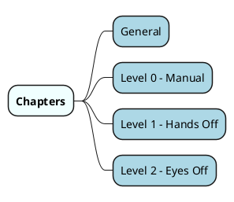
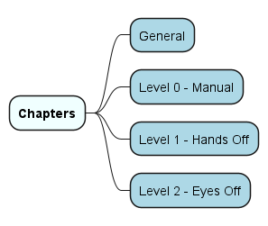
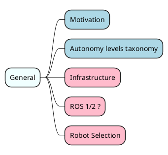
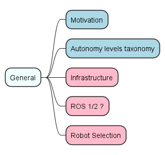
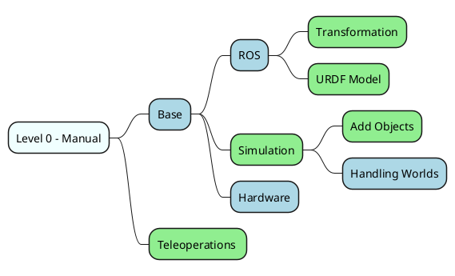
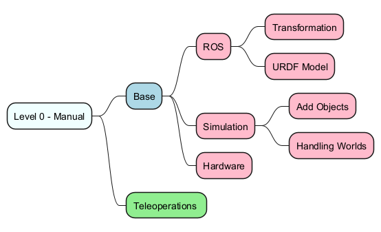
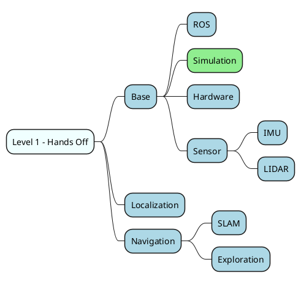
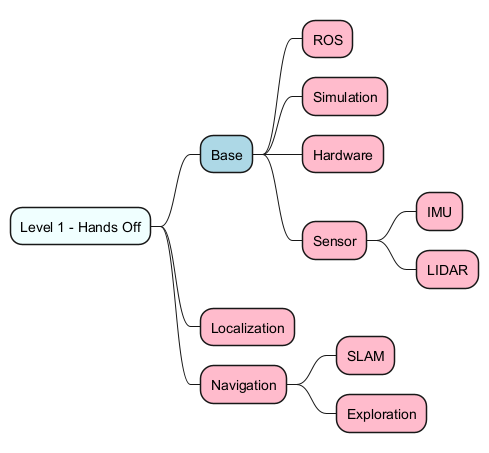
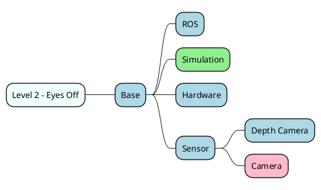
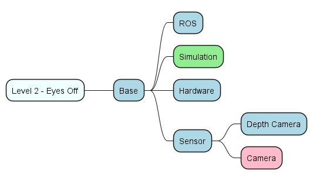

# Topics

This chapter contains a list of topics that are relevant to the project. The topics are organized into autonomy categories, and each category contains a list of subtopics. The topics are not exhaustive, but they provide a good starting point for further exploration.

## Topics overview

<!--- This mindmap is generated from the code below. It is not meant to be edited directly. --->

<!---

--->

## General Topics

This section provides an overview of the general topics that are relevant to the project. These topics are not specific to any level of autonomy, but they provide a foundation for understanding the project.

<!---

--->

## Level 0 Topics

This section provides an overview of the topics that are relevant to the Level 0 autonomy category. These topics are focused on manual control and basic robot operation.

<!---

--->

## Level 1 Topics

This section provides an overview of the topics that are relevant to the Level 1 autonomy category. These topics are focused on hands-off robot operation and autonomy.

<!---

--->

## Level 2 Topics

This section provides an overview of the topics that are relevant to the Level 2 autonomy category. These topics are focused on more advanced robot operation and autonomy.

<!---

--->

