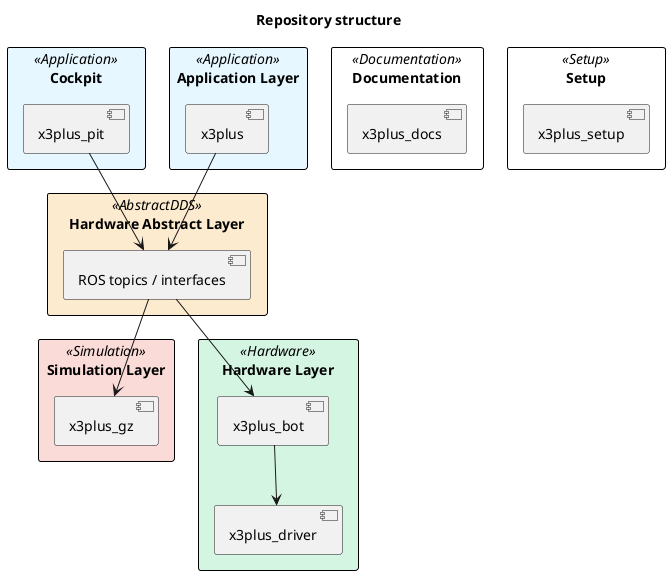
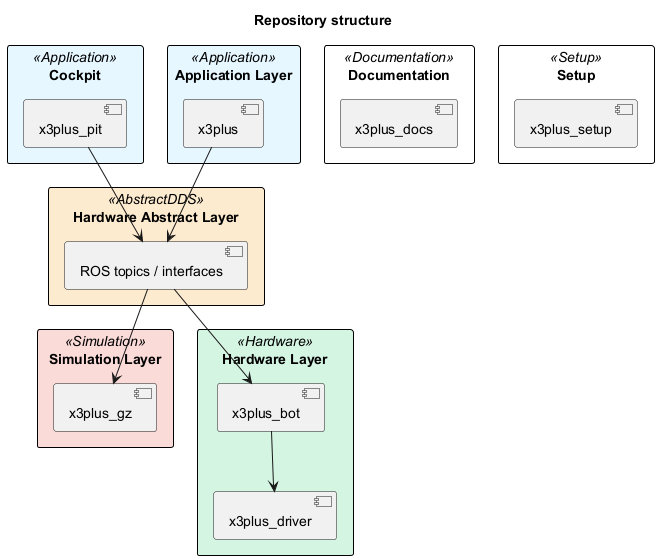
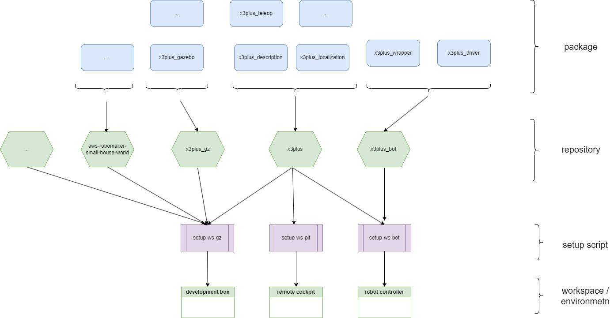

# Repository structure

Boot strap scripts of the robot project.

## Project Description

The `x3plus_setup` project is designed to provide a set of bootstrap scripts for setting up the development environment and workspace for the X3Plus robot project. The goal of this project is to simplify the process of getting started with the X3Plus robot by automating the installation of necessary dependencies and configuration of the development environment.

## List of repositories

The project is structured in the following repositories

| Name | Scope | Description |
|------|-------|-------------|
| [x3plus_setup](https://github.com/cord-burmeister/x3plus_setup) | Setup Scripts | This repository contains the scripts to setup workspace for the different deployment roles |
| [x3plus](https://github.com/cord-burmeister/x3plus) | Core Logic | This repository contains the packages of the control logic of the robot |
| [x3plus_pit](https://github.com/cord-burmeister/x3plus_pit) | Cockpit Logic | eleoperations cockpit packages for the robot project |
| [x3plus_driver](https://github.com/cord-burmeister/x3plus_driver) | Hardware driver | This repository contains the driver for the robot |
| [x3plus_bot](https://github.com/cord-burmeister/x3plus_bot) | Hardware wrapper | This repository contains the ROS nodes to wrap the hardware components to the ROS system |
| [x3plus_gz](https://github.com/cord-burmeister/x3plus_gz) | Gazebo Simulation | This repository contains the ROS and Gazebo simulation nodes to the ROS system |
| [x3plus_docs](https://github.com/cord-burmeister/x3plus_docs) | Documentation | This is the Website and source for documentation for all aspects of the project |

## Runtime structure

<!--


-->



## Project structure




## Development Environment Setup

### Prerequisites

Before running the setup scripts, ensure that you have the following dependencies installed:

- Ubuntu 22.04 or later
- ROS 2 Humble Hawksbill

### Instructions

1. Clone the repository:

    ```bash
    git clone https://github.com/cord-burmeister/x3plus_setup.git
    cd x3plus_setup
    ```

2. Run the setup script for ROS 2 Humble:

    ```bash
    bash bash/setup-humble.sh
    ```

## Running the Setup Scripts

The `x3plus_setup` project provides several setup scripts to configure different workspaces for the X3Plus robot. Below are the instructions for running each setup script:

### `bash/setup-humble.sh`

This script sets up the ROS 2 Humble environment and installs the necessary dependencies.

### `bash/setup-ws-bot.sh`

This script sets up the workspace for the X3Plus robot controller.

### `bash/setup-ws-gz.sh`

This script sets up the workspace for the X3Plus Gazebo simulation.

### `bash/setup-ws-pit.sh`

This script sets up the workspace for the X3Plus development and cockpit environment.

To run any of these scripts, use the following command:

```bash
bash <script-name>.sh
```

Replace `<script-name>` with the name of the script you want to run.

## Project Structure and Components

The `x3plus_setup` project consists of the following components:

- `bash/`: Directory containing the setup scripts.
- `docu/`: Directory containing documentation files.
- `LICENSE`: License file for the project.
- `README.md`: This file, containing the project documentation.

## Known Issues and Limitations

- The setup scripts are designed to work on Ubuntu 22.04 or later. Compatibility with other operating systems is not guaranteed.
- Some dependencies may require manual installation if they are not available through the package manager.
