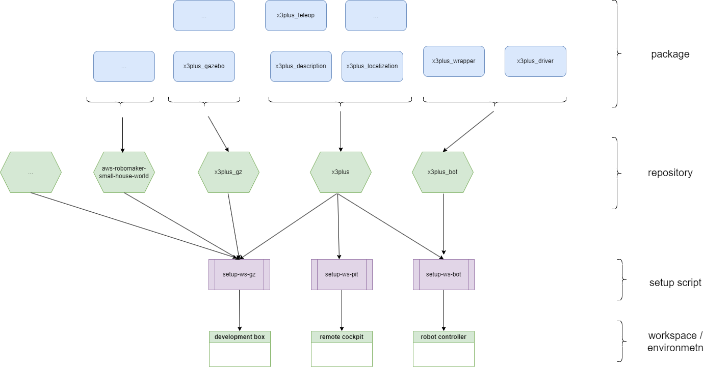

# Repository structure

Boot strap scripts of the robot project.

## Project Description

The `x3plus_setup` project is designed to provide a set of bootstrap scripts for setting up the development environment and workspace for the X3Plus robot project. The goal of this project is to simplify the process of getting started with the X3Plus robot by automating the installation of necessary dependencies and configuration of the development environment.

## Project structure



## Development Environment Setup

### Prerequisites

Before running the setup scripts, ensure that you have the following dependencies installed:

- Ubuntu 22.04 or later
- ROS 2 Humble Hawksbill

### Instructions

1. Clone the repository:

```bash
git clone https://github.com/cord-burmeister/x3plus_setup.git
cd x3plus_setup
```

2. Run the setup script for ROS 2 Humble:

```bash
bash bash/setup-humble.sh
```

## Running the Setup Scripts

The `x3plus_setup` project provides several setup scripts to configure different workspaces for the X3Plus robot. Below are the instructions for running each setup script:

### `bash/setup-humble.sh`

This script sets up the ROS 2 Humble environment and installs the necessary dependencies.

### `bash/setup-ws-bot.sh`

This script sets up the workspace for the X3Plus robot controller.

### `bash/setup-ws-gz.sh`

This script sets up the workspace for the X3Plus Gazebo simulation.

### `bash/setup-ws-pit.sh`

This script sets up the workspace for the X3Plus development and cockpit environment.

To run any of these scripts, use the following command:

```bash
bash <script-name>.sh
```

Replace `<script-name>` with the name of the script you want to run.

## Project Structure and Components

The `x3plus_setup` project consists of the following components:

- `bash/`: Directory containing the setup scripts.
- `docu/`: Directory containing documentation files.
- `LICENSE`: License file for the project.
- `README.md`: This file, containing the project documentation.

## Known Issues and Limitations

- The setup scripts are designed to work on Ubuntu 2s.04 or later. Compatibility with other operating systems is not guaranteed.
- Some dependencies may require manual installation if they are not available through the package manager.
