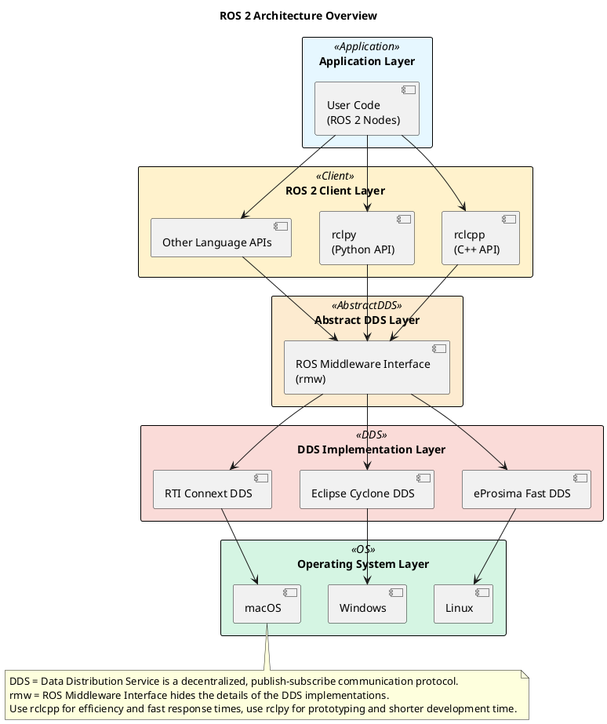
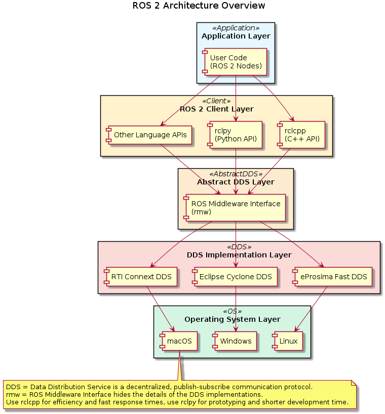

# ROS 2 Architecture

This document provides a technical overview of the ROS 2 architecture, detailing its fundamental design patterns, layers, and components. It covers the high-level architectural design and the interactions between different parts of the system.

!!! tip "This is only a high level introduction"
    This chapter covers only very high level the concepts of ROS 2. There are a series of good introduction books which are a good first learning start.

## Architectural Principles

ROS 2 represents a complete redesign of the original Robot Operating System framework, addressing limitations in the original design while incorporating modern software engineering practices. The architecture adheres to the following key principles:

* Distributed and peer-to-peer communication
* Real-time capability through Quality of Service settings
* Production-grade reliability and security
* Cross-platform compatibility (Linux, Windows, macOS)
* Modular design allowing component replacement

## Layered Architecture

ROS 2 follows a layered architecture with well-defined interfaces between layers:

<!--

-->

* Application Layer: Contains user-developed nodes and applications.
* Client Library Layer: Language-specific APIs (rclcpp, rclpy) that expose ROS functionality.
* RCL Layer: Common C API (rcl) providing unified functionality to client libraries.
* Middleware Abstraction Layer: An abstract interface (rmw) to the underlying middleware.
* Middleware Layer: Various DDS implementations (Fast DDS, Cyclone DDS, Connext DDS).

This layered approach provides flexibility for developers to choose appropriate implementations while maintaining API compatibility.

## Node-Based Architecture

ROS 2 implements a node-based architecture where:

* Each node represents a single-purpose, modular process
* Nodes maintain unique names within the ROS graph (e.g., TalkerNode, * ListenerNode)
* Nodes automatically discover others using DDS discovery mechanisms
* Nodes operate independently but can communicate with other nodes
* Nodes can be grouped into packages and launched together

Each node can:

* Publish/subscribe to topics
* Provide/use services
* Provide/use actions
* Store/access parameters

## Communication Infrastructure

ROS 2 provides three primary communication patterns:

1. Topics (Publisher/Subscriber)
    * Used for continuous data streams
    * One-to-many communication
    * Asynchronous, connectionless
2. Services (Request/Response)
    * Used for query-based interactions
    * One-to-one communication
    * Synchronous (blocking)
3. Actions (Goal/Feedback/Result)
    * Used for long-running tasks
    * Built on topics and services
    * Provides goal cancellation and preemption

Each communication pattern is implemented using the DDS middleware, which provides transport-level reliability and discovery.

## References

[DeepWiki Architecture](https://deepwiki.com/ros2/ros2/2-ros-2-architecture)
