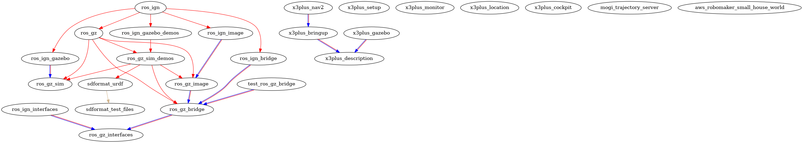

# Package Structure

a dot graph to visualize the dependency hierarchy 

``` bash
colcon graph --dot | dot -Tpng -o dependency-graph.png
```



## References

[Package Organization For a ROS Stack Best Practices](https://roboticsbackend.com/package-organization-for-a-ros-stack-best-practices/): In this guide, first you’ll see what you should not do within a package.

[colcon_gephi](https://github.com/maspe36/colcon_gephi): Colcon plugin to generate a rich dependency graph for packages in a ROS 2 workspace.

[ROSDepViz](https://github.com/gdesouza/rosdepviz?tab=readme-ov-file) : ROSDepViz (ROS Dependency Visualizer) is a Python-based tool designed to help developers understand and navigate the dependency tree of ROS (Robot Operating System) packages within a specified source directory.

