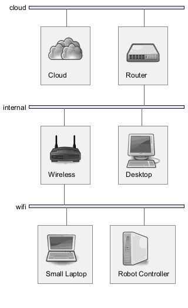

# Infrastructure

In this chapter i describe the infrastructure i used during the journey.

!!! note "Personal scope"
    This chapter describe my environment which very specific, but can be a sample how suitable certain hardware is.

## Computer Hardware

Desktop

* CPU: 13th Gen Intel(R) Core(TM) i7
* GPU: 4,352 CUDA cores / 136 Tensor cores
* RAM: 64 GB
* Hard disc: 2 TB
* Graphic Card: NVIDIA GeForce RTX 4060 Ti
* OS: Windows 11 & Ubuntu 22.04

Small-Laptop

* CPU: Intel(R) Core(TM) i5-4250U
* GPU: ./.
* RAM: 4 GB
* Hard disc: 250 GB
* Graphic Card: Mesa Intel(R) HD Graphics 5000
* OS: Ubuntu 22.04

<!-- Rasberry PI (Robot Controller)

* CPU: Broadcom BCM2711
* GPU: ./.
* RAM: 8 GB
* Hard disc: 250 GB
* Graphic Card: Broadcom VideoCore VI @ 500 MHz
* OS: Ubuntu 22.04 -->

NVIDIA Jetson Orin Nano Super (Robot Controller)

* CPU: 6-core Arm Cortex-A78AE v8.2
* GPU: 1024 CUDA cores / 32 Tensor cores
* RAM: 8 GB
* Hard disc: 1 TB
* Graphic Card: NVIDIA Ampere architecture
* OS: Ubuntu 22.04

## Network

<!-- https://plantuml.com/stdlib -->
<!-- 

``` plantuml
@startuml images/network-all
!define osaPuml https://raw.githubusercontent.com/Crashedmind/PlantUML-opensecurityarchitecture2-icons/master
!include osaPuml/Common.puml
!include osaPuml/User/all.puml
!include osaPuml/Hardware/all.puml
!include osaPuml/Misc/all.puml
!include osaPuml/Server/all.puml
!include osaPuml/Site/all.puml

nwdiag {
  network cloud {
      cloud [description = "<$osa_cloud>\n Cloud"];

      router [description = "<$osa_hub>\n Router"];
      // set multiple addresses (using comma)
  }
  network internal {
      router
      wireless_router [description = "<$osa_device_wireless_router>\n Wireless"];
      desktop [description = "<$osa_desktop>\n Desktop"];
      // set multiple addresses (using comma)
  }
  network wifi {
      wireless_router
      small_laptop [description = "<$osa_laptop>\n Small Laptop"];
      db01 [description = "<$osa_ics_plc>\n Robot Controller"];
  }
}

@enduml

```
-->



## Runtime Environments

The available hardware can be used with different runtime environments.

* **Native Ubuntu**: Install Ubuntu directly to the hardware.
* **Native Windows**: Install Windows directly to the hardware.  
* **Docker Image**: Install Ubuntu in a docker container.  
* **WSL**: Install Ubuntu in a WSL container in Windows.  
* **Virtual Machine Ubuntu**: Install Ubuntu in a Virtual Machine for a Hypervisor like Hyper-V.  
* **Virtual Machine Windows**: Install Windows in a Virtual Machine for a Hypervisor like Hyper-V.  

## Target Environments

| Name | Hardware | Environment | Role | Description |
| --- | -------- | ----------- | ---- | -- |
| ma3jet | Robot Controller | Native Ubuntu | Robot Controller | This is the controller on the robot |
| B760 | Desktop | Native Ubuntu | Development Machine | This is the development machine for simulation and backend calculation |
| W11 | Desktop | Native Windows | Development Machine | This is the development machine for simulation |
| small-laptop | small-laptop | Native Ubuntu | Remote Cockpit | This is the teleoperation cockpit |

 |
