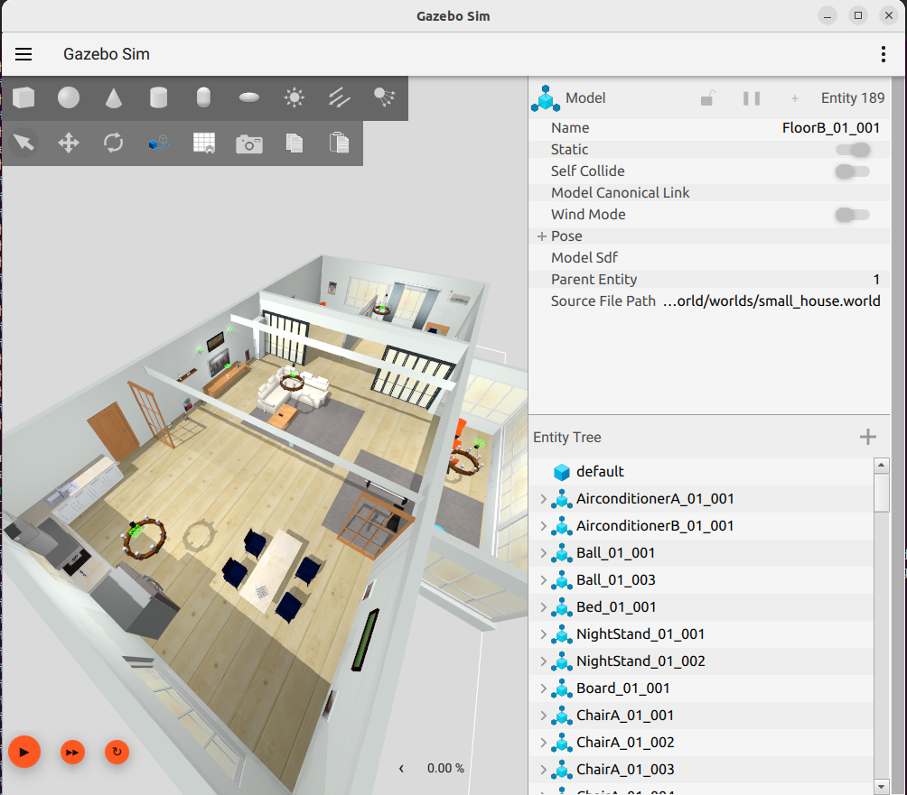
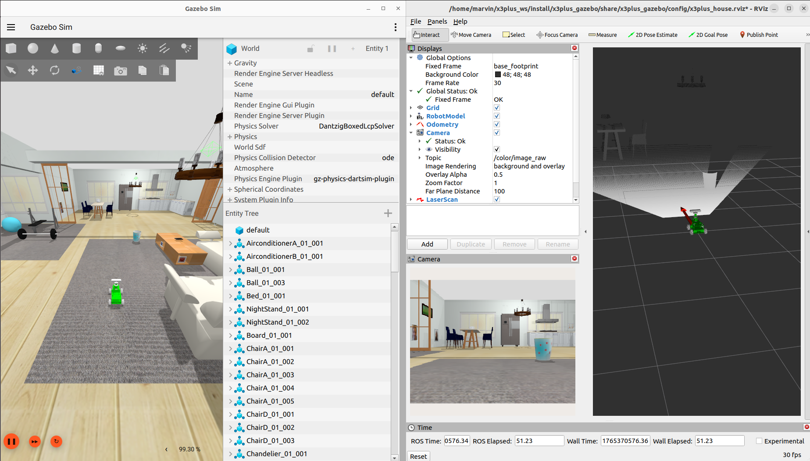

# Use cases with L0 Base


## ROS Launch with Gazebo viewer (without a robot)

Just view the simulation environment



```bash
ros2 launch aws_robomaker_small_house_world small_house.launch.py gui:=true
```

## Simulate robot with rviz



```bash
ros2 launch x3plus_gazebo x3plus_house.launch.py
```

## Adding keyboard teleoperations

Precondition

* Running robot with network connection.
* Running simulation with command handling.

Run on

* robot
* developer machine
* cockpit

``` bash
ros2 run  teleop_twist_keyboard teleop_twist_keyboard 
```

## Drive around