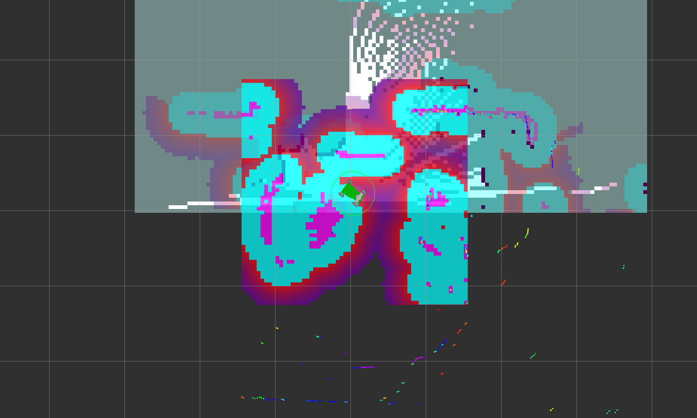

# Use cases with L1 Base

## Drive around


## Simulate robot with rviz and nav2


```bash
ros2 launch x3plus_gazebo x3plus.launch.py
```

## Robot driving

Her we can drive the robot with the navigation stack in SLAM modus.



```bash
ros2 launch x3plus_bot_bringup bringup_launch.py use_nav2:=True slam:=True
```
