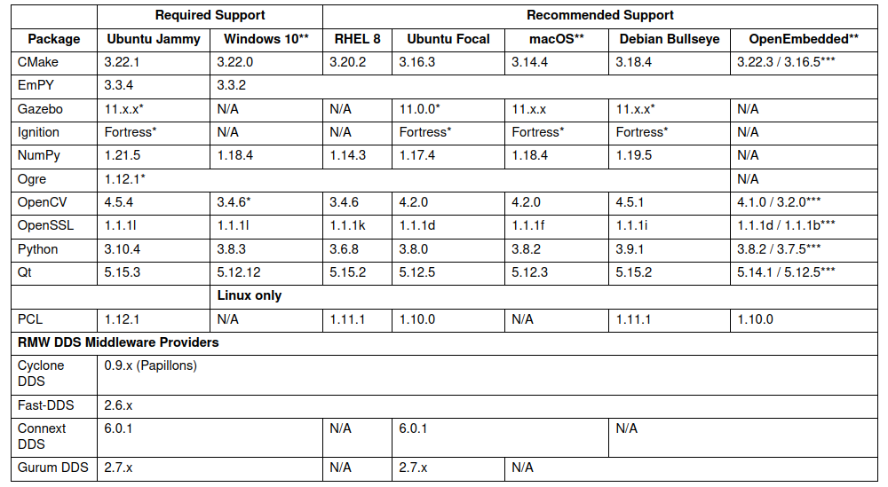

---
header-includes:
  - \usepackage{draftwatermark}
output: 
  pdf_document: 
    keep_tex: yes
---

# ROS the Robot Operating Platform

**Robot Operating System (ROS)** is an open-source robotics middleware suite. Although it's not an operating system (OS) in the traditional sense, ROS provides essential services for robot software development. These services include hardware abstraction, low-level device control, commonly used functionality, and message-passing between processes. In a ROS-based system, processes are organized as a graph, with nodes handling sensor data, control, planning, and other messages. While ROS isn't a real-time operating system (RTOS), it can be integrated with real-time computing code. For improved real-time support, ROS 2—a major revision of the ROS API—leverages modern libraries and technologies, making it suitable for embedded systems and hardware.

Software in the ROS Ecosystem can be separated into three groups:

* language-and platform-independent tools used for building and distributing ROS-based software;
* ROS client library implementations such as roscpp, rospy, and roslisp;
* packages containing application-related code which uses one or more ROS client libraries.

 Robot Operating System (ROS) offers a mix of language-independent tools and client libraries. The main client libraries—available in C++, Python, and Lisp—are released under the permissive BSD license, making them open-source and free for both commercial and research use. As for other packages within ROS, they are typically licensed under various open-source licenses. These additional packages cover essential functionalities like hardware drivers, robot models, datatypes, planning, perception, SLAM (simultaneous localization and mapping), and simulation tools, and other algorithms.

The main ROS client libraries are geared toward a Unix-like system, mostly because of their dependence on large sets of open-source software dependencies.

## ROS 2 Releases and Target Platforms

Since ROS was started in 2007, a lot has changed in the robotics and ROS community. The goal of the ROS 2 project is to adapt to these changes, leveraging what is great about ROS 1 and improving what isn’t.

### Distributions

A ROS distribution is a versioned set of ROS packages. These are akin to Linux distributions (e.g. Ubuntu). The purpose of the ROS distributions is to let developers work against a relatively stable codebase until they are ready to roll everything forward. Therefore once a distribution is released, we try to limit changes to bug fixes and non-breaking improvements for the core packages (every thing under ros-desktop-full).

### Release Schedule

New ROS 2 releases will be published in a time based fashion every 12 months. The rationale is that a shorter cycle (like 6 months) results in significant overhead and potentially many active releases at the same time (assuming they have the same support length). On the other hand a longer cycle (like 2 years) is too long for users to wait for new features to be available in a ROS 2 release.

### Targeted Platforms

Since regular Ubuntu releases are only supported for 9 months ROS 2 will not target those. A single ROS 2 distribution will only have full Tier 1 support for a single Ubuntu LTS. The rationale is that fully supporting two LTS versions - which means 2-year-different versions of upstream dependencies - is a tremendous overhead and sometimes even impossible. On a case-by-case basis, a ROS 2 distribution may support an older Ubuntu LTS distribution as a Tier 3, community-supported platform.

Since macOS (or at least brew) as well as Windows are rolling platforms ROS community aim to support the latest version available at the time of a ROS 2 distribution release. For Debian ROS community also aim to target the latest stable version though if that version is two years behind the Ubuntu version that might not be possible.

### Releases and support duration

In order to provide frequent releases to the community, in odd years a non-LTS ROS 2 release will be published. It will always target the same Ubuntu LTS as the previous ROS 2 LTS release but will only be supported for 1.5 years. This duration ensures that the non-LTS will overlap with the next ROS LTS release by 6 months to provide a long enough transition window.

    May 2021: G Turtle: non-LTS release, supported for 1.5 years
    May 2022: H Turtle: LTS release, supported for 5 years
    May 2023: I Turtle: non-LTS release, supported for 1.5 years
    May 2024: J Turtle: LTS release, supported for 5 years
    and so on, alternating annually between LTS and non-LTS releases

### Support Tiers

Platforms are defined as a combination of the OS, the architecture, and the RMW implementation. By default the tiers are expected to apply up to the desktop variant in a rosdistro, unless otherwise specified. ROS 2 variants are defined in REP 2001 [3].

#### Tier 1

Tier 1 platforms are subjected to our unit test suite and other testing tools on a frequent basis including continuous integration jobs, nightly jobs, packaging jobs, and performance testing. Errors or bugs discovered in these platforms are prioritized for correction by the development team. Significant errors discovered in Tier 1 platforms can impact release dates and we strive to resolve all known high priority errors in Tier 1 platforms prior to new version releases.

#### Tier 2

Tier 2 platforms are subject to periodic CI testing which runs both builds and tests with publicly accessible results. The CI is expected to be run at least within a week of relevant changes for the current state of the ROS distribution. Package-level binary packages may not be provided but providing a downloadable archive of the built workspace is encouraged. Errors may be present in released product versions for Tier 2 platforms. Known errors in Tier 2 platforms will be addressed subject to resource availability on a best effort basis and may or may not be corrected prior to new version releases. One or more entities should be committed to continuing support of the platform.

#### Tier 3

Tier 3 platforms are those for which community reports indicate that the release is functional. The development team does not run the unit test suite or perform any other tests on platforms in Tier 3. Installation instructions should be available and up-to-date in order for a platform to be listed in this category. Community members may provide assistance with these platforms.

## Humble Hawksbill (May 2022 - May 2027)

Targeted platforms:

| Architecture | Ubuntu Jammy (22.04) | Windows 10 (VS2019) |RHEL 8 | Ubuntu Focal (20.04) | macOS | Debian Bullseye (11) | OpenEmbedded / Yocto Project |
|---|---|---|---|---|---|---|---|
| amd64 | Tier 1 [d][a][s] | Tier 1 [a][s] | Tier 2 [d][a][s] | Tier 3 [s] | Tier 3 [s] |	Tier 3 [s] |	Tier 3 [s]
| arm64 | Tier 1 [d][a][s] | | | Tier 3 [s] ||	Tier 3 [s] |	Tier 3 [s] |
| arm32 | Tier 3 [s] | | | Tier 3 [s] | |	Tier 3 [s] | Tier 3 [s] |

The following indicators show what delivery mechanisms are available for each platform.

- " [d] " Distribution-specific (Debian, RPM, etc.) packages will be provided for this platform for packages submitted to the rosdistro.
- " [a] " Binary releases are provided as a single archive per platform containing all packages in the Humble ROS 2 repos file *Humble ROS 2 Repos File*.
- " [s] " Compilation from source.

Dependency Requirements:

{width=65%}

## References

[Website	www.ros.org](https://www.ros.org)

[Humble ROS 2 Repos File](https://github.com/ros2/ros2/blob/humble/ros2.repos)

[Wikipedia ROS](https://en.wikipedia.org/wiki/Robot_Operating_System)
