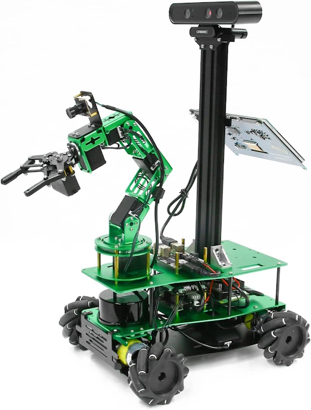
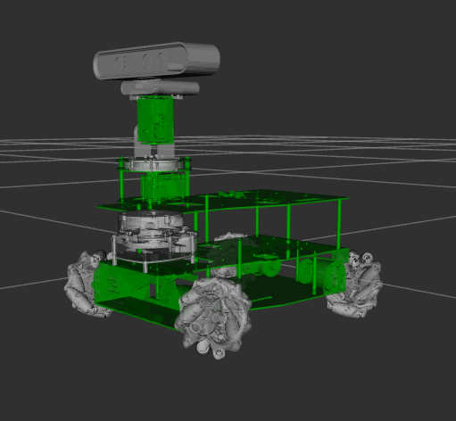
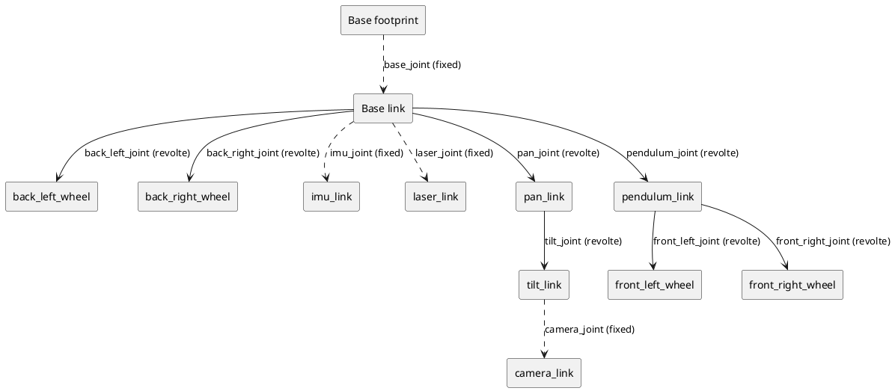
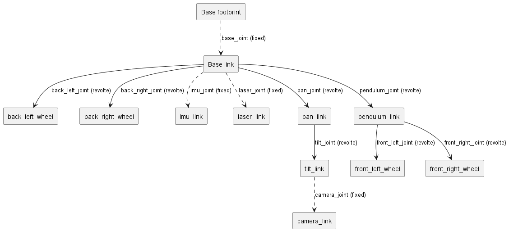
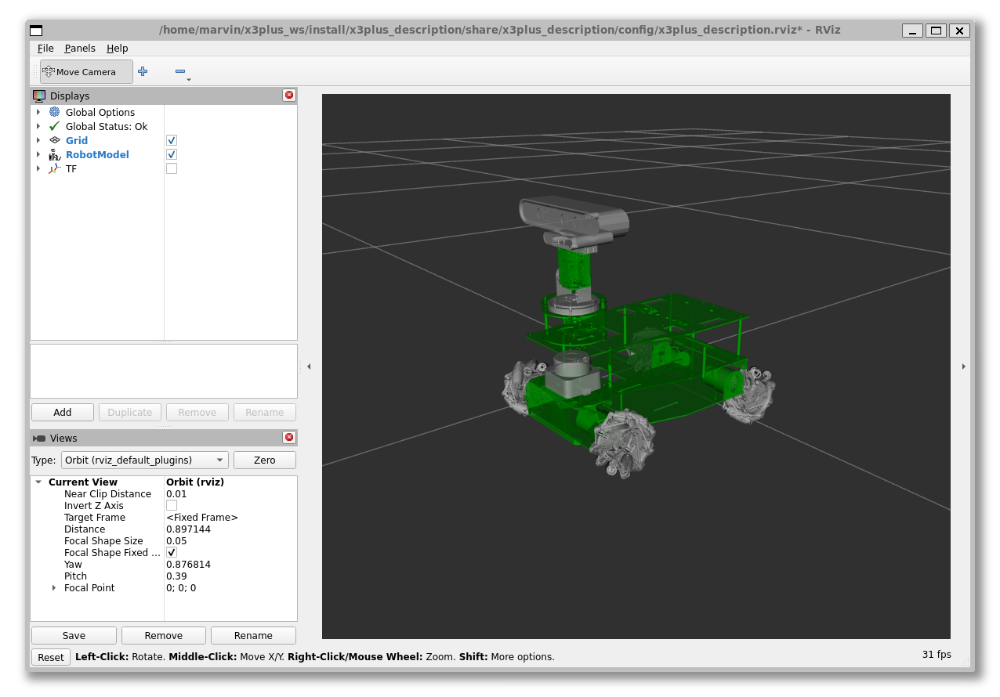
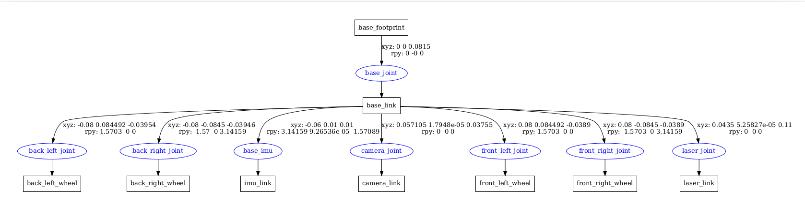

# Describe the robot

## ROSMASTER X3 PLUS

ROSMASTER X3 PLUS is an omnidirectional movement robot developed based on the ROS robot operating system. It supports four controllers: Jetson NANO 4GB/ORIN NX/ORIN NANO and Raspberry Pi 5. It is equipped with high-performance hardware configurations such as lidar, depth camera, 6DOF robotic arm, 520 high-power motor, voice recognition interactive module, and HD 7-inch display screen. It can realize applications such as APP mapping and navigation, automatic driving, human feature recognition, moveIt robotic arm simulation control and multi-machine synchronous control. It supports mobile phones, handles, computer keyboards remote control. 124 video tutorials with Chinese and English subtitles and codes are provided for free.

Reasonable design, unique shape

* X3PLUS supports four development boards: Jetson NANO 4GB/ORIN NX/ORIN NANO/RaspberryPi 5, suitable for different users.
* The whole robot is made of green aluminum alloy material, which is safe and non-toxic, beautiful and durable.
* Mecanum wheel and pendulum suspension chassis can make the robot adapt to uneven ground.



## Vision for a variant

The goal is to modify the original design to a simpler structure. Lets replace the arm with a pan tilt unit to have a flexible visualization unit.



## Logical Structure

The robot has a logical structure, which we should plan for.

<!--



-->




## Describe the Rosmaster 3 robot

### Copy the original files

Adapting the model shall keep the structure and naming content while preparing the model description for simulation and extended description.

> **Note:** Due to the fact, that the source provides an **urdf** file and a **xacro** file which are not consistent, the decision is to use the **xacro** files as the definition source. These needs adaption to integrate into the simulation.

* Copy the files into local package master3_description
  * Using the urdf file from the urdf folder
  * Using the STL files from the meshes folder  
* Adjust all internal references to the assets of the original package, especially for the meshes
* Skip the xacro files

> **Tip:** Iterating the description package is easier when only that package and dependencies are build.

``` bash
colcon build --packages-up-to x3plus_description
```

### General thoughts

The xacro allows the parameterization of the robot model. Using arguments from outside the definition files allows to generate variants of the robot model. The plan is to adapt the following aspects of the robot.

| Argument | Description |
|----------|-------------|
| mecanum | Have the ability to control if the base is using mecanum wheels or a classic diff drive behavior |

### New Launch file

Setup a new launch file *display_Xacro.launch.py* for displaying the *xacro* description

<!-- Adjust the following:

Add a new declaration of an argument for the launch file

``` python
    mecanum = LaunchConfiguration("mecanum")
    declare_mecanum_arg = DeclareLaunchArgument(
        "mecanum",
        default_value="True",
        description=(
            "Whether to use mecanum drive controller (otherwise diff drive controller is used)",
        ),
    )

``` -->

Adjust the robot description generation with *xacro* application for the master xacro definition file considering the arguments.

``` python
  robot_description_config = xacro.process_file(xacro_file, 
            mappings={  
                }).toxml()
```

<!-- Add the new declarations of the arguments to the launch description at the end of the file.

``` python
    return LaunchDescription([
        declare_mecanum_arg,
``` -->
<!-- 
### Adjusting the XACRO file

Add the new declarations of the arguments to the robot definition.

``` XML
<robot name="yahboomcar" xmlns:xacro="http://wiki.ros.org/xacro">
    <!-- define the list of relevant args -todo->
    <xacro:arg name="mecanum" default="true" />
```

Declare and assign corresponding variables for the arguments of the robot model.

``` XML
    <!-- set the internal properties based on the arguments -todo->
    <xacro:property name="mecanum" value="$(arg mecanum)" />
```

Adjust the definition based on the from the arguments derived property values based on the need. This is an example

``` XML
    <xacro:if value="${mecanum}">
      <xacro:property name="wheel_radius" value="0.05" />
    </xacro:if>
    <xacro:unless value="${mecanum}">
      <xacro:property name="wheel_radius" value="0.048" />
    </xacro:unless>
```

One major difference for the mecanum and non mecanum robot configuration is the usage of different wheel components. These will be controlled for example with an if statement and a shared macro defining the links for the wheel with the relevant differences.

``` XML
    <xacro:if value="${mecanum}">
        <xacro:common_wheel_link name="front_right_wheel" material="White" path="mecanum">
            <inertial>
                <origin xyz="1.9051E-06 -2.3183E-07 -0.00064079" rpy="0 0 0"/>
                ....
``` -->

## Checking the Visual Model

<!-- Now we can generate a variant of the *xacro* robot description by passing

``` bash
ros2 launch x3plus_description display_Xacro.launch.py
``` -->

There is a launch file which is starting the **RViz2** application to view the urdf model.
 
``` bash
ros2 launch x3plus_description display_Xacro.launch.py
```



<!-- There is a launch file which is starting the **RViz2** application to view the urdf model with non default arguments in this case the non mecanum wheel variant.

``` bash
ros2 launch master3_description display_Xacro.launch.py mecanum:=false
```

 -->

## Checking the structure

ROS provides a tool which can check the urdf.

But first it is required to generate the *urdf* file from the *xacro* definition with the variant options you want to use.

``` bash
xacro check_urdf yahboomcar_X3plus.urdf.xacro > yahboomcar_X3plus.urdf mecanum:=False
```

Try to parse the model specified by the program argument to validate it.

``` bash
check_urdf yahboomcar_X3plus.urdf
```

The output will display the structure of the robot.

``` bash
robot name is: yahboomcar_X3plus
---------- Successfully Parsed XML ---------------
root Link: base_footprint has 1 child(ren)
    child(1):  base_link
        child(1):  back_left_wheel
        child(2):  back_right_wheel
        child(3):  imu_link
        child(4):  camera_link
        child(5):  front_left_wheel
        child(6):  front_right_wheel
        child(7):  laser_link
```

There is also a more graphical representation be the following tool

``` bash
urdf_to_graphviz yahboomcar_X3plus.urdf yahboomcar_X3plus
```

This will generate a gv (graphviz) and PDF file with the graph.



## References

[ROSMASTER X3 PLUS on Github](https://github.com/YahboomTechnology/ROSMASTERX3-PLUS)

[Building a Pan-Tilt Mechanism](https://kamathsblog.com/building-a-pan-tilt-mechanism)


