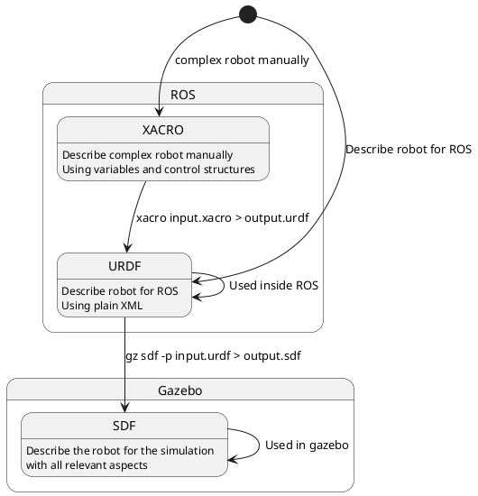
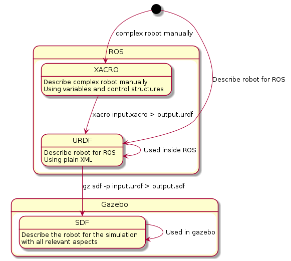
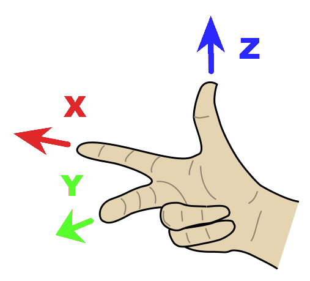

# Start with the model

## How to describe the Robot

When defining a robot, you have a few options: **URDF**, **Xacro**, and **SDF**. Let's explore when to use each format:

1. **URDF (Unified Robot Description Format)**:
    - **Purpose**: URDF is primarily used for specifying the **kinematic and dynamic properties** of a single robot in isolation.
    - **Limitations**:
        - URDF **cannot** specify the pose of the robot within a world.
        - It lacks certain features, such as joint loops, friction properties, and descriptions of non-robot elements (e.g., lights, heightmaps).
        - The syntax can be inflexible due to heavy attributes.
        - No backward compatibility mechanism exists.
    - **Historical Context**: URDF has been historically used within **ROS**.
    - **Example Use Case**: When you need to describe a robot's basic properties without considering the larger environment.

2. **Xacro**:
    - **Purpose**: Xacro is an extension of URDF that allows for more modular and reusable robot descriptions.
    - **Advantages**:
        - **Parameterization**: Xacro enables parameterization, making it easier to create and maintain robot models.
        - **Code Reuse**: You can define macros and include them in multiple robot descriptions.
    - **Example Use Case**: When you want to create cleaner, more organized URDF files by using macros and reducing redundancy.

3. **SDF (Simulation Description Format)**:
    - **Purpose**: SDF provides a **complete description** for everything from the world level down to the robot level.
    - **Advantages**:
        - **Universal**: SDF can specify joint loops, friction, and other properties that URDF lacks.
        - **Scalability**: It is highly scalable and easy to add or modify elements.
        - **Self-Descriptive**: SDF is described using XML, allowing for straightforward upgrades.
    - **Example Use Case**: When you need a comprehensive robot description that includes both robot-specific details and environmental elements (e.g., lights, terrain).

In summary:

- Use **URDF** for basic robot properties within ROS.
- Use **Xacro** for modular and reusable robot descriptions. This is a good choice when creating a more complex robot manually. This can be preprocessed or converted into URDF.
- Use **SDF** for complete robot and world-level descriptions in Gazebo simulations.

## Robot Description workflows

<!-- 
 Using the plantuml and enhanced markdown preview extensions here to have a interactive editing experience. 
 Comment section when ready. 
 Call plantuml <filename.md> When ready
 Using names for image filenames like @startuml images/XACRO-URDF-SDF

Using -down->  instead of plain error to avoid end comment in XML 
-->

<!-- 

 -->

## URDF (Unified Robot Description Format)

Adapting a robot model in URDF (Unified Robot Description Format) within the ROS (Robot Operating System) environment involves several steps:

1. **Understanding URDF**: URDF is an XML format that describes a robot's physical properties, such as its shape, size, kinematics, dynamics, and visual aspects¹.

2. **Creating a Basic URDF Model**: Start by creating a simple URDF model.

3. **Visualizing the Model**: Use Rviz to visualize the model.

4. **Building a Movable Model**: After creating a visual model, you can define movable joints in URDF to make the model movable.

5. **Adding Physical and Collision Properties**: You can add physical properties like mass and inertia, and collision properties for simulation.

6. **Adapting the Model**: Depending on the robot's actual structure and functionality, you may need to modify the URDF model. This could involve adding more links and joints, adjusting their properties, or changing their parent-child relationships.

Remember, creating and adapting a URDF model requires a good understanding of the robot's physical characteristics and how they're represented in URDF. It's also important to test the model in a simulated environment like Gazebo before using it to control a real robot.

## Coordination system in URDF

Handedness is given by the right hand rule. This means that the X direction is aligned in the direction of travel.
The Y direction is oriented to the left and Z to the top.
This applies to the robot model. The handedness of the camera is defined differently. index{Coordinate system! TF}

The units and handedness for ROS is described at the following link: [rep-0103](http://www.ros.org/reps/rep-0103.html)

## Frame Structure in ROS

In ROS, there is a convention such as the relationships between certain coordinate systems
is defined. This is generally available at the following link [rep-0105](http://www.ros.org/reps/rep-0105.html)
and for humanoid robots under [rep-0120](http://www.ros.org/reps/rep-0120.html#id17).

The frames are briefly described here.

- *map:*  This is the global map in which the position of the robot is typically displayed from a localization component. The position is not continuous and can jump, because it is calculated on the basis of sensor information.
- *odom:* This frame reflects the position of the robot based on one or more odometry sources and is typically afflicted with an error over time be. The position is continuous.
- *base_link:* This frame serves as a fixed reference point to the robot itself.
- *base_footprint:* This frame serves as a reference point of the robot itself, projected onto the "Floor": This is intended to track occupancy on the flat surface.

## Motivation using XACRO

Writing URDFs that involve more than just a few elements can quickly become a pain. Your file gets huge and duplicate items in your workspace means copy-pasting a bunch of links and joints while having to change their names just slightly. It’s really easy to make a mistake that may (or may not) be caught at startup. It’d be nice if we could take some guidance from programming languages themselves: define a component once, then re-use it anywhere without excessive duplication. Functions and classes do that for programs, and XACRO macros do that for URDFs. XACRO has other cool features too, like a file include system (think #include), constant variables, math expression evaluation, and more.

## Setup a xacro file

The following basic steps are required to setup a new *xacro* robot description.

## References

[Building a Visual Robot Model with URDF from Scratch - ROS Wiki.](http://wiki.ros.org/urdf/Tutorials/)

[Adding Physical and Collision Properties to a URDF Model](http://wiki.ros.org/urdf/Tutorials/Adding%20Physical%20and%20Collision%20Properties%20to%20a%20URDF%20Model)

[Using Xacro to Clean Up a URDF File](http://wiki.ros.org/urdf/Tutorials/Using%20Xacro%20to%20Clean%20Up%20a%20URDF%20File)

[SDFormat extensions to URDF](http://sdformat.org/tutorials?tut=sdformat_urdf_extensions&cat=specification&)

[sdformat - SDF vs URDF what should one use? - Robotics Stack Exchange](https://robotics.stackexchange.com/questions/25286/sdf-vs-urdf-what-should-one-use.)

[Create a URDF for an Industrial Robot - ROS Wiki](http://wiki.ros.org/Industrial/Tutorials/Create%20a%20URDF%20for%20an%20Industrial%20Robot.)

[URDF (.xacro) vs model file (.sdf) with ROS - Gazebo: Q&A Forum.](https://answers.gazebosim.org/question/16129/urdf-xacro-vs-model-file-sdf-with-ros/.)

[Tutorial: ROS2 launch files – All you need to know](https://roboticscasual.com/tutorial-ros2-launch-files-all-you-need-to-know/)
