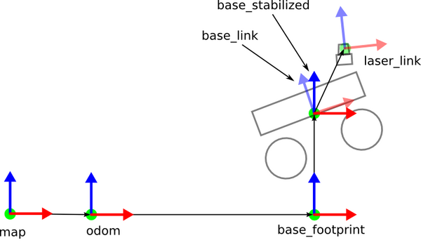
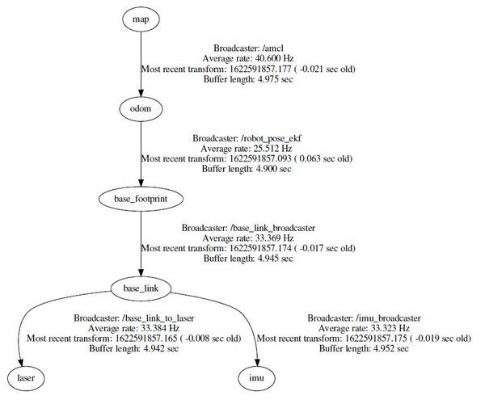

# Links

## Links in Gazebo

In Gazebo, a link refers to a rigid body within the simulated world. It is synonymous with the concept of a body in the URDF (Unified Robot Description Format) context.
Links represent physical objects such as robot parts, sensors, or any other components that interact with the simulation environment.
Each link has intrinsic properties like mass, friction coefficients, and a pose (position and orientation) relative to the world frame.
Links are connected to each other via joints, forming a Gazebo model. A model is essentially a collection of interconnected links.

## Frame IDs

A frame ID (also known as a coordinate frame) defines a reference coordinate system within the simulation.
In ROS and Gazebo, different components (such as links, sensors, or cameras) have their own coordinate frames.
Commonly used frame IDs include:

* *World frame*: The global reference frame in which all other frames are defined. It remains fixed relative to the simulated world.
* *Link frames*: Each link has its own local coordinate frame. The pose of a link is specified relative to this frame.
* *Sensor frames*: Sensors (like cameras, IMUs, or lidars) have their own frames. For example, an IMU sensor may have a frame attached to the robot’s body.
* *Base frame*: Often used for mobile robots, the base frame represents the robot’s footprint or chassis.
* *End-effector frame*: For robotic arms, this frame corresponds to the tool or end-effector.
Transformations between frames allow us to express positions and orientations of objects relative to each other.

<!-- 
## ROS Communication with Gazebo

Gazebo provides a set of ROS APIs that allow users to manipulate and obtain information about the simulated world.

Key ROS topics related to links and frame IDs in Gazebo include:
/gazebo/link_states: Publishes pose and twist information for all links in the simulation relative to the world frame.
/gazebo/model_states: Provides pose and twist information for entire models (collections of links) relative to the world frame.
You can retrieve this information using the following commands:
To see link states: rostopic echo -n 1 /gazebo/link_states
To see model states: rostopic echo -n 1 /gazebo/model_states -->

> *Note:* Remember that understanding links and frame IDs is crucial for correctly modeling and simulating robots in Gazebo.

## Why Coordinate Frames Are Important?

In a real-world scenario, in order for the robot to avoid obstacles as it moves around in the environment, we need to convert a detected object’s coordinates in the LIDAR coordinate frame to equivalent coordinates in the robot base’s frame.

You can see why coordinate frames and being able to transform data from one coordinate frame to another is important for accurate autonomous navigation.

## Standard Coordinate Frames in ROS for a Mobile Robot

Below are the standard coordinate frames for a basic two wheeled differential drive robot.

* The red arrows represent the x axes
* The blue arrows represent the z axes
* The green dots (into the page) represent the y axes.



The official ROS documents have an explanation of these coordinate frames, but let’s briefly define the main ones.

* *map* frame has its origin at some arbitrarily chosen point in the world. This coordinate frame is fixed in the world.
* *odom* frame has its origin at the point where the robot is initialized. This coordinate frame is fixed in the world.
* *base_footprint* has its origin directly under the center of the robot. It is the 2D pose of the robot. This coordinate frame moves as the robot moves.
* *base_link* has its origin directly at the pivot point or center of the robot. This coordinate frame moves as the robot moves.
* *laser_link* has its origin at the center of the laser sensor (i.e. LIDAR). This coordinate frame remains fixed (i.e. “static”) relative to the base_link.
If you have other sensors on your robot, like an IMU, you can have a coordinate frame for that as well.

## Static Transform Publisher

How can we automatically convert data that is published in one coordinate frame to equivalent data in another coordinate frame? For example, suppose we have an object at coordinate (x=3.7, y=1.23, z = 0.0) in the map coordinate frame. We want to navigate the robot to this object. What is the object’s position relative to the base_link coordinate frame?

Fortunately, ROS has a package called tf to handle all these coordinate transforms for us.

For coordinate frames that don’t change relative to each other through time (e.g. laser_link to base_link stays static because the laser is attached to the robot), we use the Static Transform Publisher.

For coordinate frames that do change relative to each other through time (e.g. map to base_link), we use tf broadcasters and listeners. A lot of ROS packages handle these moving coordinate frame transforms for you, so you often don’t need to write these yourself.



Examples
coordinate_frames
Let’s take a look at some examples of how to set up static transform publishers in ROS. These static transform publishers will typically appear inside the launch file for whatever robot you’re working on.

Here is the syntax:

static_transform_publisher x y z yaw pitch roll frame_id child_frame_id period_in_ms

From the ROS website: “Publish a static coordinate transform to tf using an x/y/z offset in meters and yaw/pitch/roll in radians. (yaw is rotation about Z, pitch is rotation about Y, and roll is rotation about X). The period, in milliseconds, specifies how often to send a transform. 100ms (10hz) is a good value.”

## Map to Odom

If we want, for example, the map and odometry frame to be equivalent, here is the code you would write inside a ROS launch file:

``` bash
<node pkg="tf" type="static_transform_publisher" name="map_to_odom" args="0 0 0 0 0 0 map odom 30" />
```

map -> odom transform tells us the position and orientation of the starting point of the robot (i.e. odom coordinate frame, which is the child) inside the map’s coordinate frame (i.e. the parent).

In our example above, we assume that the odom frame does not move relative to the map frame over time.

Odom to Base Footprint
odom -> base_footprint transform is not static because the robot moves around the world. The base_footprint coordinate frame will constantly change as the wheels turn. This non-static transform is often provided in packages like the robot_pose_ekf package.

Base Footprint to Base Link
base_footprint -> base_link is a static transform because both coordinate frames are fixed to each other. The robot moves, and the coordinate frame of its “footprint” will move.

``` bash
<node pkg="tf" type="static_transform_publisher" name="base_link_broadcaster" args="0 0 0.09 0 0 0 base_footprint base_link 30" />
```

In this case above, we assume that the origin of the base_link coordinate frame (i.e. center of the robot) is located 0.09 meters above its footprint.

Base Link to Laser
base_link -> laser transform gives us the position and orientation of the laser inside the base_link’s coordinate frame. This transform is static.

``` bash
<node pkg="tf" type="static_transform_publisher" name="base_link_to_laser" args="0.06 0 0.08 0 0 0 base_link laser 30" />
```

We assume that the laser is located 0.06 meters forward of the center of the robot and 0.08 meters above the center of the robot.

## More intuitive command-line arguments for static_transform_publisher

The command-line handling has been changed to use flags instead, and all flags except for --frame-id and --child-frame-id are optional. Thus, the above command-line can be simplified to: ros2 run tf2_ros static_transform_publisher --frame-id foo --child-frame-id bar To change just the translation x, the command-line would be:


ros2 run tf2_ros static_transform_publisher --x 1.5 --frame-id foo --child-frame-id bar

## References

[Coordinate Frames and Transforms for ROS-based Mobile Robots](https://automaticaddison.com/coordinate-frames-and-transforms-for-ros-based-mobile-robots/)
