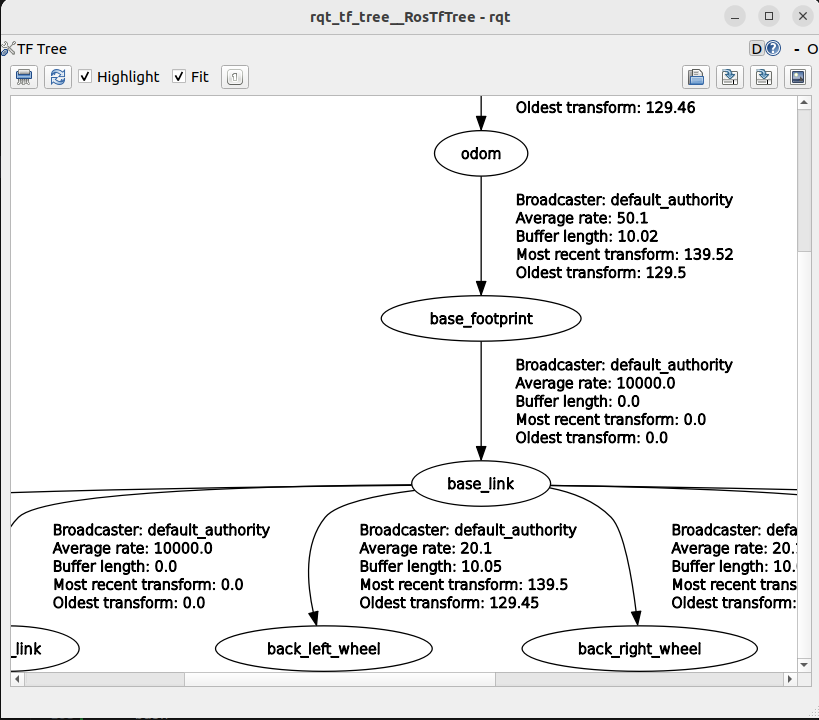

# TF2

tf2 is the second generation of the transform library, which lets the user keep track of multiple coordinate frames over time. tf2 maintains the relationship between coordinate frames in a tree structure buffered in time, and lets the user transform points, vectors, etc between any two coordinate frames at any desired point in time.

## Overview

tf2 is the transform library, which lets the user keep track of multiple coordinate frames over time. tf2 maintains the relationship between coordinate frames in a tree structure buffered in time and lets the user transform points, vectors, etc. between any two coordinate frames at any desired point in time.


## Properties of tf2

A robotic system typically has many 3D coordinate frames that change over time, such as a world frame, base frame, gripper frame, head frame, etc. tf2 keeps track of all these frames over time, and allows you to ask questions like:

* Where was the head frame relative to the world frame 5 seconds ago?
* What is the pose of the object in my gripper relative to my base?
* What is the current pose of the base frame in the map frame?

tf2 can operate in a distributed system. This means all the information about the coordinate frames of a robot is available to all ROS 2 components on any computer in the system. tf2 can have every component in your distributed system build its own transform information database or have a central node that gathers and stores all transform information.

## Concepts

There are essentially two main tasks that any user would use tf2 for, listening for transforms and broadcasting transforms.

To extend the capabilities of a robot, you will need to start broadcasting transforms. Broadcasting transforms means to send out the relative pose of coordinate frames to the rest of the system. A system can have many broadcasters that each provide information about a different part of the robot. 

In addition to that, tf2 can broadcast static transforms that do not change over time. This mainly saves storage and lookup time, but also reduces the publishing overhead. You should note that static transforms are published once and assumed to not change, so no history is stored. 

## Coordinate Frame Conventions

An important part of using tf2 is to use standard conventions for coordinate frames.

There are several sources of conventions for using coordinate frames.

* Units, orientation conventions, chirality, rotation representations, and covariance representations are covered in [REP 103](https://www.ros.org/reps/rep-0103.html)
* Standard names for mobile base coordinate frames are covered in [REP 105](https://www.ros.org/reps/rep-0105.html)
* Standard coordinate frames for Humanoid Robots are in [REP 120](https://www.ros.org/reps/rep-0120.html)
* For definitions of some of the math terms used please see the /Terminology page.

## Naming

Coordinate frames in ROS are identified by a string frame_id in the format lower case underscore separated. This string has to be unique in the system. All data produced can simply identify it's frame_id to state where it is in the world.

*No tf_prefix:* In previous versions there was a concept of a tf_prefix which would be prepended to the frame name using a / separator. A leading slash used to indicate that it had already been prefixed. For backwards compatibility tf2 will strip any leading / character.

*No Remapping:* The concept of tf frame_ids is not scoped in the same way as ROS Names. In particular, namespacing a specific subpart of a computation graph does not change the physical layout which the tf tree represents. Because of this frame_ids do not follow namespace remapping rules. It is common to support a ROS parameter to allow changing frame_ids used in algorithms.

Multiple Robots:

For use cases with multiple robots it is generally recommended to use multiple masters and forward specific tf information between the robots. There are several different methods of implementing bridges between masters. For more information please see the sig/Multimaster.


## Tf2 tools

We can use tf2_tools to look at what tf2 is doing behind the scenes.

### Using view_frames

> **Note:** This utility only works on Linux;

view_frames creates a diagram of the frames being broadcast by tf2 over ROS.

``` bash
ros2 run tf2_tools view_frames
```

You will see:

``` bash
Listening to tf data during 5 seconds...
Generating graph in frames.pdf file...
```

Here a tf2 listener is listening to the frames that are being broadcast over ROS and drawing a tree of how the frames are connected. To view the tree, open the resulting frames.pdf with your favorite PDF viewer.


### Using tf2_echo

tf2_echo reports the transform between any two frames broadcast over ROS.

Usage:

ros2 run tf2_ros tf2_echo [source_frame] [target_frame]
Let’s look at the transform of the turtle2 frame with respect to turtle1 frame which is equivalent to:

``` bash
ros2 run tf2_ros tf2_echo turtle2 turtle1
```

You will see the transform displayed as the tf2_echo listener receives the frames broadcast over ROS 2.

``` bash
At time 1683385337.850619099
- Translation: [2.157, 0.901, 0.000]
- Rotation: in Quaternion [0.000, 0.000, 0.172, 0.985]
- Rotation: in RPY (radian) [0.000, -0.000, 0.345]
- Rotation: in RPY (degree) [0.000, -0.000, 19.760]
- Matrix:
  0.941 -0.338  0.000  2.157
  0.338  0.941  0.000  0.901
  0.000  0.000  1.000  0.000
  0.000  0.000  0.000  1.000
At time 1683385338.841997774
- Translation: [1.256, 0.216, 0.000]
- Rotation: in Quaternion [0.000, 0.000, -0.016, 1.000]
- Rotation: in RPY (radian) [0.000, 0.000, -0.032]
- Rotation: in RPY (degree) [0.000, 0.000, -1.839]
- Matrix:
  0.999  0.032  0.000  1.256
 -0.032  0.999 -0.000  0.216
 -0.000  0.000  1.000  0.000
  0.000  0.000  0.000  1.000
```

As you drive your robot around you will see the transform change.

## Checking the frames

Firstly, to find out if tf2 knows about our transform between turtle3 and turtle1, we will use tf2_echo tool.

``` bash
ros2 run tf2_ros tf2_echo turtle3 turtle1
```

The output tells us that frame turtle3 does not exist:

``` bash
[INFO] [1630223557.477636052] [tf2_echo]: Waiting for transform turtle3 ->  turtle1:
Invalid frame ID "turtle3" passed to canTransform argument target_frame - frame does
not exist
```

Then what frames do exist? If you like to get a graphical representation of this, use view_frames tool.

``` bash
ros2 run tf2_tools view_frames
```

Open the generated frames.pdf file to see the following output:

../../../_images/turtlesim_frames.png

So obviously the problem is that we are requesting transform from frame turtle3, which does not exist. To fix this bug, just replace turtle3 with turtle2 in line 65.

And now stop the running demo, build it, and run it again:

ros2 launch turtle_tf2 start_debug_demo.launch.py
And right away we run into the next problem:

[turtle_tf2_listener_debug-4] [INFO] [1630223704.617382464] [listener_debug]: Could not
transform turtle2 to turtle1: Lookup would require extrapolation into the future. Requested
time 1630223704.617054 but the latest data is at time 1630223704.616726, when looking up
transform from frame [turtle1] to frame [turtle2]

## Using tf2_echo

tf2_echo reports the transform between any two frames broadcasted over ROS.

Usage:

``` bash
ros2 run tf2_ros tf2_echo [source_frame] [target_frame]
```

Let’s look at the transform of the turtle2 frame with respect to turtle1 frame which is equivalent to:

``` bash
ros2 run tf2_ros tf2_echo turtle2 turtle1
```

You will see the transform displayed as the tf2_echo listener receives the frames broadcasted over ROS 2.

``` bash
At time 1622031731.625364060
- Translation: [2.796, 1.039, 0.000]
- Rotation: in Quaternion [0.000, 0.000, 0.202, 0.979]
At time 1622031732.614745114
- Translation: [1.608, 0.250, 0.000]
- Rotation: in Quaternion [0.000, 0.000, 0.032, 0.999]
As you drive your turtle around you will see the transform change as the two turtles move relative to each other.
```

## Using rqt_tf_tree

Using the tools which can display the TF tree online. This must be installed separately, because it is not part of the the desktop bundle.

``` bash
sudo apt install ros-humble-rqt-tf-tree
```

Start it with 

``` bash
sudo apt install ros-humble-rqt-tf-tree
```

The benefit is, that the information is displayed online without the need to generate output files.



## References

[ROS TF2](https://wiki.ros.org/tf2)

[Learn how to use a systematic approach for debugging tf2 related problems.](https://docs.ros.org/en/rolling/Tutorials/Intermediate/Tf2/Debugging-Tf2-Problems.html)

[A definitive guide to launching multi-robot operations in ROS2](https://robotics.stackexchange.com/questions/100288/a-definitive-guide-to-launching-multi-robot-operations-in-ros2)

[Creating and Managing a Multi-Robot Simulation in Gazebo with ROS 2 Foxy: A Guide for Scalable TurtleBot3 Deployment](https://medium.com/@arshad.mehmood/efficient-deployment-and-operation-of-multiple-turtlebot3-robots-in-gazebos-f72f6a364620#id_token=eyJhbGciOiJSUzI1NiIsImtpZCI6ImFjM2UzZTU1ODExMWM3YzdhNzVjNWI2NTEzNGQyMmY2M2VlMDA2ZDAiLCJ0eXAiOiJKV1QifQ.eyJpc3MiOiJodHRwczovL2FjY291bnRzLmdvb2dsZS5jb20iLCJhenAiOiIyMTYyOTYwMzU4MzQtazFrNnFlMDYwczJ0cDJhMmphbTRsamRjbXMwMHN0dGcuYXBwcy5nb29nbGV1c2VyY29udGVudC5jb20iLCJhdWQiOiIyMTYyOTYwMzU4MzQtazFrNnFlMDYwczJ0cDJhMmphbTRsamRjbXMwMHN0dGcuYXBwcy5nb29nbGV1c2VyY29udGVudC5jb20iLCJzdWIiOiIxMTA3MjAxNjQ1OTgzOTMyMzMwNjQiLCJlbWFpbCI6ImNvcmQuYnVybWVpc3RlckBnb29nbGVtYWlsLmNvbSIsImVtYWlsX3ZlcmlmaWVkIjp0cnVlLCJuYmYiOjE3MTQ5MTQ2MDAsIm5hbWUiOiJDb3JkIEJ1cm1laXN0ZXIiLCJwaWN0dXJlIjoiaHR0cHM6Ly9saDMuZ29vZ2xldXNlcmNvbnRlbnQuY29tL2EvQUNnOG9jSXVCR3RUMms3OEZWSlV2bmJSWGcxdHQ2dm9vOEU3RElvWDRydS1kNlZCdjY4MU9CUT1zOTYtYyIsImdpdmVuX25hbWUiOiJDb3JkIiwiZmFtaWx5X25hbWUiOiJCdXJtZWlzdGVyIiwiaWF0IjoxNzE0OTE0OTAwLCJleHAiOjE3MTQ5MTg1MDAsImp0aSI6IjhhNWM2OWQ4N2ZhOTRjYjM5MjA3MWY0ZjU1YjUwYjhjMjEwYzVjNGQifQ.W0fpQwNWnKhmNq30TtPCGeiw2xEFGjJcnLFdSqt2Jbrx9JCtPFPNiO65tLJzA-5owUHe7Gn_s38TfyPJQSTzd8-iGsorIHBmAiSXBmHfsQxVVuRwm22SgiyZH39a0x5oOxGpyFfMH0vtPUGfErMyx0_kZ2ljzzcAdF2RA_Tjk9rpg4P5IDGvVQdv2uvAfmVboABqbRVjtOIupsURr8rvlHN5OluodoGx4ZpIipFxaedjfcuZuFQRhfk0Z2EKg3OAsSGV1rDwtkEzBNLGHW4h-ibeINQOsXh9xE7Xnyuwupq5_XdV0GIvDDlrVoAOtEoYBnEuC-x1cQMTiDhywsmGlg)

[About-Tf2](https://docs.ros.org/en/rolling/Concepts/Intermediate/About-Tf2.html)

[Introducing tf2](https://docs.ros.org/en/rolling/Tutorials/Intermediate/Tf2/Introduction-To-Tf2.html)

[ROS2 Part 13 – ROS2 tf2 Transform](https://www.roboticsunveiled.com/ros2-tf2-transform/)