# Installing Jetson

## Everything You Need to Set Up Your Development Environment

NVIDIA SDK Manager provides an end-to-end development environment setup solution for NVIDIA’s Jetson, Holoscan, Rivermax, DeepStream, GXF Runtime, Aerial Research Cloud (ARC-OTA), Ethernet Switch, RAPIDS, DRIVE and DOCA SDKs for both host and target devices.

## Flow with Host Linux PC

Besides this default setup with microSD card, there is an optional setup flow in which you use a Linux host PC to run NVIDIA SDK Manager to  flash an Jetson Linux image of selected JetPack version on your selection of primary storage medium (microSD card, NVMe SSD or USB drive) and/or install JetPack components of selected JetPack version using the host PC.

## Prerequisite

In this description we follow the headless installation flow. Therefore you need.

* A Ubuntu based Host PC with enough hard disc space to cache the installation files. This is approximately 10 GB.
* USB Cable to flash the image
* Cable to bridge the jumper to set the Jetson in recovery mode
* Network first cable then WiFi

## Get Started

1. DOWNLOAD and INSTALL

    Installation on Ubuntu Ubuntu:

    ``` bash
    sudo apt install ./sdkmanager_[version]-[build#]_amd64.deb
    ```

2. LAUNCH:

    From a terminal window, launch SDK Manager with the command:

    ``` bash
    sdkmanager
    ```

## How to Enter Force Recovery Mode on Jetson Orin Nano

1. Locate the J14 Header Pins
On the Jetson Orin Nano Developer Kit, find the J14 header—this is a row of pins near the edge of the board.

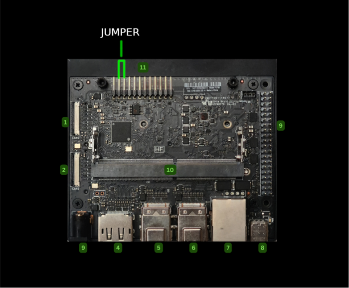

You’ll need to connect Pin 9 (FC REC) and Pin 10 (GND) using a jumper wire or a small jumper cap.

2. Connect to Host PC
Use a USB-C cable to connect the Jetson Orin Nano to your Ubuntu host PC (Ubuntu 20.04 or 22.04 is recommended).

Make sure the host has NVIDIA SDK Manager installed.

3. Power On the Device
With the jumper in place, power on the Jetson Orin Nano.

The device should now boot into Force Recovery Mode.

4. Verify Recovery Mode
On your host PC, open a terminal and run:

``` bash
lsusb
```

You should see a line like:

``` Code
Bus XXX Device XXX: ID 0955:7f21 NVIDIA Corp.
```

This confirms the Jetson is in recovery mode.

## Why Use Recovery Mode?

Required for flashing JetPack via SDK Manager

Useful for recovering from boot failures

Allows firmware updates and low-level access

If you’re using a custom carrier board or a third-party enclosure, the pin layout might differ slightly—so always check the board’s documentation.

## Hardware Setup

Connect NVIDIA Jetson Orin Nano Developer Kit to the PC with a USB Type-C cable.

While shorting the FC REC pin and GND pin of the 12-pin header under the module, insert the power supply plug into the DC jack.

This will turn on the Jetson dev kit in Force Recovery Mode .

## Steps

Launch SDK Manger

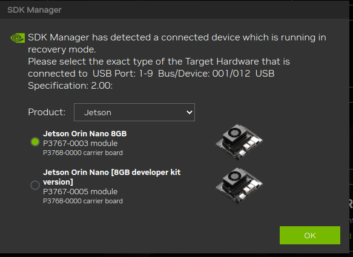

When asked select the target model of the Jetson model

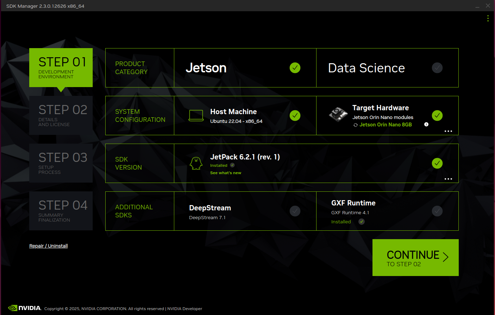

On the Step 01 Development Environment window;

* From the Product Category panel, select Jetson.
* From the Hardware Configuration panel select Jetson Orin Nano Developer Kit for Target Hardware.

Click **CONTINUE** button.

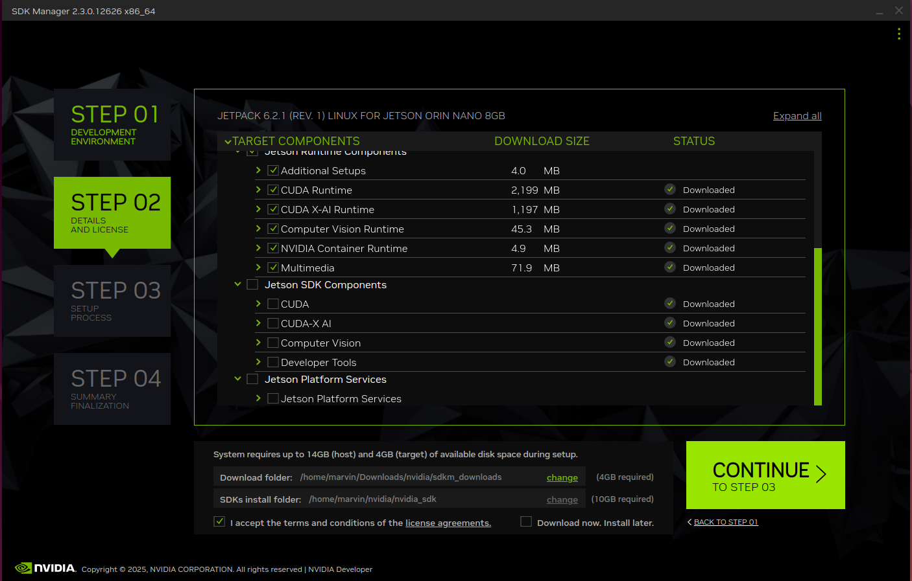

* From the Target Components panel, just select " Jetson OS " to install the base L4T BSP, and deselect "Jetson SDK Components".
* Review the license.
* Enable the checkbox to accept the license agreements.

Click **CONTINUE** button.

On the Step 02 Details and License window;

* Before the installation begins, SDK Manager prompts you to enter your sudo password.

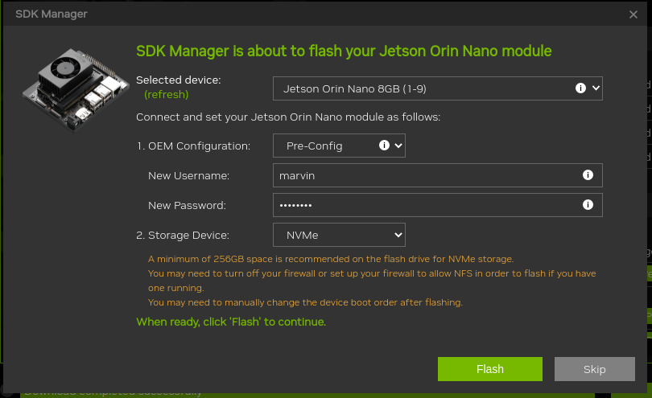

Click **FLASH** button.

<!-- Step 03 Setup Process window shows the download progress.

SDK Manager opens a dialog when it is ready to flash your target device. A prompt provides instructions for preparing your device to get it ready for flashing.

On the flashing prompt;

Select "Manual Setup - Jetson AGX Orin" for 1.
Ignore 7, OEM configuration.
Select your desired storage device to flash the L4T BSP to for 8, Storage Device.
Click Flash button.
When flashing is done, the Jetson developer kit will reboot and boot into the L4T BSP.

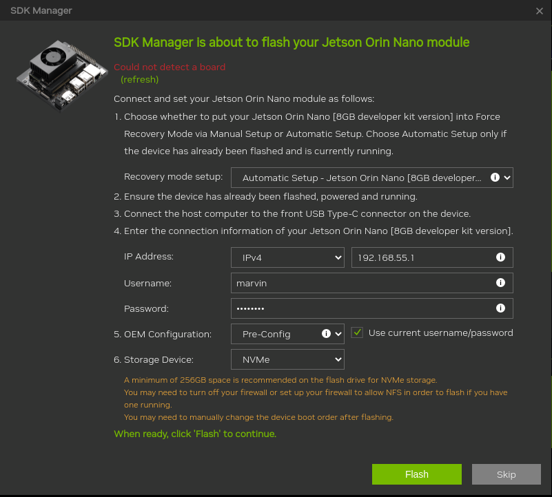
 -->

After this actions we shall have a device with the ubuntu version running.

## Most Likely Causes & Fixes

If the SDK Manager isn’t detecting your Jetson board, it’s usually due to one of these common culprits:

### USB Connection Issues

Make sure you're using a data-capable USB cable (not just a charging cable).

Try different USB ports or cables.

Confirm the board is connected to the correct recovery port.

### Recovery Mode Not Enabled

Jetson boards must be in Force Recovery Mode to be detected.

For most models, this involves shorting specific pins (e.g., FC REC to GND) or pressing a button combo during boot.

### Host System Configuration

Run lsusb on your host machine. You should see something like NVIDIA Corp. APX (ID 0955:7023) if the board is in recovery mode.

If ls /dev/ttyACM* returns nothing, the board might not be properly connected.

## **Headless Setup (No Monitor Required)**

In this flow we prepare the base image for network integration, so that the Jetson can operate via WiFi in the integration phase or in the robot.

If you don’t have a monitor, you can still access Jetson remotely from your laptop:

* Connect Jetson to your local network via a ethernet cable.
* Start ssh in a terminal to access the remote Jetson. The default name of the flashed installation is *ubuntu*

### Rename the computer

renaming the computer to a target name

``` bash
hostnamectl set-hostname ma3jet
```

### Update the computer

Update computer

``` bash
sudo apt update; sudo apt upgrade -y;
```

To see list of available WiFi hotspots (<WiFiSSID>)

``` bash
nmcli d wifi list
```

!!! tip Regulatory domain mismatch
    If your system is set to the wrong country code, it may not scan all channels.
    Set it with (for Germany as an example):
    ``` bash
    sudo iw reg set DE
    ```

To see a list of all saved connections

``` bash
nmcli c
```

if you want to connect to a network called PrettyFlyForAWiFi-5G

``` bash
nmcli -a d wifi connect PrettyFlyForAWiFi-5G
```

-a (or --ask) means it will ask you for the password. The connection will be saved and should connect automatically if you restart your computer.

You could append password <your password> to the end (the literal word password followed by the actual password)

``` bash
nmcli d wifi connect PrettyFlyForAWiFi-5G password 12345678
```

### nmtui ncurses solution

Great interactive ncurses network manager option which can run on a terminal:

``` bash
nmtui
```

If for some reason it is not installed, the Debian package is:

``` bash
sudo apt install network-manager
```

Comes in the same package as nm-applet (the default top bar icon thing) and nm-cli, and is therefore widely available.

Screenshot:

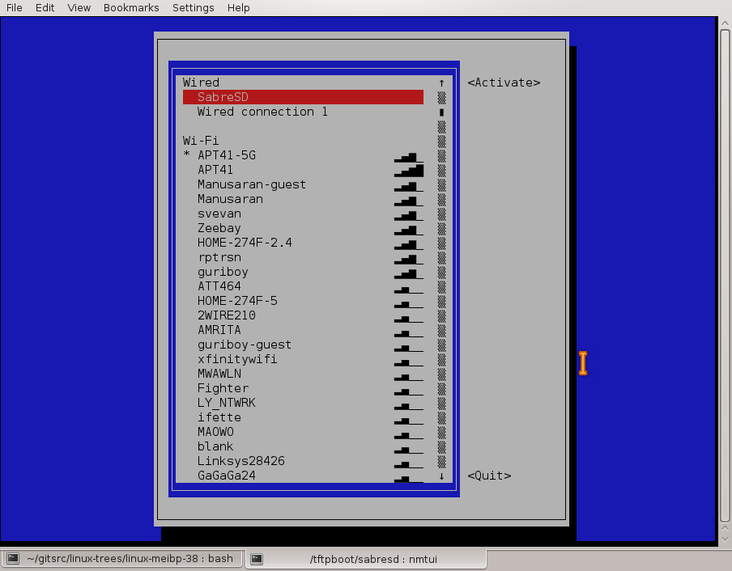

### Check ip address from host

To check the connection ping from the host to the Jetson ip address 

``` bash
 ping -4 ma3jet
PING  (192.168.178.183) 56(84) bytes of data.
64 bytes from ma3jet.fritz.box (192.168.178.183): icmp_seq=1 ttl=64 time=0.870 ms
```

## Persistent Regulatory Domain Setup

When the wifi connection is not compatible with the regulatory domain then the settings must be persisted.

!!! note "This chapter describes the german region"
     Adjust the language to you needs

Create a systemd service:

``` bash
sudo nano /etc/systemd/system/set-regdom.service
```

Add this content:

``` bash
ini
[Unit]
Description=Set regulatory domain
After=network.target

[Service]
Type=oneshot
ExecStart=/sbin/iw reg set DE
RemainAfterExit=yes

[Install]
WantedBy=multi-user.target
```

Enable the service:

``` bash
sudo systemctl enable set-regdom.service
```

This ensures your Jetson Nano always boots with the correct regulatory domain, avoiding channel mismatches with your region.

<!-- 

## Disable IP V6 on the Jetson

Disable via sysctl (temporary or persistent)

### Step 1: Test it temporarily

``` bash
sudo sysctl -w net.ipv6.conf.all.disable_ipv6=1
sudo sysctl -w net.ipv6.conf.default.disable_ipv6=1
``` 

### Step 2: Make it persistent Edit the config file:

``` bash
sudo nano /etc/sysctl.conf
```

Add these lines at the end:

``` Code
net.ipv6.conf.all.disable_ipv6 = 1
net.ipv6.conf.default.disable_ipv6 = 1
```

Then apply:

``` bash
sudo sysctl -p
``` 

-->


## Install the NVIDIA SDKs

Now we can use the sdk manager on the host to install the missing SDKs.

Launch SDK Manger again

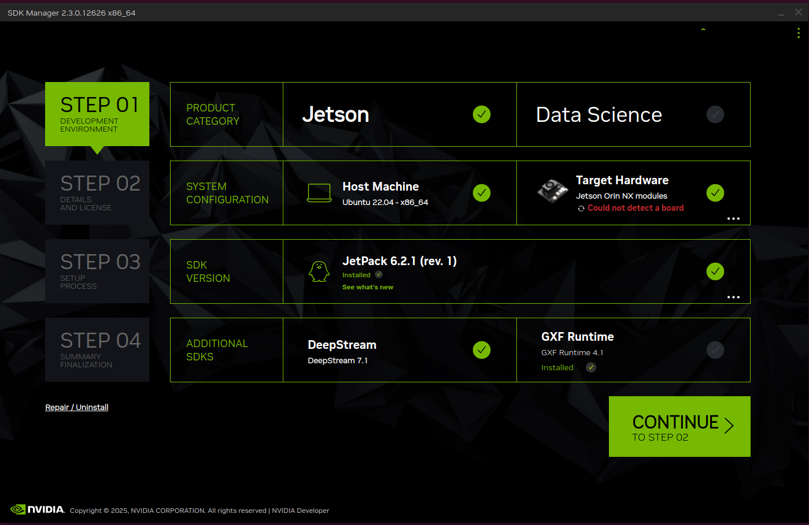

On the Step 01 Development Environment window;

* From the Product Category panel, select Jetson.
* Select installing to Host machine.
* From the Hardware Configuration panel select Jetson Orin Nano Developer Kit for Target Hardware.
* Select required SDK Versions here JetPack and DeepStream.

Click **CONTINUE** button.

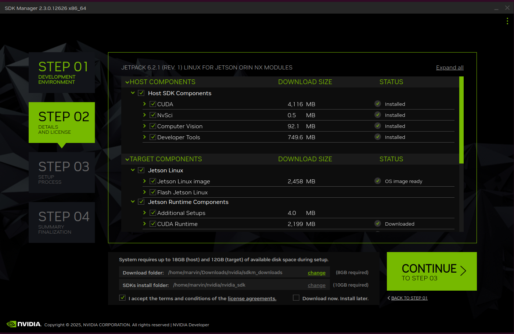


On the Step 02 Details and License window;

* Before the installation begins, SDK Manager prompts you to enter your sudo password.

Click **CONTINUE** button.

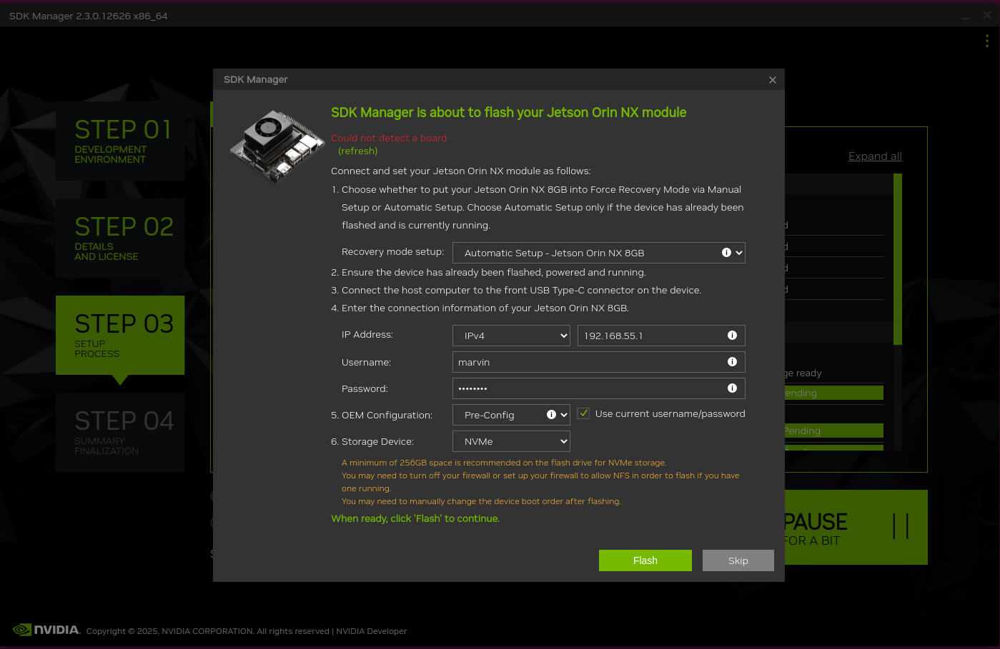


After the Step 02 Details how to connect to the Jetson are required. 

* Specify the Jetson model and network parameter.

Click **FLASH** button.

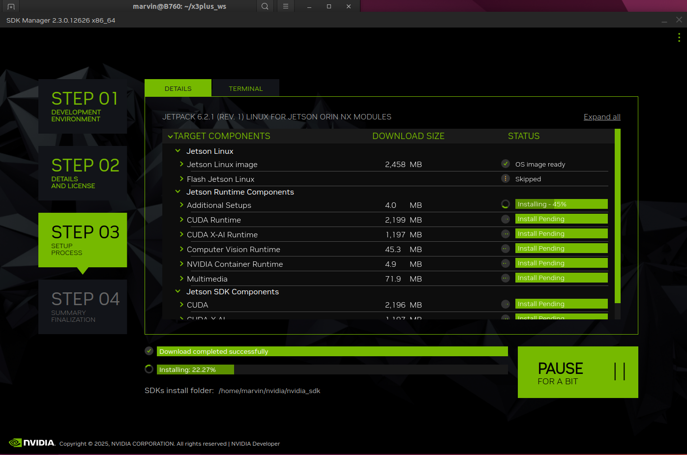

While installation of downloading and installing the SDKs on the Jetson device you can see the current status. 

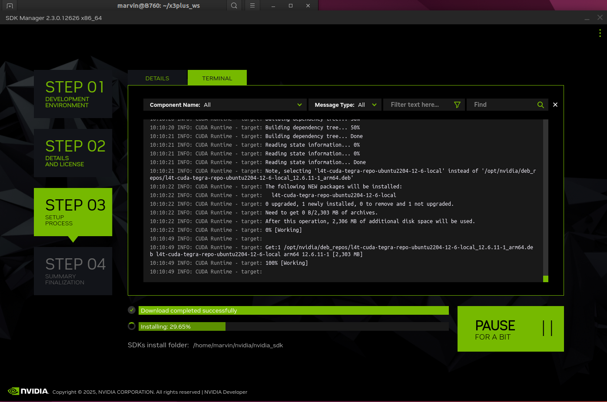

While installation of downloading and installing the SDKs on the Jetson device you can see in ter terminal view the current detailed status.

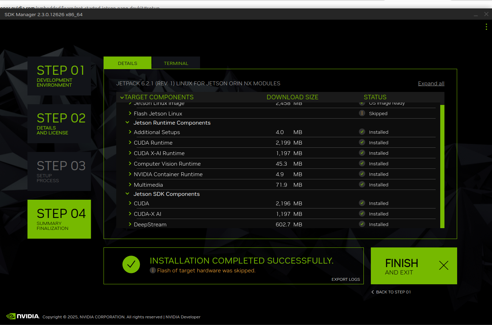

The last step is the acknowledgement of the successful installation.

## Making sure CUDA is installed in Jetson Nano

One way is to check if the CUDA compiler is installed and operational

``` bash
nvcc --version
nvcc: NVIDIA (R) Cuda compiler driver
Copyright (c) 2005-2024 NVIDIA Corporation
Built on Wed_Aug_14_10:14:07_PDT_2024
Cuda compilation tools, release 12.6, V12.6.68
Build cuda_12.6.r12.6/compiler.34714021_0
```

## References

[Initial Setup Guide for Jetson Orin Nano Developer Kit](https://www.jetson-ai-lab.com/initial_setup_jon.html)

[Everything You Need to Set Up Your Development Environment](https://developer.nvidia.com/sdk-manager)

[Jetson Orin Nano Developer Kit User Guide - Software Setup](https://developer.nvidia.com/embedded/learn/jetson-orin-nano-devkit-user-guide/software_setup.html)

[Tips - SSD + Docker](https://www.jetson-ai-lab.com/tips_ssd-docker.html)
