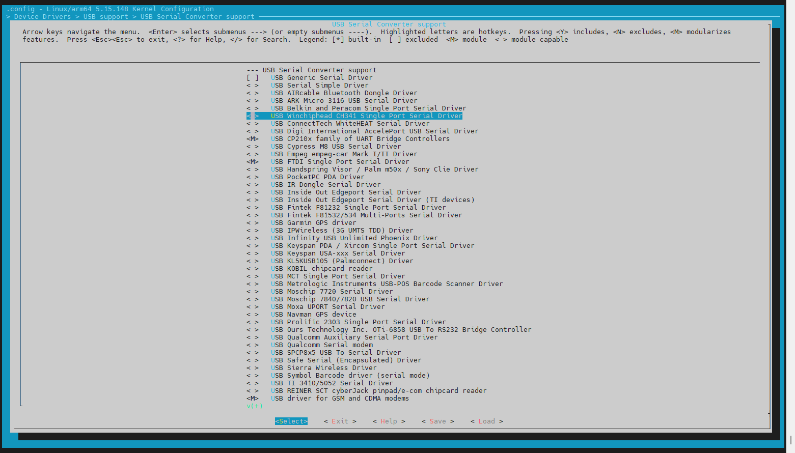

# Build Kernel of Jetson Orin Nano

In my case i have to modify the modules to support out of tree modules for my robot board.

## Query System component versions

Here’s a compact set of CLI commands to check Jetson Linux and JetPack component versions on a **Jetson Orin Nano Super** (assuming it runs Jetson Linux 36.X or similar):

### Jetson Linux & JetPack Version

```bash
dpkg-query --show nvidia-l4t-core
```

- Shows something like: `nvidia-l4t-core 36.4.4-20230925123456`
- `36.4.4` is the Jetson Linux version (part of JetPack 6.2.1)

### CUDA Version

```bash
nvcc --version
```

or

```bash
cat /usr/local/cuda/version.txt
```

### cuDNN Version

```bash
cat /usr/include/cudnn_version.h | grep CUDNN_MAJOR -A 2
```

### TensorRT Version

```bash
dpkg -l | grep nvinfer
```

### All NVIDIA Packages (Quick Overview)

```bash
dpkg -l | grep nvidia
```

### Camera & Multimedia Stack

```bash
dpkg -l | grep libargus
```

or

```bash
dpkg -l | grep nvmm
```

### UEFI Bootloader Version

```bash
cat /proc/device-tree/chosen/bootloader-version
```

### Kernel Version

```bash
uname -a
```

- Should show something like: `Linux jetson 5.15.0-tegra #1 SMP ...`

---

### L4T Release Info

```bash
cat /etc/nv_tegra_release
```

- Gives a summary like: `# R36 (release), REVISION: 4.4, GCID: 12345678, BOARD: jetson-orin-nano`

## Jetson Linux 36.X

Jetson Linux 36.X is NVIDIA’s latest board support package (BSP) for Jetson Orin modules, providing kernel, drivers, bootloader, and Ubuntu-based root filesystem for edge AI development.

!!! warning "Issues with R36 Revision 4.7"
    [R36 (release), REVISION: 4.7 cannot boot up properly](https://forums.developer.nvidia.com/t/r36-release-revision-4-7-cannot-boot-up-properly/347732) has issues with booting and kernel source availability.

    It’s also worth noting that the Jetson Orin Nano has a known issue with booting after updating to L4T R36 release REVISION 47, which is related to a change in the boot configuration. 

Jetson Linux 36.X—specifically version **36.4.4** as of October 2025—is part of the **JetPack 6.2.1 SDK** and is designed to support production-grade deployment on Jetson AGX Orin, Orin NX, and Orin Nano modules. Here's a breakdown of its key features and architecture:

### Core Components

- **Linux Kernel 5.15**: Offers long-term support and improved hardware compatibility.
- **Ubuntu 22.04 Root Filesystem**: Provides a familiar and robust userland environment.
- **UEFI Bootloader**: Modern boot architecture for secure and flexible boot management.
- **OP-TEE**: Trusted Execution Environment for secure operations and cryptographic tasks.
- **NVIDIA Drivers**: Accelerated support for GPU, camera, and AI workloads.

### Security Enhancements

- **Hardware Security Module (HSM) support**: Enables signing of boot images for secure boot.
- **OTA Tools**: For over-the-air updates and remote maintenance.
- **Vulkan 1.3 Support**: For advanced graphics and compute workloads.

### Development Workflow

- **SDK Manager Integration**: Flash Jetson modules and install JetPack components easily.
- **Sample Filesystem and Flashing Utilities**: Streamlined bring-up and customization.
- **Source Availability**: Kernel, drivers, and rootfs sources are hosted on GitHub and NVIDIA’s developer portal.

### Compatibility

- Supports:
  - **Jetson AGX Orin Developer Kit**
  - **Jetson Orin Nano Developer Kit**
  - **All Jetson Orin Production Modules**
- Not backward-compatible with older Jetson platforms like TX2 or Xavier.

### Documentation & Resources

- The [Jetson Linux Developer Guide](https://docs.nvidia.com/jetson/archives/r36.4.4/DeveloperGuide/index.html) provides detailed instructions for flashing, customizing, and deploying Jetson Linux.
- Release notes and BSP packages are available on the [NVIDIA Developer Portal](https://developer.nvidia.com/embedded/jetson-linux-r3644).

!!! warning "Modify Kernel"
    To build a custom kernel with a new driver for a Jetson Orin Nano, you'll need to download the correct sources, configure the kernel, compile it with your driver, and deploy it carefully.

Here’s a step-by-step breakdown tailored for a Jetson Orin Nano Super setup running JetPack 6.x:

---

### 1. Prepare Your Environment

!!! warning "Backup your system"
         or work on a separate SSD to avoid bricking your main setup.

- Install essential packages:

  ```bash
  sudo apt update && sudo apt install -y build-essential bc bison flex libssl-dev libncurses-dev libelf-dev
  ```

### 2. Download Kernel Sources

Use the JetsonHacks scripts or manually grab the BSP (Board Support Package) sources:

!!! warning "Before using these scripts, ensure:"
    You have a Jetson Orin device running JetPack 6.X.

- JetsonHacks repo: [jetson-orin-kernel-builder](https://github.com/jetsonhacks/jetson-orin-kernel-builder)

  ```bash
    git clone https://github.com/jetsonhacks/jetson-orin-kernel-builder.git
  ```

Using the scripts to perform the steps. Start with downloading the sources

  ```bash
    ./scripts/get_kernel_sources.sh --force-replace 
  ```

### 3. Configure the Kernel

<!-- Choose GUI or CLI:

- GUI:

  ```bash
  ./scripts/edit_config_gui.sh
  ```

- CLI: -->

  ```bash
  ./scripts/edit_config_cli.sh
  ```

Enable your driver (either built-in or as a module) via `make menuconfig` or `make xconfig`.

### 4. Integrate Your Driver



<!-- - **In-tree driver**: Place source in the appropriate kernel subdirectory.
- **Out-of-tree driver**: Use `make -C /path/to/kernel M=$(pwd) modules` with proper Makefile setup. -->

### 5. Build the Kernel and Modules

```bash
./scripts/make_kernel.sh
./scripts/make_kernel_modules.sh
```

<!-- Or manually:
```bash
make -j$(nproc) Image modules dtbs
``` -->

### 6. Install and Deploy

!!! tip Install
    If you're only updating kernel modules, you do not need to install or reboot into a new kernel image. You can simply install the updated modules and they’ll be available for use immediately (or after a reboot, depending on what they do).

- Copy the new kernel image:

  ```bash
  cp arch/arm64/boot/Image /boot/Image
  ```

- Install modules:

  ```bash
  sudo make modules_install
  ```
<!-- 
- Update DTBs if needed:

  ```bash
  cp *.dtb /boot/dtb/
  ``` 
  -->

### Check kernel config for new driver

After building the kernel and modules the following command will check if the requested driver is part of the kernel configuration.

``` bash
./scripts/module_info.sh CONFIG_USB_SERIAL_CH341
```

You get the following output

``` bash
Module flag: CONFIG_USB_SERIAL_CH341
Module name: ch341
Module path: drivers/usb/serial/ch341.ko
In .config:
CONFIG_USB_SERIAL_CH341=m
Module type: Standalone module
Kconfig analysis from /usr/src/kernel/kernel-jammy-src/drivers/usb/serial/Kconfig:
  Type: tristate "USB Winchiphead CH341 Single Port Serial Driver"
  Possible values: y (built-in), m (module), n (disabled)
  Dependencies: None explicitly defined
  Selects: None explicitly defined
```

<!-- 
### 7. Flash If Needed
For full deployment or flashing to external storage:
```bash
sudo ./tools/kernel_flash/l4t_initrd_flash.sh --external-device nvme0n1p1 ...
```
Details on flashing are in [this NVIDIA forum guide](https://forums.developer.nvidia.com/t/building-custom-kernel-for-orin-nano-and-orin-nx-and-flashing-it-on-custom-carrier-board-jp-6-0/323540). 
-->

## References

[Build Jetson Orin Kernel and Modules](https://jetsonhacks.com/2025/03/13/build-jetson-orin-kernel-and-modules/)

[Issue with CH340 USB-to-Serial Converter Not Creating Device Files on Jetson Orin Nano Super](https://forums.developer.nvidia.com/t/issue-with-ch340-usb-to-serial-converter-not-creating-device-files-on-jetson-orin-nano-super/326022/7)
