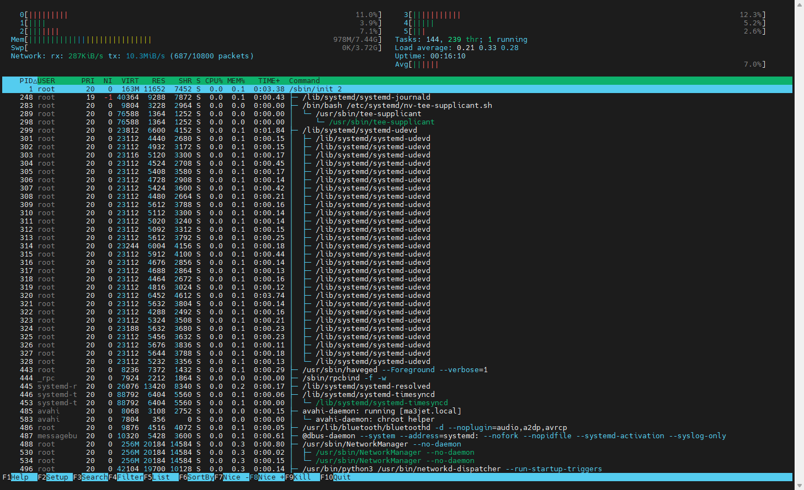

# Setup for Development

Here are a couple of applications and tools i consider as useful for development and operation of the robot.

## Install ssh server

To install a ssh server, so that we con connect from remote.

``` bash
sudo apt install openssh-server
```

## Setup Git

Configure the git for usage with proper user information

``` bash
git config --global user.email "<user email>"
git config --global user.name "<user name>"
git config --global credential.credentialStore cache
```

Configure the git-crendtianl-manager 

!!! Note
    The following procedure works also on a Rasberry PI

``` bash
sudo apt-get install -y dotnet-sdk-8.0
dotnet tool install -g git-credential-manager
git-credential-manager configure
```

## Htop

Htop gives you performance overview with a text UI.



## References

[git-credential-manager](https://github.com/git-ecosystem/git-credential-manager)
