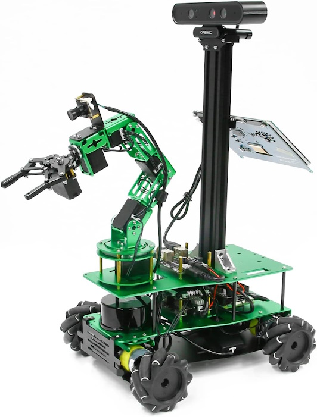
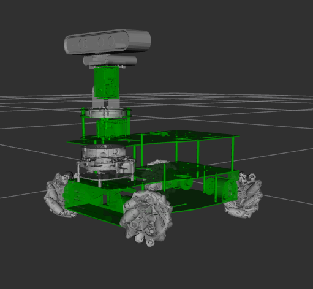
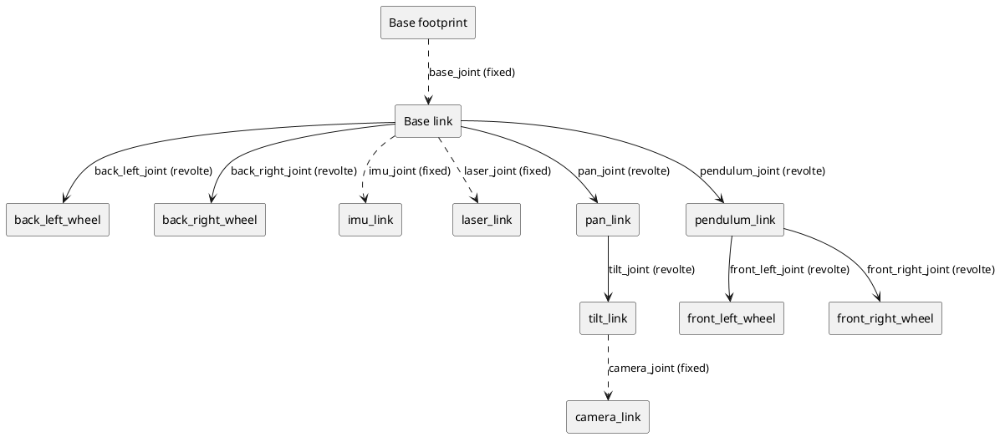
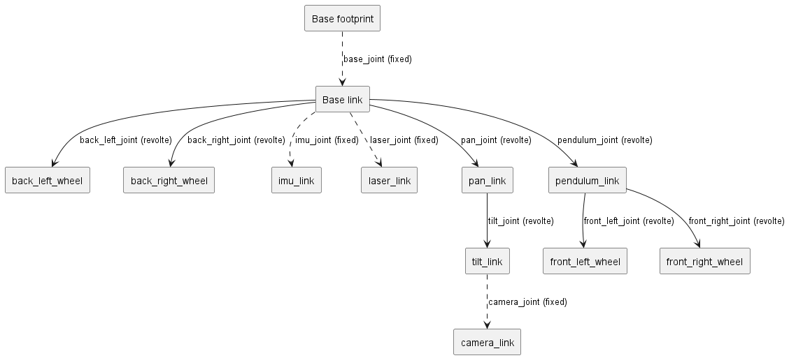

# Describe the robot

## ROSMASTER X3 PLUS

ROSMASTER X3 PLUS is an omnidirectional movement robot developed based on the ROS robot operating system. It supports four controllers: Jetson NANO 4GB/ORIN NX/ORIN NANO and Raspberry Pi 5. It is equipped with high-performance hardware configurations such as lidar, depth camera, 6DOF robotic arm, 520 high-power motor, voice recognition interactive module, and HD 7-inch display screen. It can realize applications such as APP mapping and navigation, automatic driving, human feature recognition, moveIt robotic arm simulation control and multi-machine synchronous control. It supports mobile phones, handles, computer keyboards remote control. 124 video tutorials with Chinese and English subtitles and codes are provided for free.

Reasonable design, unique shape

* X3PLUS supports four development boards: Jetson NANO 4GB/ORIN NX/ORIN NANO/RaspberryPi 5, suitable for different users.
* The whole robot is made of green aluminum alloy material, which is safe and non-toxic, beautiful and durable.
* Mecanum wheel and pendulum suspension chassis can make the robot adapt to uneven ground.

## Vision for a variant

The goal is to modify the original design to a simpler structure. Lets replace the arm with a pan tilt unit to have a flexible visualization unit.

## Logical Structure

The robot has a logical structure, which we should plan for.

<!--

-->

## References

[ROSMASTER X3 PLUS on Github](https://github.com/YahboomTechnology/ROSMASTERX3-PLUS)

[Building a Pan-Tilt Mechanism](https://kamathsblog.com/building-a-pan-tilt-mechanism)