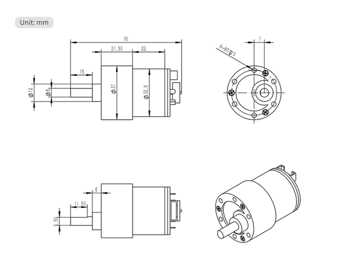
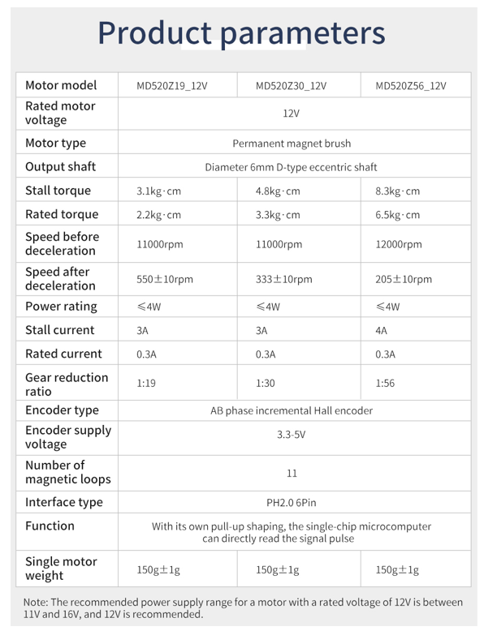

# Motor unit

520 DC Gear Motor: Comes with an encoder for precise speed and position control. Available in different RPM variants (205, 333, 550).

## Encoder output description

The phase difference between the two signals is 100 degrees, and the rotation direction of the motor can be judged according to the sequence of the two signals. The current tire walking distance can be calculated according to the number of signal pulses per unit time and the tire circumference. If only the number of AB-phase pulses per unit time is detected, the speed and slowness of the current motor speed can also be measured.

Take a motor with a reduction ratio of 1:56 as an example, the single-phase output of 11 pulses when the motor rotates one circle, and with a reduction ratio of 1:56, the maximum output of the output shaft of the motor rotates one circle $(56*11*4) = 2464$ counts. The phase difference of AB two-phase output pulse signal is 100 degrees, which can detect the rotation direction of the motor.

$$
f(x) = x^2
$$

