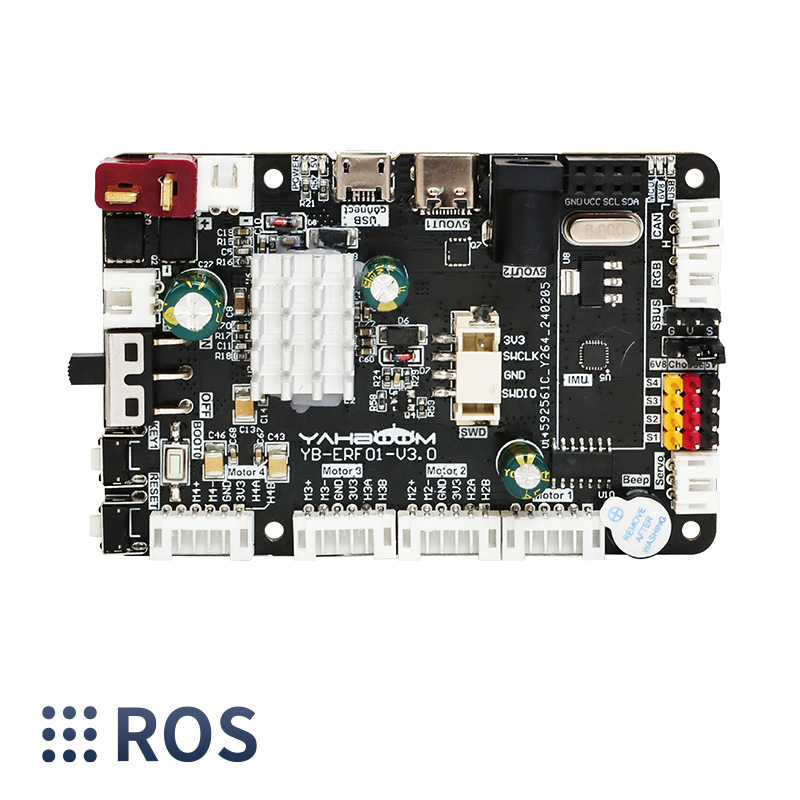

# Yahboom ROS robot control board with STM32F103RCT6 IMU



## Introduction

This robot control board is not only a ROS car driver board, but also a STM32 core development board. It integrates STM32 core control unit, MPU9250 nine-axis attitude sensor and other components, and provides four-way encoder motor, four-way PWM servo, serial bus servo, RGB light bar and other peripheral interfaces. It can communicate and supply power with main control boards such as Raspberry Pi, JETSON series boards, and industrial computers.

## Features

On board 9-axis IMU sensor, STM32 core control unit.
It can drive 4-channel encoder motors, 4-channel PWM servos and serial bus servos.
Support CAN bus communication, USB serial communication, SBUS bus communication.
It can be used for Raspberry Pi, JETSON series boards, industrial computers.
Support 12V voltage input and multiple power supply interface output, refuse to use a safe and stable power supply system.

## Bind PCB port devices

### View the devices connected to the system

``` bash
lsusb
```

You can see the USB device information corresponding to the ROS control board through the lsusb command. (The device ID information we mainly focus on is 1a86:7523)

``` bash
Bus 003 Device 001: ID 1d6b:0002 Linux Foundation 2.0 root hub
Bus 002 Device 002: ID 2109:0817 VIA Labs, Inc. USB3.0 Hub
Bus 002 Device 001: ID 1d6b:0003 Linux Foundation 3.0 root hub
Bus 001 Device 004: ID 1a86:7523 QinHeng Electronics CH340 serial converter
Bus 001 Device 005: ID 2109:8817 VIA Labs, Inc. USB Billboard Device
Bus 001 Device 003: ID 2109:2817 VIA Labs, Inc. USB2.0 Hub
Bus 001 Device 002: ID 2109:3431 VIA Labs, Inc. Hub
Bus 001 Device 001: ID 1d6b:0002 Linux Foundation 2.0 root hub
```

#### Method1

Edit myserial.rules file

``` bash
sudo nano /etc/udev/rules.d/myserial.rules
```

The ROS control board device ID information 1a86:7523 is required here, and the following is the content of the myserial.rules file

``` bash
KERNEL=="ttyUSB*", ATTRS{idVendor}=="1a86", ATTRS{idProduct}=="7523", MODE:="0777", SYMLINK+="myserial"
```

Note: Binding failures often occur at this step. It is recommended to directly open the tutorial copy we provided.

Save the file and exit, then enter the following command to give execution permission to myserial.rules

``` bash
sudo chmod a+x /etc/udev/rules.d/myserial.rules
```

Enter the following three commands to re-plug the ROS control board device.

``` bash
sudo udevadm trigger
sudo service udev reload
sudo service udev restart
```

Enter the following command to check whether the device number is successfully bound.

``` bash
ll /dev/myserial
```

When the picture shown in the figure below appears, it can be considered that the binding is successful.

### Configuration issues when dev/myserial do not show up

There is an issue with the default Ubuntu 22.04 configuration which causes that the device does not show up.

The log message in the demsg might show

``` bash
...
input: BRLTTY 6.4 Linux Screen Driver Keyboard as /devices/virtual/input/input2
usb 1-1.2.4: usbfs: interface 0 claimed by ch341 while 'brltty' sets config #1
ch341-uart ttyUSB0: ch341-uart converter now disconnected from ttyUSB0
ch341 1-1.2.4:1.0: device disconnected
...
```

indicates that the CH341 USB-to-serial converter is being recognized by the kernel but then quickly disconnects. This behavior is most commonly caused by a software conflict—particularly with the **brltty** service on Ubuntu.

### Why Is This Happening?

On some Ubuntu distributions (for example, Ubuntu 22.04), the **brltty** service is installed by default. Its purpose is to provide support for braille displays, but it can mistakenly claim USB-serial devices like those using the CH341 chip (identified by vendor/product IDs such as 1a86:7523). When brltty unexpectedly attaches to your device, it interferes with the standard driver binding process. As a result, the kernel logs show that the device is recognized and attached, then immediately disconnected because brltty takes over control of the device.

### What Can You Do?

If you don't require braille display support (which is the case for most robotics or embedded projects), the recommended solution is to remove or disable brltty.

1. **Remove brltty:**

   Open a terminal and run the following command to remove brltty:

   ```bash
   sudo apt remove --purge brltty
   ```

   This command will uninstall the brltty package along with its configuration files. On some systems, you might also use:

   ```bash
   sudo apt autoremove brltty
   ```

2. **Reconnect Your Device:**

   After uninstalling brltty, disconnect your CH341-based device, wait a moment, and then reconnect it. The system should now bind the device correctly to a ttyUSB node without interference.

3. **Verify the Connection:**

   Use the following commands to verify that the converter is now working properly:

   ```bash
   lsusb
   dmesg | tail
   ls /dev/ttyUSB*
   ```

   You should see a stable entry in `/dev/ttyUSB0` (or another ttyUSB* node) without immediate disconnection messages.

## References

[Yahboom ROS robot control board with STM32F103RCT6 IMU for Raspberry Pi Jetson Robotics](https://github.com/YahboomTechnology/ROS-robot-expansion-board/blob/main/README.md)

[Bind PCB port devices](http://www.yahboom.net/study/ROS-Driver-Board)

[Tutorial on how to write basic udev rules in Linux](https://linuxconfig.org/tutorial-on-how-to-write-basic-udev-rules-in-linux)