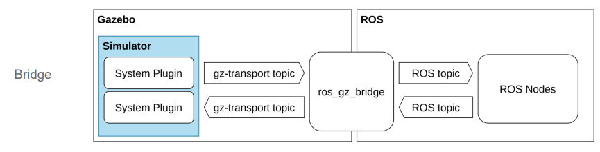

# Simulating the robot

## Gazebo

Gazebo brings a fresh approach to simulation with a complete toolbox of development libraries and cloud services to make simulation easy. Iterate fast on your new physical designs in realistic environments with high fidelity sensors streams. Test control strategies in safety, and take advantage of simulation in continuous integration tests.

## Gazebo Classic vs Gazebo Ignition

Open Robotics started a new platform line as stated in [A new era for Gazebo — Open Robotics.](https://www.openrobotics.org/blog/2022/4/6/a-new-era-for-gazebo)

Let's delve into the comparison between **Gazebo Ignition** and **Gazebo Classic**. These two simulators serve as powerful tools for robotic simulations, but they have some key differences:

1. **Physics Engines**:
   - **Gazebo 11 (Classic)** uses the **ODE** (Open Dynamics Engine) physics engine.
   - **Ignition Citadel** (the successor to Gazebo Classic) employs the **DART** (Dynamic Animation and Robotics Toolkit) physics engine.

2. **Visualization**:
   - **Gazebo 11** relies on the **OGRE** rendering engine for visualization.
   - **Ignition Citadel** also uses **OGRE**, but it supports **OGRE2** by default (although this may not be compatible with all systems).

3. **Inertia**:
   - Both simulators correctly calculate the dynamics of inertia for objects in simulation.
   - However, there's a noticeable difference in rendering: the Gazebo version appears darker, even with identical lighting properties. Shapes in Gazebo lack shadowing on the ground plane, unlike Ignition's rendering¹.

4. **Friction**:
   - Friction behavior highlights a significant distinction.
   - In Gazebo Classic, the coefficient of friction (modeled using ODE parameters) doesn't always behave as expected.
   - For example:
     - A cube with default friction (high friction) should remain stationary.
     - Adjusting the friction coefficients (mu and mu2) along different axes can yield unexpected results.
     - Ignition and Gazebo Classic exhibit different behaviors in these scenarios¹.

5. **Portability**:
   - Both Gazebo and Ignition use **SDFormat** as the world description format.
   - Worlds and models that work in Gazebo can be easily ported to Ignition³.

6. **Plugin Support**:
   - **Ignition Gazebo** supports various plugin types from Gazebo Classic³.

In summary, Ignition Gazebo builds upon the lessons learned from Gazebo Classic, providing a more modular and extensible framework for robotic simulations. The transition from Classic to Ignition is part of a new era for Gazebo, and the community has played a crucial role in its success.

!!! note "Note"
    This project is targeting the LTS Version **Gazebo Harmonic** and not the recommended Humble version.


## Roadmap

The recommended installation for new users is the use of binary packages available for the platform to use:

 | Platform | Gazebo Versions |
 |----------|-----------------|
|Ubuntu 22.04 Jammy | Gazebo Harmonic (recommended), Gazebo Garden and Gazebo Fortress |
|Ubuntu 20.04 Focal | Gazebo Garden (recommended), Gazebo Fortress and Gazebo Citadel |
|Ubuntu 18.04 Bionic | Gazebo Citadel |
|Mac Ventura | Gazebo Harmonic (recommended), Gazebo Garden, Gazebo Fortress and Gazebo Citadel |
|Mac Monterey | Gazebo Harmonic (recommended), Gazebo Garden, Gazebo Fortress and Gazebo Citadel |
|Windows | Support via Conda-Forge is not fully functional, as there are known runtime issues see this issue for details.|

If the desired platform is not listed above or if a particular feature in a given Gazebo release is needed, there is an installation package per release available with all the installation options:

- Gazebo Harmonic installation options (EOL 2028 Sep)
- Gazebo Garden installation options (EOL 2024 Sep)
- Gazebo Fortress (LTS) installation options (EOL 2026 Sep)
- Gazebo Citadel (LTS) installation options (EOL 2024 Dec)

## Setting up Gazebo with ROS 2

Setting up the the robot simulation *gazebo* for ROS 2.

!!! warning **Note:** 
    Please read the following chapter carefully. Based on the decision of the gazebo community to the start a new major version of gazebo and to handle also a rename of the new gazebo version, picking a gazebo version has a lot of dependencies to the setup of an ROS and gazebo integration.

See the [Migration Guide](https://gazebosim.org/docs/harmonic/migration_from_ignition)

## Installing Gazebo with ROS

This chapter provides guidance on using different versions of ROS in combination with different versions of Gazebo. We recommend reading it before installing ros_gz.

### Picking the "Correct" Versions of ROS & Gazebo

If this is your first time using ROS and Gazebo, and you are not following specific instructions or tutorials, we recommend using the latest long term support (LTS) versions of both ROS and Gazebo for the best user experience. Successive versions of ROS and Gazebo releases are named alphabetically, and the documentation for each version of ROS and Gazebo will indicate if it is an LTS version. It is worth noting that each version of ROS works best with a specific version of each Tier 1 platform. Tier one platforms are platforms / host operating systems that are used in the development of ROS and Gazebo. All of this information is outlined in REP-2000.

To summarize, the best user experience is to use the latest LTS version of ROS and the Tier 1 platform / operating system recommend for that version of ROS. If your host operating system does not match the Tier 1 operating system, consider using the Tier 1 platform in a virtual machine. This approach has the added benefit of not modifying your host OS and allowing you to roll back your mistakes.

Different branches of this repository support different combinations of ROS 1, ROS 2 and Gazebo

[](https://github.com/gazebosim/ros_gz/blobblob/ros2/RELEASING.md)

## Integration between ROS and Gazebo

This project is implementing the guide [ros_gz_project_template](https://github.com/gazebosim/ros_gz_project_template), how to use the ros_gz_project_template to create a (recommended) structured workspace or improve your existing workspace for your ROS 2 and Gazebo projects. This template offers a consistent layout, automated build process, and integration with both ROS 2 and Gazebo, enabling you to focus on developing your robotics applications.

!!! note **Note:** 
    This template is incorporated already in the packages.

### Define gazebo version

!!! warning **Note:** 
    We are using a specific and unsupported Gazebo version with ROS 2, you  need to set the GZ_VERSION environment variable, like:

``` bash 
export GZ_VERSION=harmonic
```

!!! note **Note:**
    Best you add this statement in the .bashrc file.

### Map ROS 2 and Gazebo topics/ messages using a bridge



### Accessing Simulation Assets

Simulation assets include your models or robot descriptions in URDF or SDF, meshes and materials files to help visualize different parts of the robot and finally compiling all these elements in a simulated world SDF. Gazebo offers a few different mechanisms for locating those, initializing it's search on GZ_SIM_RESOURCE_PATH environment variable, see gz-sim API on finding resources for more details.

There is a difference in how ROS and Gazebo resolves URIs, that the ROS side can handle package:// URIs, but by default SDFormat only supports model://. Now libsdformat can convert package:// to model:// URIs. So existing simulation assets can be loaded by "installing" the models directory and exporting the model paths to your environment.

This can be automated using colcon environment hooks (shell scripts provided by a ROS package) in a DSV file. Whenever you source the setup file in a workspace these environment hooks are also being sourced. See an example of prepending the model share path to GZ_SIM_RESOURCE_PATH which enables Gazebo to load models from a ROS package using the model:// URI.

## Installation of gazebo  harmonic

The installation is well documented in the web portal.

[Installation of Gazebo](https://gazebosim.org/docs/harmonic/install_ubuntu)

## References

[Integration between ROS and Gazebo](https://github.com/gazebosim/ros_gz)

[Guide to ros_gz_project_template for ROS 2 and Gazebo Development](https://gazebosim.org/docs/latest/ros_gz_project_template_guide)

<!-- The following is a good source. **This is the best source** -->

[Gazebo Tutorials](https://github.com/osrf/gazebo_tutorials/tree/master)

[Ignition vs Gazebo | Allison Thackston.](https://www.allisonthackston.com/articles/ignition-vs-gazebo.html)

[Gazebo : Blog : Gazebo 11.0.0 release.](https://classic.gazebosim.org/blog/gazebo11)

[Migration from Gazebo Classic to Ignition with ROS 2.](https://www.blackcoffeerobotics.com/blog/migration-from-gazebo-classic-to-ignition-with-ros-2)

[Why Ignition Gazebo — gym-ignition documentation - GitHub Pages.](https://robotology.github.io/gym-ignition/master/why/why_ignition_gazebo.html)

[Open Source Robotics: Getting Started with Gazebo and ROS 2](https://www.infoq.com/articles/ros-2-gazebo-tutorial/)

[ROS 2 and Gazebo Integration Best Practices](http://download.ros.org/downloads/roscon/2022/ROS%202%20and%20Gazebo%20Integration%20Best%20Practices.pdf)

[Video RosCon23: ROS 2 and Gazebo Integration Best Practices](https://vimeo.com/showcase/9954564/video/767127300)
