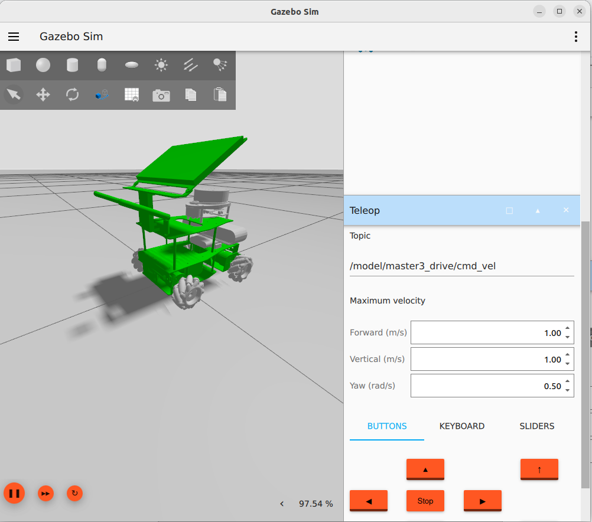

# Simulate the robot

In this chapter we adapt the URDF file description, so that the simulation can handle robot in the relevant aspects.

!!! note "**Note:**"
    Due to the fact, that the Drive system plugin for gazebo has an implementation, but is missing odometry and tf publishing as of April 2024 based on the issue [Add TF publishing in MecanumDrive system](https://github.com/gazebosim/gz-sim/issues/1619), two modes are implemented in the *URDF* model and in the *gazebo* simulation. The mecanum drive and the diff drive behavior.

## Adding Movement

!!! note "**Note:**"
     To improve the development cycle, only build the simulation packages with *colcon build --packages-up-to master3_bringup*

We add a plugin in the urdf file at the end before the end robot tag, for the mecanum case.

``` XML
  <xacro:if value="${mecanum}">
    <gazebo>
        <plugin
        filename="ignition-gazebo-mecanum-drive-system"
        name="ignition::gazebo::systems::MecanumDrive">
        <front_left_joint>front_left_joint</front_left_joint>
        <front_right_joint>front_right_joint</front_right_joint>
        <back_left_joint>back_left_joint</back_left_joint>
        <back_right_joint>back_right_joint</back_right_joint>
        <wheel_separation>0.17</wheel_separation>
        <wheelbase>0.17</wheelbase>
        <wheel_radius>0.042</wheel_radius>
        <min_acceleration>-5</min_acceleration>
        <max_acceleration>5</max_acceleration>
        <odom_publish_frequency>10</odom_publish_frequency>
      </plugin>
    </gazebo>
  </xacro:if>

```

Similar definition is done not the *NON* mecanum case.

``` XML
 <xacro:unless value="${mecanum}">
        <gazebo>
            <plugin
            filename="ignition-gazebo-diff-drive-system"
            name="ignition::gazebo::systems::DiffDrive">
            <left_joint>${ns}front_left_joint</left_joint>
            <right_joint>${ns}front_right_joint</right_joint>
            <!-- Lateral distance between left and right wheels -->
            <wheel_separation>0.169</wheel_separation>
            <!-- Wheel radius -->
            <wheel_radius>0.042</wheel_radius>
            <odom_publish_frequency>1</odom_publish_frequency>
            <max_linear_acceleration>1</max_linear_acceleration>
            <min_linear_acceleration>-1</min_linear_acceleration>
            <max_angular_acceleration>2</max_angular_acceleration>
            <min_angular_acceleration>-2</min_angular_acceleration>
            <max_linear_velocity>0.5</max_linear_velocity>
            <min_linear_velocity>-0.5</min_linear_velocity>
            <max_angular_velocity>1</max_angular_velocity>
            <min_angular_velocity>-1</min_angular_velocity>
          </plugin>
        </gazebo>
    </xacro:unless>
```

We change the collision sections in all wheel links to a sphere, because the Mecanum controller is dependent on this collision model. This is a simplified geometry which models the ideal friction model.

``` XML
<collision>
    <origin xyz="0 0 0" rpy="0 0 0"/>
    <geometry>
        <sphere>
            <radius>0.042</radius>
        </sphere>
    </geometry>
</collision>
```

We need also a adjustment of the friction parameter to mimic  the behavior of the mecanum wheels.

``` XML
<gazebo reference='back_left_wheel'>
    <mu1>1</mu1>
    <mu2>0</mu2>
    <fdir1 expressed_in='base_footprint'>1 1 0</fdir1>
</gazebo>
```

This has to be added to all wheels with different parameter.

!!! note **Note:**
     This configuration is adapted from the official example under [gz-sim/examples/worlds/mecanum_drive.sdf](https://github.com/gazebosim/gz-sim/blob/gz-sim8/examples/worlds/mecanum_drive.sdf)

## Friction in Gazebo

There are several different types of friction that you can model. In the sdformat specification, the most common is the coefficient of friction. The coefficient of friction in version 1.7 of the sdformat is modeled as an ODE parameter with mu as the coefficient for the “first friction direction” and mu2 as the coefficient for the “second friction direction”. There is an additional parameter, fdir1 that can specify a specific primary friction direction relative to the link. Otherwise, it is modeled relative to the world.

## Setting friction

To set the friction direction in Gazebo for **mecanum wheels**, we need to consider the unique behavior of these wheels. Mecanum wheels allow omnidirectional movement by using rollers set at an angle to the wheel's rotation axis. Each roller has its own direction of motion, which makes modeling their friction properties a bit challenging.

Here's how you can approach it:

- Gazebo uses the **Open Dynamics Engine (ODE)** for physics simulation.
- ODE supports two friction coefficients: `mu` (static friction) and `mu2` (dynamic friction) ¹.
- By default, the friction directions corresponding to each coefficient are computed to be orthogonal to each other and the contact normal unit vector.
- If the `fdir1` parameter is not set, the first friction direction is computed from the component of the global X-axis that is orthogonal to the unit normal. The second friction direction is mutually orthogonal using a vector cross product.
- However, this approach doesn't work well for mecanum wheels because their link frame rotates as the wheel spins.

```xml
<surface>
    <friction>
        <ode>
            <mu>1</mu>
            <mu2>0</mu2>
            <fdir1 ignition:expressed_in='chassis'>1 -1 0</fdir1>
        </ode>
    </friction>
    <bounce/>
    <contact/>
</surface>
```

This XML snippet describes the surface properties for a physics simulation. Let's break it down:

1. `<friction>`: Specifies the friction properties.
    - `<ode>`: Indicates that the ODE (Open Dynamics Engine) physics engine is being used.
        - `<mu>`: Coefficient of friction (static friction coefficient). A value of 1 means high friction.
        - `<mu2>`: Coefficient of dynamic friction. A value of 0 means no dynamic friction.
        - `<fdir1>`: Direction of friction force expressed in the chassis coordinate system. The values (1, -1, 0) indicate friction along the x and y axes, but no friction along the z axis.

2. `<bounce>`: Defines the bounce behavior when objects collide. It's not specified here, so the default behavior will apply.

3. `<contact>`: Specifies additional contact properties. Not detailed in this snippet.

Overall, this snippet provides information necessary for simulating interactions between objects with the specified surface properties.

## Adjust Launch File

The launch file *master3_drive.launch.py* will be extended with a handling of the command line parameter.

``` python
  mecanum = LaunchConfiguration("mecanum")
    declare_mecanum_arg = DeclareLaunchArgument(
        "mecanum",
        default_value="True",
        description=(
            "Whether to use mecanum drive controller (otherwise diff drive controller is used)",
        ),
    )
```

The parsing of the *xacro* model will be provided with the parameter of the model generation.

``` python
 robot_description = Command(
    [
        PathJoinSubstitution([FindExecutable(name="xacro")]),
        " ",
        PathJoinSubstitution(
            [
                FindPackageShare("master3_description"),
                "urdf",
                "yahboomcar_X3.urdf.xacro",
            ]
        ),
        " mecanum:=",
        mecanum,
        " namespace:=",
        namespace,
    ]
)
```

Then pass it to the robot publisher as argument

``` python
   robot_state_publisher_node = Node(
        package='robot_state_publisher',
        executable='robot_state_publisher',
        parameters=[{'robot_description': robot_description}]
    )
```

## Starting the simulation

<!-- I think this is gazebo harmonic and  -->
!!! warning "**Note:**"
     As of developing the scenario the WSL from Windows does not support the ogre2 rendering engine. Therefore is always the Ogre Rendering engine used.

<!-- For those that are not using the command line to start Ignition Gazebo, is editing ~/.ignition/gazebo/6/gui.config and change 
``` bash
//plugin[filename=MinimalScene]/engine
```

 from ogre2 to ogre. -->

We start the simulation in an empty world with the following command.

``` bash
ros2 launch master3_bringup master3_drive.launch.py
```

## Check the model in the simulation

### Operate mobile base inside the simulation

After spawning the model in the simulation and an empty world the following actions can trigger the drive logic

- Add the teleop UI in the simulation UI with *...*, search for *Teleop*
- Scroll to the plugin UI
- Enter */model/master3_drive/cmd_vel* as topic.
- Use buttons to move the mobile base



### Operate mobile base with simulation commands

Commands can be send to the simulation to move the mobile base
 
``` bash
gz topic -t "/model/master3_drive/cmd_vel" -m gz.msgs.Twist -p "linear: {x: 0.5, y: 0.5}"

gz topic -t "/model/master3_drive/cmd_vel" -m gz.msgs.Twist -p "linear: {y: 0.5}, angular: {z: 0.2}"

gz topic -t "/model/master3_drive/cmd_vel" -m gz.msgs.Twist -p "linear: {x: 0, y: 0}, angular: {z: 0}"
```

## References

[SDFormat extensions to URDF](http://sdformat.org/tutorials?tut=sdformat_urdf_extensions&cat=specification&)

[Tutorial: ROS2 launch files – All you need to know](https://roboticscasual.com/tutorial-ros2-launch-files-all-you-need-to-know/)

[Mecanum simulation possible using directional friction?.](https://robotics.stackexchange.com/questions/27423/mecanum-simulation-possible-using-directional-friction)

[Modelling of the motion of a Mecanum-wheeled vehicle - arXiv.org.](https://arxiv.org/pdf/1211.2323.pdf)

[Simulate the Mecanum Wheel Robot in Gazebo Harmonic - ROS2 Jazzy Tutorial](https://youtu.be/07nK9Dh-tZM)