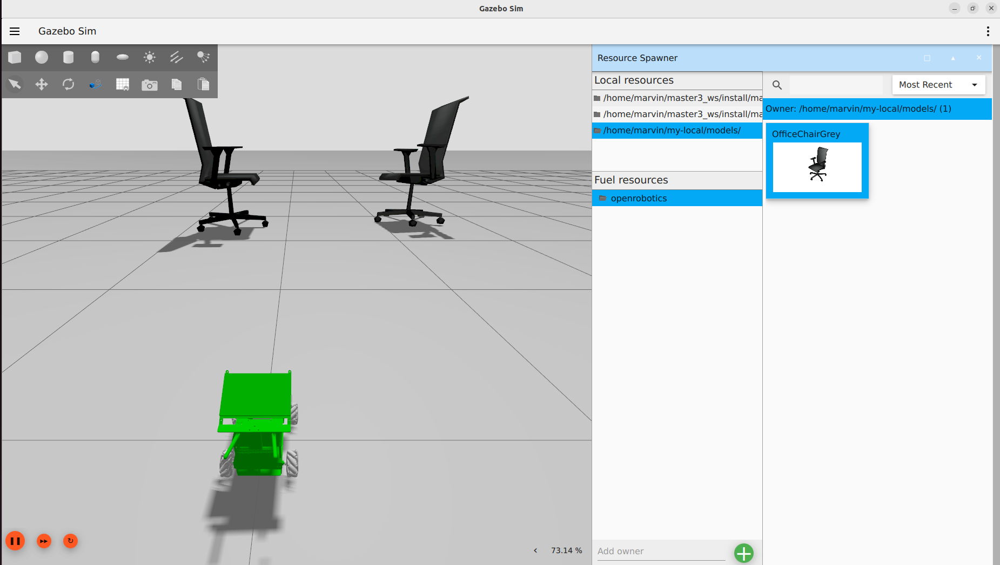
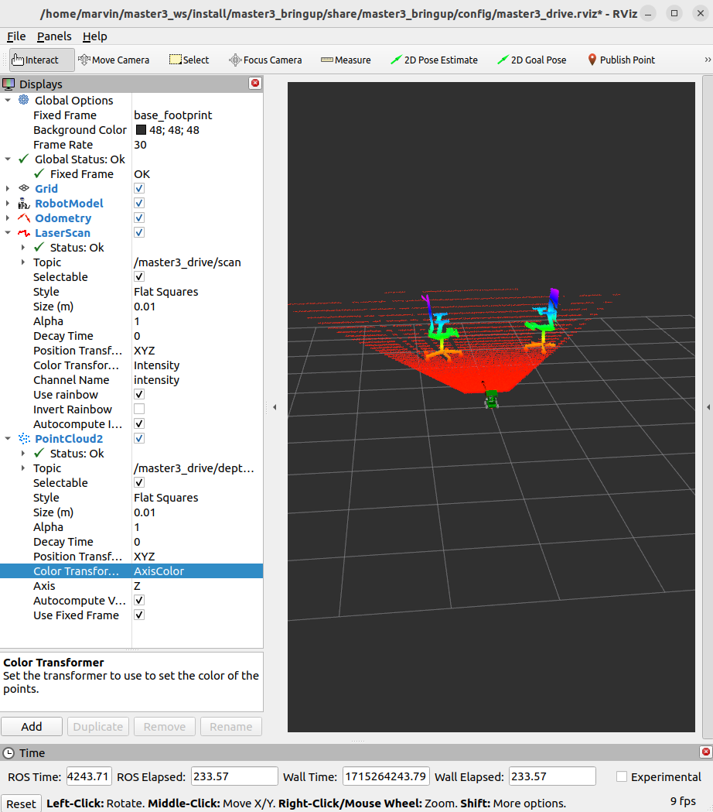

# Worlds

## Accessing Simulation Assets

Simulation assets include your models or robot descriptions in URDF or SDF, meshes and materials files to help visualize different parts of the robot and finally compiling all these elements in a simulated world SDF. Gazebo offers a few different mechanisms for locating those, initializing it's search on GZ_SIM_RESOURCE_PATH environment variable, see gz-sim API on [finding resources](https://gazebosim.org/api/sim/8/resources.html) for more details.

There is a difference in how ROS and Gazebo resolves URIs, that the ROS side can handle package:// URIs, but by default SDFormat only supports model://. Now libsdformat can convert package:// to model:// URIs. So existing simulation assets can be loaded by "installing" the models directory and exporting the model paths to your environment.

This can be automated using colcon environment hooks (shell scripts provided by a ROS package) in a DSV file. Whenever you source the setup file in a workspace these environment hooks are also being sourced. See an example of prepending the model share path to GZ_SIM_RESOURCE_PATH which enables Gazebo to load models from a ROS package using the model:// URI.

### Create local model folder

We create a local folder for the models downloaded locally.

``` bash
mkdir ~/my-local/models/
```

Then we add the following statement to the .bashrc file to point to the additional models.

``` bash
GZ_SIM_RESOURCE_PATH=~/my-local/models/
```

### Downloading models

Download model files from Fuel and spawn from local sources using the Resource Spawner plugin.

Download the model files from [app.gazebosim.org/fuel/models](https://app.gazebosim.org/fuel/models).
Extract the files and places them under your local model directory (e.g. ~/my-local/models/). The folder should contain materials, meshes as well as the model.config and the model.sdf files.

>**Note:** Remember to rebuild with *colcon build* and re-source install/setup.bash to execute the hooks and reload the environment variables before launch the ros2 simulation.

Open the Gazebo Simulator and add the Resource Spawner Plugin, the model should now show up under your local resources.



Placing the objects give more possibilities to evaluate the sensor data in *Rviz2*.



