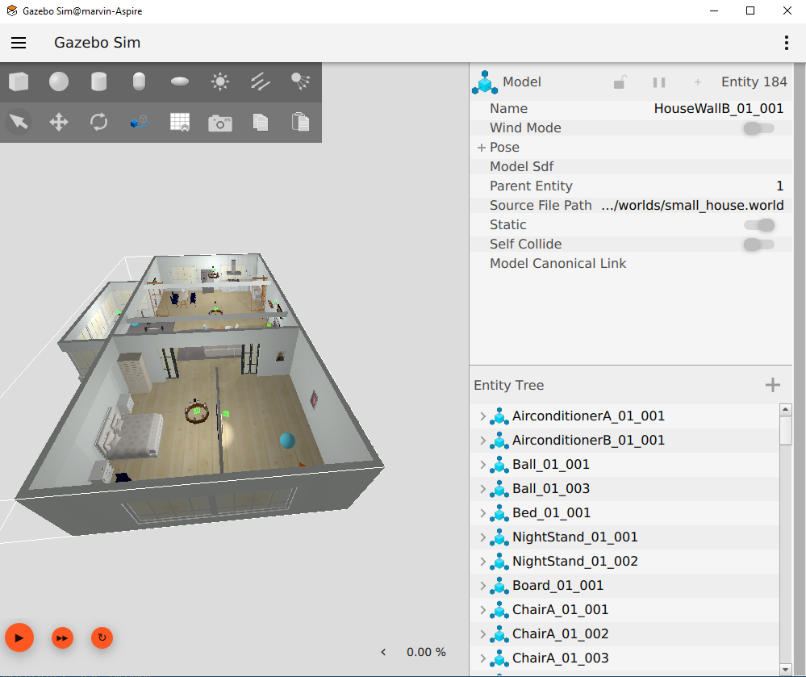
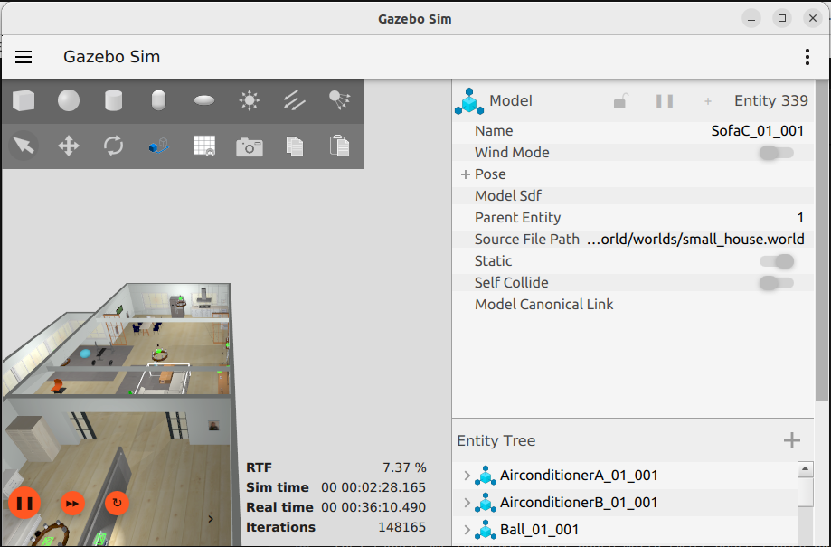
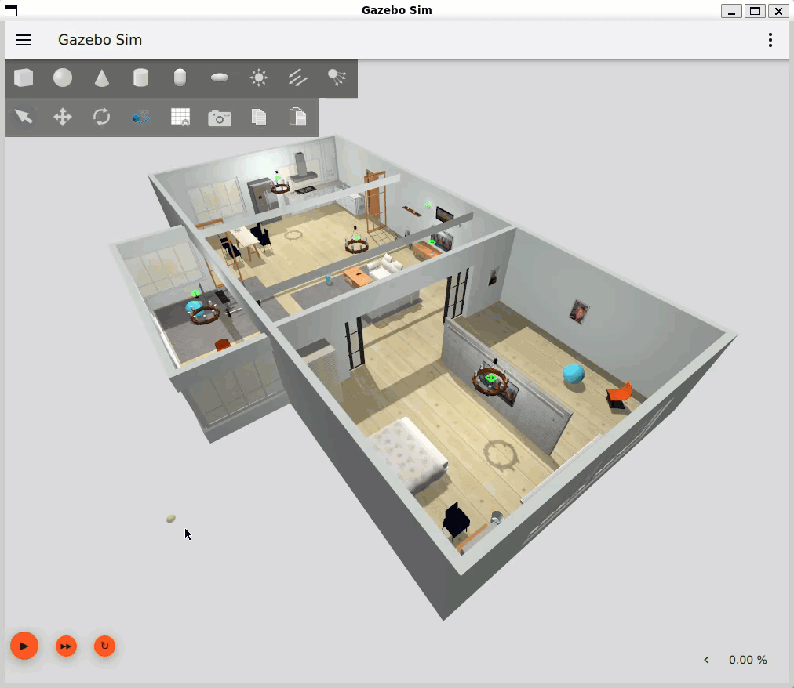

# Adding Worlds

## Using world scenarios

Using robots in more complex scenarios requires a modeled world in a world description. There are some sample world description available in the open source community. Unfortunately most of the world description are targeting the classic gazebo version 11 which require some modification for the usage in the newer gazebo versions.  

### Small house world

Visit the [AWS RoboMaker website](https://aws.amazon.com/robomaker/) to learn more about building intelligent robotic applications with Amazon Web Services.

## Adaption

There are some changes required to use the scenario in *gazebo harmonic* or later. This fork describe the changes to run the branch *ros2* in the harmonic environment.

## Include the world from another package

Update *vcs* config file and add the following entry to load the package into the workspace.

``` yaml
aws-robomaker-small-house-world:
    type: git
    url: https://github.com/cord-burmeister/aws-robomaker-small-house-world.git
    version: ros2
```

* Add the following to your launch file:

```python
    small_house = launch.actions.IncludeLaunchDescription(
        launch.launch_description_sources.PythonLaunchDescriptionSource(
            os.path.join(
                get_package_share_directory('aws_robomaker_small_house_world'),
                'launch',
                'small_house.launch.py')))
```

### Load directly into Gazebo (without ROS)

After change working folder the *aws_robomaker_small_house_world* folder use the following command.

```bash
export GZ_SIM_RESOURCE_PATH=`pwd`/models:$GZ_SIM_RESOURCE_PATH
gz sim worlds/small_house.world
```

### ROS Launch with Gazebo viewer (without a robot)

```bash
# build for ROS2
source /opt/ros/humble/setup.bash
rosdep install --from-paths . --ignore-src -r -y
colcon build

# run in ROS2
source install/setup.sh
ros2 launch aws_robomaker_small_house_world small_house.launch.py gui:=true
```



## Performance and Tuning

Based on the hardware from CPU and GPU and the complexity of the world definition the simulation might run slow. Following chapters shall help to improve the situation.

### Optimizing Gazebo Performance

Gazebo can be resource-intensive, especially when simulating complex environments. Here are some tips for optimizing Gazebo performance:

* Reduce Model Complexity: Use simpler models with fewer polygons.
Disable Unnecessary Sensors: Disable sensors that are not needed for your simulation.
* Adjust Physics Parameters: Experiment with different physics parameters, such as the step size and solver iterations, to find a balance between accuracy and performance.
* Use a Dedicated Graphics Card: A dedicated graphics card can significantly improve Gazebo’s rendering performance.
* Run Gazebo Headless: Run Gazebo in headless mode (without a graphical interface) if you don’t need to visualize the simulation.

### Real Time factor

The first indication how *fast* the simulation is based on a existing world description and an operational hardware is the *real time factor* which is the ratio from simulated time and real time.

You can see it in the UI in the status line on the left side which can be extended.



Without the UI running you can use the topic */world/default/stats* to query the simulation data.

!!! note Note
    Remember the the name of the world is part of the topic. Here it is *default*.

```bash
gz topic -e -t /world/default/stats
```

```bash
sim_time {
  sec: 113
  nsec: 563000000
}
real_time {
  sec: 1640
  nsec: 575232323
}
iterations: 113563
real_time_factor: 0.077084973155543524
step_size {
  nsec: 1000000
}

```

Just divide *simt_time->sec* by *real_time->sec*

### Simulation Parameters

By default, Gazebo simulates the world as fast as it can. The current simulation speed can be observed by the real time factor shown in the Gazebo GUI. A factor of one means the simulation is run in real time, a lower factor means it runs slower.

Since Gazebo uses all of the CPU resources by default, it might be desirable to limit the real time factor to a fixed, lower value. However, when using the (default) ODE physics engine, the factor cannot be set directly, but is rather computed by two other values. The first is the max_step_size (default: 0.001), determining the time in the simulation (in s) to be simulated in one step. The second value is the real_time_update_rate (default: 1000), which determines the minimum time period (in Hz) after which the next simulation step is triggered. The multiplication of these two values is the real_time_factor, which results in a default real time factor of 1, i.e., the simulation never runs faster than real time.

These values must be set in Gazebo, which stores it in world files. Below is an example of an empty time-limited simulation world.

``` XML
    <physics name='default_physics' default='0' type='ode'>
      <max_step_size>0.001</max_step_size>
      <real_time_factor>1</real_time_factor>
      <real_time_update_rate>1000</real_time_update_rate>
    </physics>
```

real_time_update_rate: This is the frequency at which the simulation time steps are advanced. The default value in Gazebo is 1000 Hz. Multiplying with the default max_step_size of 0.001 seconds gives a real_time_factor of 1. If real_time_update_rate is set to 0 the simulation will run as fast as it can. If Gazebo is not able to update at the desired rate, it will update as fast as it can, based on the computing power.

### Reducing world

One simple approach is to remove models which are part of the world description. I this case we remove some decorative objects from the model. This is easily done by comment the model references from the SDF file.

We focus there on the objects which are part of a navigation use case.

### Operating Headless

One possibility to reduce computer load is not to start the Client UI. This is archived by starting the simulation headless with the following launch switch modifying the argument for the simulation in the launch file.

``` bash
 gz_args = "--headless-rendering -s -v 4 -r {world}" if eval(headless) else "-r {world}"
```

### Results

These results are based on a fixed hardware.

| Situation | Changes | RTF (%) | Implications | Remarks |
|-----------|---------|---------|--------------|---------|
| Original world definition | nothing | 7 | Simulation is slow | |
| Changed update rate by factor 10 | step_size = 0.01 update_rate = 100 | 30 | Time behavior of simulation lost accuracy | Higher interactivity |
| Changed update rate 0 | step_size = 0.01 update_rate = 0 | 35 | Time behavior of simulation lost accuracy | |
| Removed the Portrait objects | Comment models | 53 | Images removed from scene | not relevant for robot use cases|
| Removed the Candelier and carpet objects | Comment models | 53 | Images removed from scene | not relevant for robot use cases|
| Removed the higher objects | Comment models | 54 | Images removed from scene | not relevant for robot use cases|
| Running headless | Adjust the launch file | 70 | No simulation visibility | |

### Issue with WSL, gWSL and NVIDIA driver

I was using a Windows 11 environment with an NVIDIA graphics card with the latest driver versions to use Ubuntu in a WSL configuration. This work pretty well except there is an issue with a memory leak in that constellation.

See the issues

* [WSL2 + Docker causes severe memory leaks in vmmem process, consuming all my machine's physical memory](https://github.com/microsoft/WSL/issues/8725)

I can switch to software rendering in the WSL and run gazebo in a headless mode.

``` bash
export LIBGL_ALWAYS_SOFTWARE=1
```

This will slow down the simulation significantly but will have no memory leak.

### The output 



### Conclusion

Using the simplified configuration and model for further development (on my machine).
For configurations topics and structural development i prefer the WSL environment.
For topics require a stable simulation i switch to a native (side by side) ubuntu installation with an NVIDIA graphic Card.

## References

[Finding resources](https://gazebosim.org/api/sim/8/resources.html)

[Guide to ros_gz_project_template for ROS 2 and Gazebo Development](https://gazebosim.org/docs/harmonic/ros_gz_project_template_guide#accessing-simulation-assets)

[Dataset-of-Gazebo-Worlds-Models-and-Maps](https://github.com/mlherd/Dataset-of-Gazebo-Worlds-Models-and-Maps)

[Parameters Applicable to All Physics Engines](https://classic.gazebosim.org/tutorials?tut=physics_params&cat=physics)
