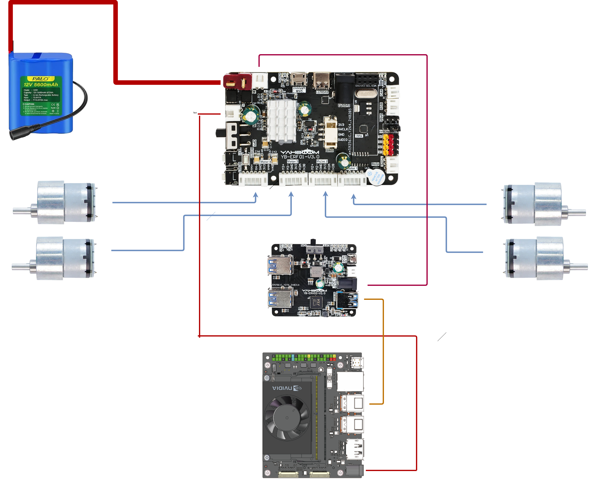

# Wiring the Robot

To wire the Yahboom X3Plus robot properly, follow these key steps:

* Motor Connections
  * Connect each of the four high-power motors to the motor driver board. Ensure correct polarity and secure the connectors to avoid loose contact.

* Expansion Board Setup
  * Mount the expansion board and connect it to the main control board (Jetson Nano, Raspberry Pi, or Orin).
* Use the provided ribbon cables or USB connectors depending on your board type.
* Power Wiring
  * Connect the battery to the power distribution board.
  * Route power lines to the motor driver and control board, ensuring voltage compatibility.

<!-- * Peripheral Modules
  * Attach the depth camera, lidar, OLED screen, and robotic arm to their respective ports.
  * Use labeled connectors and follow the wiring diagram to avoid misplacement.

* Communication Interfaces
  * Connect USB serial lines for voice module and debugging.
  * Use CAN or SBUS interfaces if you're integrating advanced control systems. -->

* Final Checks
  * Verify all connections are secure and match the wiring diagram.
  * Power on the robot and check LED indicators for proper initialization.

For detailed visuals and step-by-step videos, Yahboom provides a full assembly and wiring tutorial. Let me know if you want a breakdown for a specific module like the lidar or robotic arm!

!!! note "Reduced wiring"
    Keep in mind that the current wiring is a reduced subset compared to the full configuration.

