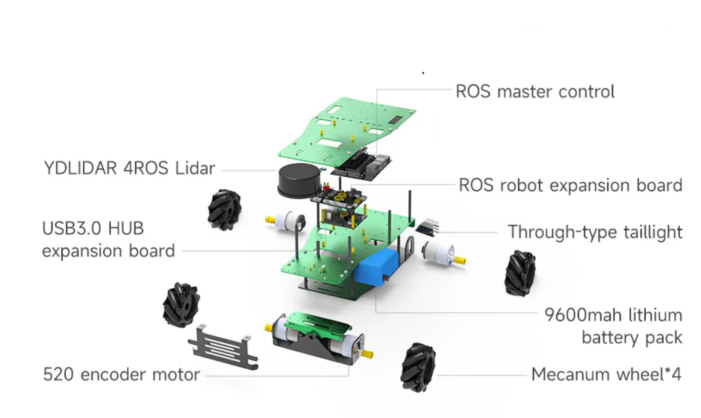

# Mechanical Assembly

!!! note "The robot configuration deviates from the vendor version"
This description is not the configuration of the full vendor version

1. **Prepare the Base Frame and Chassis**
   - Begin by assembling the aluminum alloy base plate and frame. This forms the structural foundation for the robot.
   - [ROSMASTER X3 PLUS Installation Video](https://www.youtube.com/watch?v=JVqzgYPJW0M) walks through the initial chassis setup, including mounting brackets and alignment tips.

2. **Install the Mecanum Wheels and Suspension**
   - Attach the four Mecanum wheels to the motor mounts. Ensure correct orientation for omnidirectional movement.
   - The suspension system (pendulum-style) is mounted to help the robot adapt to uneven terrain.
   - [ROSMASTER X3 ROS2 Robot with Mecanum Wheel for ...](https://www.youtube.com/watch?v=KT_r-rOF3yw) showcases the wheel installation and explains how the suspension improves mobility.

3. **Mount Motors and Wiring**
   - Secure the high-power 520 motors to the chassis and connect them to the motor driver board.
   - Route the wiring cleanly through the frame to avoid interference with moving parts.
   - [ROSMASTER X3--Assembly steps1 3](https://www.youtube.com/watch?v=qeUsH8dlXDo) provides a close-up view of motor placement and cable management.

<!-- 4. **Attach Sensors and Display**
   - Mount the lidar and depth camera modules to the designated slots on the top plate.
   - Install the 7-inch HD display and voice recognition module, ensuring stable connections.
   - These components are shown in context in the [ROSMASTER X3 PLUS Installation Video](https://www.youtube.com/watch?v=JVqzgYPJW0M), especially during the final build walkthrough.

5. **Optional: Robotic Arm Integration**
   - If you're using the 6DOF robotic arm, mount it to the top plate using the provided brackets.
   - Connect servos and calibrate their range of motion.
   - [15.4 [ROSMASTER X3 Plus--Robotic arm control course ...](https://www.youtube.com/watch?v=pj7kQqIleY0) demonstrates how to mechanically install and test the robotic arm.
 -->

## Tips for Efficient Assembly

- Use thread-locking compound on screws to prevent loosening from vibration.
- Label wires during installation to simplify debugging later.
- Test each subsystem (motors, sensors, arm) independently before full integration.
