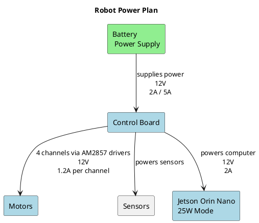
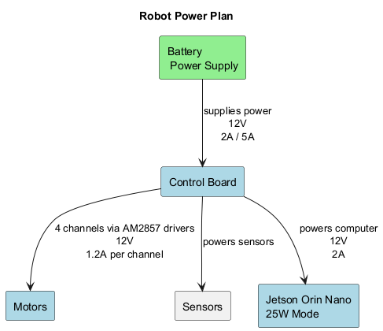

# Power Plan

Breakdown of ROS Robot Control Board V3.0 current-handling capabilities based on Yahboom’s specs and typical usage:

### Power Input

- **Input Voltage:** 12V DC (via T-type barrel connector)
- **Recommended Power Supply:** 12V/2A or higher depending on peripherals

### Current Capacity by Output

| Output Type                  | Max Current Supported | Notes |
|-----------------------------|------------------------|-------|
| **DC Output to Host Board** | Up to **3A**           | For Jetson Nano/NX, Raspberry Pi, etc. |
| **Motor Driver Channels**   | ~**1.2A per channel**  | 4 channels via AM2857 drivers |
| **Serial Bus Servo Port**   | Up to **3A total**     | Shared across serial servos |
| **PWM Servo Ports**         | ~**1A per channel**    | 4 channels |
| **RGB Light Bar**           | ~**500mA**             | Depends on LED count |
| **OLED, Buzzer, etc.**      | Negligible             | Typically <100mA |

### Board Logic Power

- The STM32 MCU and onboard logic draw minimal current (~50–100mA), so most of your current budget goes to motors and host board.

### Safety Tips

- Use a **12V/5A power adapter** if you're driving multiple motors and powering a Jetson board.
- Always check **polarity** and **cable gauge** — especially for XT60-to-barrel or DC-to-Type-C adapters.
- If you're using a battery, ensure it can safely deliver **peak current** (e.g., 5–6A bursts).

<!-- 

-->

USB Ports 4 × USB 3.2 Type-A ports (dual stacked): Host mode only, each stack supports up to 3A VBUS output.
