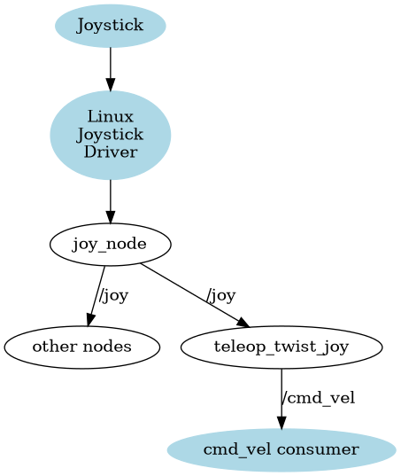
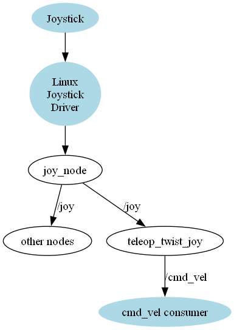
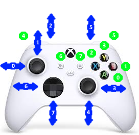

# Adding joystick teleoperations

It doesn't take long to realize though, that it’s not a very practical approach. The keyboard:

Only gives coarse control
Requires terminal window to be kept open and active
Isn't very "portable"
All of this can sometimes make for a less-than-comfortable teleop experience, so we’re going to explore some other options we have to improve things!

## Using a Gamepad

You're probably familiar with gamepads - also known as game controllers. They're usually used for playing video games and are a compact and ergonomic way of controlling many buttons and axes. This tutorial will (try to) avoid using the term "controller" to minimize confusion with the controllers used by ros2_control, but it will sometimes use the word "joystick", which is used by ROS and Linux to refer to all game controllers, not just actual joysticks (which are one large stick, gripped with a hand).

Gamepads generally fall into three main categories:

* Wired (USB)
* Wireless (USB)
* Bluetooth

Each has their pros and cons. Of course within each of these is a whole range of options with different features at different price points.

I am using the Xbox controller


## Why use gamepads for robotics?

!!! warning "No Joystick in WSL Kernel"
    Using the Linux subsystem on windows has a restriction. Although is is possible to map the USB Host Port into the linux subsystem, the joystick support is not enabled for the kernel used in the Ubuntu 22.04 version of the WSL. See [Gamepad support in WSL2 (/dev/jsx) #7747](https://github.com/microsoft/WSL/issues/7747)

So our first step is going to be checking that the gamepad actually works in Linux. Without going too deep into it, there are two different underlying interfaces that Linux can use to handle gamepads, the “old way” and the “new way”. For the most part this isn't something we need to know about, and all the examples in this tutorial will use the “new way” underneath, but in the next tutorial there will be some extra info about the old way, in case your situation requires it.

To check our gamepad works in Linux, we want to install some useful tools:

``` bash
sudo apt install joystick jstest-gtk evtest
```

With the controller connected (e.g. via USB or Bluetooth), we can open a terminal and run *evtest*. It will ask for the event number (it helpfully tells you some options).

``` bash
$ evtest
No device specified, trying to scan all of /dev/input/event*
Not running as root, no devices may be available.
Available devices:
/dev/input/event9: Microsoft X-Box One S pad
Select the device event number [0-9]: 9
Input driver version is 1.0.1
Input device ID: bus 0x3 vendor 0x45e product 0x2ea version 0x301
Input device name: "Microsoft X-Box One S pad"
```

After proceeding, any button presses should cause some new text to come through on the screen.

``` bash
Event: time 1713622172.597958, -------------- SYN_REPORT ------------
Event: time 1713622172.613928, type 3 (EV_ABS), code 1 (ABS_Y), value 56
Event: time 1713622172.613928, -------------- SYN_REPORT ------------
Event: time 1713622172.629927, type 3 (EV_ABS), code 1 (ABS_Y), value 122
Event: time 1713622172.629927, -------------- SYN_REPORT ------------
Event: time 1713622172.653968, type 3 (EV_ABS), code 1 (ABS_Y), value 198
Event: time 1713622172.653968, -------------- SYN_REPORT ------------
Event: time 1713622172.685962, type 3 (EV_ABS), code 1 (ABS_Y), value 265
Event: time 1713622172.685962, -------------- SYN_REPORT ------------
Event: time 1713622172.785972, type 3 (EV_ABS), code 1 (ABS_Y), value 329
Event: time 1713622172.785972, -------------- SYN_REPORT ------------
Event: time 1713622174.590057, type 3 (EV_ABS), code 4 (ABS_RY), value 1432
Event: time 1713622174.590057, -------------- SYN_REPORT ------------
```

## Connecting to Joysticks/Gamepads in ROS

Once Linux can see the gamepad, we need to get it into ROS.

ROS comes with some packages that make working with gamepads and joysticks really easy. Rather than just running one program that generates Twist messages directly (like teleop_twist_keyboard), the process is split into two. The first program communicates with the joystick through the Linux drivers and publishes a sensor_msgs/Joy message - essentially a list of which buttons and axes were pressed at that time. This data can be used by other nodes to drive behavior (e.g. trigger a service when a particular button is pressed, or use an analog stick to steer a camera with a servo). What we’ll be using it for soon is to pick out the thumb stick values and publish an appropriate Twist message.

Although splitting things up might seem more complex, it means that we don't need to rewrite the Twist calculations for every joystick out there, and we don't need to rewrite the joystick driver code for every possible application.

<!--

-->



To listen to a joystick with the new drivers, we can use the tools from the joy package. The first one will tell us which controllers ROS can see:

``` bash
ros2 run joy joy_enumerate_devices
```

``` bash
ID : GUID                             : GamePad : Mapped : Joystick Device Name
-------------------------------------------------------------------------------
 0 : 030000005e040000ea02000001030000 :    true :   true : Xbox One Wireless Controller
```

Now we can open up two terminals to run the two commands below - the first is running the node and the second is displaying the outputs.

Run in first terminal

``` bash
ros2 run joy joy_node 
```

Run in second terminal

``` bash
ros2 topic echo /joy 
```

## Map buttons to index numbers

Each controller version has potential different buttons and mappings.
So first thing is determine the axis and button mapping to the index.

The visual map looks like this



I document that with this mapping table

| Axis / button | Index | description | Mapping |
|---------------|-------|-------------|---------|
| Axis          | 0     | Left thumb stick vertical | Rotate base |
| Axis          | 1     | Left thumb stick horizontal | Move forward |
| Axis          | 4     | Right thumb stick  vertical | |
| Axis          | 3     | Right thumb stick horizontal | Move sideways |
| Axis          | 7     | Directional pad   vertical | |
| Axis          | 6     | Directional pad  horizontal |  |
| Axis          | 2     | Left Throttle | |
| Axis          | 5     | Right Throttle | |
| Button          | 0     | "A" Button | |
| Button          | 1     | "B" Button | |
| Button          | 2     | "X" Button | |
| Button          | 3     | "Y" Button | |
| Button          | 4     | Left Bumper | Activate Turbo |
| Button          | 5     | Right Bumper | Enable Movements |
| Button          | 6     | View  Button | |
| Button          | 7     | Menu  Button | |

## Creating a launch and params file

Before we go any further, we’re going to create a new package for the teleoperations, a launch file and a params file for running our gamepad control. That’s because the next node we’ll be running has a lot of parameters to specify, and typing them all in at the command line will be tedious.

We’ll start with the launch file. Create joystick_xbox.launch.py in the launch directory, and copy-paste the launch script below. This script simply:

* Specifies the path to a params file
* Declares a joy node that uses the params file
* Launches it

``` bash
from launch import LaunchDescription
from launch_ros.actions import Node

import os
from ament_index_python.packages import get_package_share_directory

def generate_launch_description():

    joy_params = os.path.join(get_package_share_directory('master3_teleop'),'config','joystick_xbox.yaml')

    joy_node = Node(
            package='joy',
            executable='joy_node',
            parameters=[joy_params],
         )

    return LaunchDescription([
        joy_node       
    ])
```

Of course we then need to actually write the params file, so we will go ahead and create joystick_xbox.yaml in our config directory. The parameters specified below are only a subset of the full parameter list but they are ones we are more likely to change. The values shown here are actually the same as the defaults, but they are there to change if we need to. We'll learn a bit more about them in the next tutorial.

``` YAML
joy_node:
  ros__parameters:
    device_id: 0
    deadzone: 0.05
    autorepeat_rate: 20.0
```

After a rebuild to add the new files, we should be able to launch joystick_xbox.launch.py and get the same behavior as we did running joy_node directly.

``` bash
ros2 launch master3_teleop joystick_xbox.launch.py 
```

## Converting Joy to Twist

Now that we have our raw joystick data coming through on /joy we need to convert it to a Twist message. The package we use for this is called teleop_twist_joy.

Although we can run it at the command line with ros2 run, there are so many nested parameters to set that it’s not worth it unless we trying to troubleshoot something. Instead, let’s add it straight to our launch file and we’ll pass the parameters using the same joystick.yaml file as earlier to keep things simple.

By default, teleop_twist_joy wants to publish its output to /cmd_vel, but remember our differential drive controller from the last tutorial is subscribing instead to /master3_drive/cmd_vel, so we need to remap the topic name. Also note the example code below explicitly names the node teleop_node. This is because the default "node name" (that we need to set the parameters properly) doesn’t match the "executable name" which, while technically fine, is quite confusing. By explicitly naming it, we force everything to line up.

``` bash
teleop_node = Node(
            package='teleop_twist_joy', 
            executable='teleop_node',
            name = 'teleop_node',
            parameters=[joy_params],
            remappings=[('/cmd_vel', 'master3_drive/cmd_vel')]
            )
#...
```

And add to launch description at the bottom

Now for the parameters. For each of the six dimensions of the Twist we can specify:

Which joystick axis to use

* Max speed in regular mode
* Max speed in turbo mode

Keep in mind that our differential drive robot controller can only linear X and angular Z, so we only need to set those.

We also need to set which button enables regular mode, and which button for turbo mode. Having separate regular and turbo speeds gives us finer control over the robot, especially if your joystick sensitivity is poor or you’re just using the D-pad.

Finally, we have the option of disabling the “dead-man's switch”. By default, you need to keep the regular or turbo button held down while moving the joystick to send commands, so that if something bad happens (e.g you drop the controller and the thumbstick gets bumped), it won’t send any motion commands. This is enabled by default, and the parameters below keep it that way, but you can change it if desired.

So we’ve got axis_linear, scale_linear, scale_linear_turbo, then the same for *angular*. Inside all the linear ones we want to set what it is for the x dimension, and in the angular ones we have yaw (note that it is roll, pitch, yaw here even though the resulting Twist message will refer to the angular axes also as x, y, z). Finally we’ve got the require_enable_button, enable_button, and enable_turbo button.

The example below sets the regular speeds to 0.5 (m/s and rad/s) and the turbos to 1. These are decent defaults and you can tweak them now or later if required. If you can’t remember your axes or button numbers that’s ok, just have a guess so that we can get this to run, and then you can rerun the test tool to confirm it later.

``` bash
# ... below the joy parameters

teleop_node:
  ros__parameters:
    
    axis_linear:  # Left thumb stick vertical
      x: 1
    scale_linear:
      x: 0.5
    scale_linear_turbo:
      x: 1.0

    axis_linear:  # Right thumb stick horizontal
      y: 6
    scale_linear:
      y: 0.5
    scale_linear_turbo:
      y: 1.0

    axis_angular:  # Left thumb stick horizontal
      yaw: 0
    scale_angular:
      yaw: 0.5
    scale_angular_turbo:
      yaw: 1.0

    require_enable_button: true
    enable_button: 5  # Right shoulder button
    enable_turbo_button: 4  # Left shoulder button
```

Once those are in we can rerun the launch file. In a new terminal, run ros2 topic echo /cmd_vel to see the values coming up.

When we move the sticks by themselves there should be nothing, when we hold the regular speed button down, we should get those regular speeds, and likewise the higher speeds with the turbo button.

## Nodes

The resulting nodes for the joystick handling looks like


## References

[Teleoperation by Articulated Robotics](https://articulatedrobotics.xyz/tutorials/mobile-robot/applications/teleop/)
