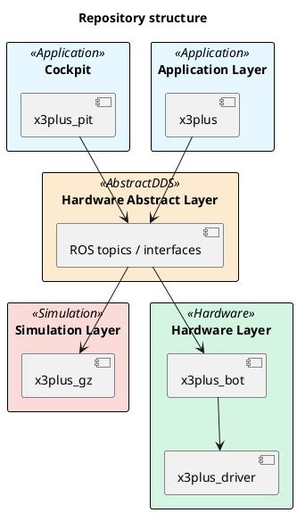
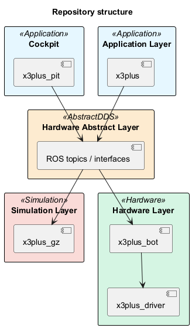

# Project Structuring

The project shall be structured, so that the logic can run in the simulation as well as on the hardware.

## Runtime structure

The goal here is to be able to swap the hardware layer with the simulation layer by using a defined set of communication topics.

<!--

-->

## Implementation status

This is a list of topics which will be supported in the mapping.

!!! note "WIP"
    This mapping is work in progress

| Description | Gazebo | Hardware | Topic | Direction |
| ----------- | ------ | -------- | ----- | --------- |
| Drive Commands |  |  | /cmd_vel | In |
| Odometry |  |  | /wheeled/odom | Out |
| Battery Voltage |  |  | /voltage | Out |
| Imu |  |  | /imu/data_raw | Out |
| LIDAR |  |  | /scan_raw | Out |

<!-- 
| Velocity |  |  | /vel_raw | Out |
| Edition |  |  | /edition | Out |
| Buzzer |  |  | /Buzzer | In |
| MagneticField |  |  | /imu/mag | Out | 
-->

 Topic is integrated

 This has to be done and documented for the final integration

 Topic can be ignored
