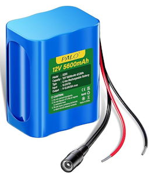

# Battery

Reliable battery integration is essential for autonomous robotic systems, influencing uptime, mobility, and safety. This module outlines a unified approach to managing battery behavior across both physical hardware and simulation environments.

!!! note "No Charging Support"
    We start with a battery modeling without charging support.

## Used Battery

We adapt the values of the battery used in the project



| Parameter | Value |
| --------- | ----- |
| Model | XZ01 |
| Voltage | 12V |
| Capacity | 5600mAH |
| Type | Li-ion Rechargeable Battery |

## Simulation Modeling

In simulation, battery behavior is abstracted to enable realistic testing in a predefined gazebo plugin which simulates a linear battery consumption.

``` XML
<model>
  ...
  <plugin filename="gz-sim-linearbatteryplugin-system"
        name="gz::sim::systems::LinearBatteryPlugin">
        <battery_name>linear_battery</battery_name>
        <voltage>12</voltage>
        <open_circuit_voltage_constant_coef>12</open_circuit_voltage_constant_coef>
        <open_circuit_voltage_linear_coef>-2.0</open_circuit_voltage_linear_coef>
        <initial_charge>5.6</initial_charge>
        <capacity>5.6</capacity>
        <resistance>0.07</resistance>
        <smooth_current_tau>2.0</smooth_current_tau>
        <enable_recharge>false</enable_recharge>
        <charging_time>3.0</charging_time>
        <soc_threshold>0.51</soc_threshold>
        <!-- Consumer-specific -->
        <power_load>2.1</power_load>
        <start_on_motion>true</start_on_motion>
      </plugin>
  ...
</model>
```

Description of the SDF parameters used:

* &lt;battery_name&gt;: The name of the battery.
* &lt;voltage&gt;: Initial voltage of the battery (V).
* &lt;open_circuit_voltage_constant_coef&gt;: Voltage at full charge (V).
* &lt;capacity&gt;: Total charge that the battery can hold (Ah).
* &lt;power_load&gt;: Power load on battery (W).

Description of the SDF optional parameters not used:

* &lt;fix_issue_225&gt;: As reported here, there are some issues affecting batteries in Gazebo Blueprint and Citadel. This parameter fixes the issues. Feel free to omit the parameter if you have legacy code and want to preserve the old behavior.
* &lt;start_draining&gt;: Start draining battery from the beginning of the simulation. If this is not set the battery draining can only be started through the topics set through .
* &lt;start_power_draining_topic&gt;: Topic(s) that can be used to start power draining.
* &lt;stop_power_draining_topic&gt;: Topic(s) that can be used to stop power draining.

When setting the &lt;capacity&gt;, &lt;voltage> of the battery and its &lt;power_load&gt;, keep in mind the following formula:

$$ battery\_runtime (hours) = capacity * voltage / power\_load$$

We need to add the mapping from gazebo to ROS in the bridge file.

``` yaml
- ros_topic_name: "/battery_state"
  gz_topic_name: "/model/x3plus_bot/battery/linear_battery/state"
  ros_type_name: "sensor_msgs/msg/BatteryState"
  gz_type_name: "gz.msgs.BatteryState"
  direction: "GZ_TO_ROS"
```

## Hardware Integration

In the physical robot, battery handling involves:

* **Voltage and Current Monitoring**: Using ADCs or dedicated battery management ICs to track charge levels and detect undervoltage conditions.
* **Power Distribution**: Isolating high-current loads and protecting sensitive components via fuses, regulators, and soft-start circuits.
* **Thermal and Safety Management**: Implementing temperature sensors and cutoff logic to prevent overheating or over-discharge.
* **Charging Interface**: Supporting safe charging protocols (e.g., CC/CV for Li-ion) with status feedback to the control system.

## References

[Gazebo Battery](https://gazebosim.org/api/sim/8/battery.html): The battery system keeps track of the battery charge on a robot model.

[How to Create a Battery State Publisher in ROS 2](https://automaticaddison.com/how-to-create-a-battery-state-publisher-in-ros-2/): Tutorial to show you how to create a simulated battery state publisher in ROS 2.
