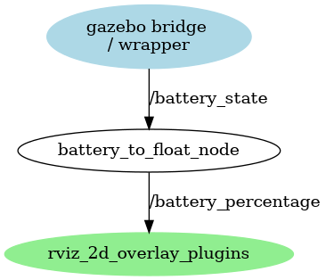
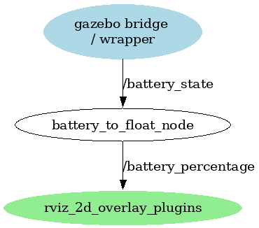

# Battery

Reliable battery integration is essential for autonomous robotic systems, influencing uptime, mobility, and safety. This module outlines a unified approach to managing battery behavior across both physical hardware and simulation environments.

!!! note "No Charging Support"
    We start with a battery modeling without charging support.

## Used Battery

We adapt the values of the battery used in the project


| Parameter | Value |
| --------- | ----- |
| Model | XZ01 |
| Voltage | 12V |
| Capacity | 5600mAH |
| Current | 5A max |
| Type | Li-ion Rechargeable Battery |

## Simulation Modeling

In simulation, battery behavior is abstracted to enable realistic testing in a predefined gazebo plugin which simulates a linear battery consumption.

!!! warning "Simulation stops all joint changes when battery is empty"
    When the battery is empty there is no possible movement more for the model.

!!! Note "Linear Battery Model"
    The linear battery model assumes a constant power draw from the battery, leading to a linear decrease in charge over time. This simplification is suitable for many robotic applications where power consumption remains relatively stable.

``` XML
<model>
  ...
  <plugin filename="gz-sim-linearbatteryplugin-system"
        name="gz::sim::systems::LinearBatteryPlugin">
        <battery_name>linear_battery</battery_name>
        <voltage>12</voltage>
        <open_circuit_voltage_constant_coef>12</open_circuit_voltage_constant_coef>
        <open_circuit_voltage_linear_coef>-2.0</open_circuit_voltage_linear_coef>
        <initial_charge>5.6</initial_charge>
        <capacity>5.6</capacity>
        <resistance>0.07</resistance>
        <smooth_current_tau>2.0</smooth_current_tau>
        <enable_recharge>false</enable_recharge>
        <charging_time>3.0</charging_time>
        <soc_threshold>0.51</soc_threshold>
        <!-- Consumer-specific -->
        <power_load>2.1</power_load>
        <start_on_motion>true</start_on_motion>
      </plugin>
  ...
</model>
```

Description of the SDF parameters used:

* &lt;battery_name&gt;: The name of the battery.
* &lt;voltage&gt;: Initial voltage of the battery (V).
* &lt;open_circuit_voltage_constant_coef&gt;: Voltage at full charge (V).
* &lt;capacity&gt;: Total charge that the battery can hold (Ah).
* &lt;power_load&gt;: Power load on battery (W).

Description of the SDF optional parameters not used:

* &lt;fix_issue_225&gt;: As reported here, there are some issues affecting batteries in Gazebo Blueprint and Citadel. This parameter fixes the issues. Feel free to omit the parameter if you have legacy code and want to preserve the old behavior.
* &lt;start_draining&gt;: Start draining battery from the beginning of the simulation. If this is not set the battery draining can only be started through the topics set through .
* &lt;start_power_draining_topic&gt;: Topic(s) that can be used to start power draining.
* &lt;stop_power_draining_topic&gt;: Topic(s) that can be used to stop power draining.

When setting the &lt;capacity&gt;, &lt;voltage> of the battery and its &lt;power_load&gt;, keep in mind the following formula:

$$ battery\_runtime (hours) = capacity * voltage / power\_load$$

We need to add the mapping from gazebo to ROS in the bridge file.

``` yaml
- ros_topic_name: "/battery_state"
  gz_topic_name: "/model/x3plus_bot/battery/linear_battery/state"
  ros_type_name: "sensor_msgs/msg/BatteryState"
  gz_type_name: "gz.msgs.BatteryState"
  direction: "GZ_TO_ROS"
```

## Hardware Integration

In the physical robot, battery handling involves:

* **Voltage and Current Monitoring**: Using ADCs or dedicated battery management ICs to track charge levels and detect undervoltage conditions.
* **Power Distribution**: Isolating high-current loads and protecting sensitive components via fuses, regulators, and soft-start circuits.
* **Thermal and Safety Management**: Implementing temperature sensors and cutoff logic to prevent overheating or over-discharge.
* **Charging Interface**: Supporting safe charging protocols (e.g., CC/CV for Li-ion) with status feedback to the control system.

!!! note "Battery Handling"
    The robot's robot battery handling is handled by the ROS robot control board which includes voltage and current sensing capabilities along with safety features.

The linear battery model is not perfect for real Li-Ion Batteries.
Non-Linear Discharge Curve: Li-ion batteries (like the 12V XZ01 pack, likely a 3S configuration of 18650 cells) don't discharge linearly. Voltage typically:

* Starts high (~12.6V fully charged).
* Drops slowly at first (plateau around 12-11V for much of the capacity).
* Then declines more steeply toward the end (down to ~9-10V at cutoff).

Linear model assumes a straight drop from 12V to 10V, which overestimates voltage early in discharge and underestimates it late. This could lead to inaccurate SOC estimates in hardware integration.
Battery Specs: Based on general XZ01 specs (a common 12V 5.6Ah Li-ion pack), the actual curve might look more like this rough approximation:

* 100% SOC: ~12.6V
* 80% SOC: ~12.2V
* 50% SOC: ~11.8V
* 20% SOC: ~11.0V
* 0% SOC: ~9.0V (cutoff)

Other Factors: Temperature, load current, and aging affect the curve. Simulation assumes constant power_load (2.1W), but real discharge varies with current draw.

## What C‑rating corresponds on a Li‑ion battery?

To compute the C‑rating, you divide the discharge current by the battery’s capacity:

$$
\text{C-rate} = \frac{\text{discharge current (A)}}{\text{capacity (Ah)}}
$$

The C-rate expresses how much current a battery can safely deliver relative to its capacity

## Calculating Battery Runtime

Key Calculations

* **State of Charge (SOC):**

  * SOC = (voltage - min_voltage) / (max_voltage - min_voltage)
  * SOC = (voltage - 10) / (12 - 10) = (voltage - 10) / 2
  * Clamp SOC to [0.0, 1.0] to avoid invalid values.
* **Charge:**
  * charge = $SOC * capacity = SOC * 5.6 Ah$
* **Percentage:**
  * percentage = SOC * 100 (as a float, e.g., 85.5 for 85.5%)
* **Voltage:**
  * Directly use the measured/available voltage value.
* **Current:**

  * If you have a current sensor, use the measured value.
  * Otherwise, estimate from the model's power_load (2.1W): current ≈ power_load / voltage = 2.1 / voltage (A). Note: This is a rough approximation and assumes constant power draw—real hardware may vary.
* **Capacity:**
  * Fixed at 5.6 Ah (from your battery spec).
Other Fields (set based on hardware status):
* **power_supply_status:**
 Set to 2 (DISCHARGING) if voltage > min_voltage and not charging.
* **power_supply_health:** Set to 1 (GOOD) unless you have fault detection.
* **power_supply_technology:** Set to 3 (LION) for Li-ion.
* **present:** Set to true.
* **cell_voltage, cell_temperature, location, serial_number:** Populate if available from hardware; otherwise, leave empty or set defaults.
* **header:** Include timestamp and frame_id (e.g., "battery").

### Curve Based SOC Calculation

For a more accurate model based on the typical Li-ion discharge curve, use piecewise linear interpolation with the following voltage-SOC points (approximated for XZ01):

* 12.6V → 100% SOC
* 12.2V → 80% SOC
* 11.8V → 50% SOC
* 11.0V → 20% SOC
* 9.0V → 0% SOC

**Calculation Steps:**

1. If voltage ≥ 12.6V, SOC = 1.0
2. If voltage ≤ 9.0V, SOC = 0.0
3. Otherwise, find the interval $[V_i, V_{i+1}]$ where $V_i ≤ voltage < V_{i+1}$
4. Interpolate: $SOC = SOC_i + (SOC_{i+1} - SOC_i) * (voltage - V_i) / (V_{i+1} - V_i)$

This provides better accuracy than the linear model, accounting for the plateau and steeper drop-off.

## Code

Here is ROS 2 Python code that publishes battery state based on the above calculations:

```python
import rclpy
from sensor_msgs.msg import BatteryState

# Constants from your model
CAPACITY = 5.6  # Ah
POWER_LOAD = 2.1  # W

# Voltage-SOC curve points (voltage, SOC)
CURVE_POINTS = [
    (12.6, 1.0),  # 100% SOC
    (12.2, 0.8),  # 80% SOC
    (11.8, 0.5),  # 50% SOC
    (11.0, 0.2),  # 20% SOC
    (9.0, 0.0)    # 0% SOC
]

def calculate_soc_from_curve(voltage: float) -> float:
    """Calculate SOC using piecewise linear interpolation from the discharge curve."""
    if voltage >= CURVE_POINTS[0][0]:
        return 1.0
    if voltage <= CURVE_POINTS[-1][0]:
        return 0.0
    
    for i in range(len(CURVE_POINTS) - 1):
        v1, soc1 = CURVE_POINTS[i]
        v2, soc2 = CURVE_POINTS[i + 1]
        if v1 >= voltage >= v2:  # Note: voltages are decreasing
            # Linear interpolation
            soc = soc1 + (soc2 - soc1) * (voltage - v1) / (v2 - v1)
            return max(0.0, min(1.0, soc))
    return 0.0  # Fallback

def calculate_battery_state(voltage: float, current_measured: float = None) -> BatteryState:
    msg = BatteryState()
    msg.voltage = voltage
    msg.capacity = CAPACITY
    
    # Calculate SOC using curve
    soc = calculate_soc_from_curve(voltage)
    
    msg.charge = soc * CAPACITY
    msg.percentage = soc * 100.0
    
    # Current
    if current_measured is not None:
        msg.current = current_measured
    else:
        msg.current = POWER_LOAD / voltage if voltage > 0 else 0.0
    
    # Other fields
    msg.power_supply_status = BatteryState.POWER_SUPPLY_STATUS_DISCHARGING
    msg.power_supply_health = BatteryState.POWER_SUPPLY_HEALTH_GOOD
    msg.power_supply_technology = BatteryState.POWER_SUPPLY_TECHNOLOGY_LION
    msg.present = True
    
    return msg
```

## Adding Battery State to Cockpit

We add the battery state topic to the cockpit configuration file to visualize the battery status in the cockpit interface. We are using the rviz2 [rviz_2d_overlay_plugins](https://github.com/teamspatzenhirn/rviz_2d_overlay_plugins) plugin to visualize the battery state.

Therefore, we need to add the conversion from BatteryState message to the a float message which can be visualized in the rviz2.

### Node structure

The final node structure with the relevant topics are described below.

* /gazebo: When starting the simulation the gazebo bridge will publish the ROS message.
* /wrapper_node: Start the car chassis, obtain the speed vel data of the wheels, and publish it
* /battery_to_float_node: Receive the battery state data and convert it to a float message for visualization in rviz2.

<!--


-->



## References

[Gazebo Battery](https://gazebosim.org/api/sim/8/battery.html): The battery system keeps track of the battery charge on a robot model.

[How to Create a Battery State Publisher in ROS 2](https://automaticaddison.com/how-to-create-a-battery-state-publisher-in-ros-2/): Tutorial to show you how to create a simulated battery state publisher in ROS 2.

[Battery Discharge Curve](https://www.powerstream.com/li.htm): Information about Li-Ion battery discharge curves.

[Lithium-Ion Battery C-Rate Explained: Charge & Discharge Limits, Heat, and Safety](https://batteryuniversity.com/article/bu-409-what-is-c-rate): Explanation of C-Rate for Lithium-Ion batteries.

[How to Read Lithium Battery Discharge Curve and Charging Curve?](https://www.evspecifications.com/en/news/2021-07-15-how-to-read-lithium-battery-discharge-curve-and-charging-curve): Guide on reading lithium battery discharge and charging curves.
