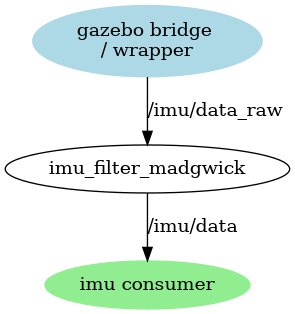
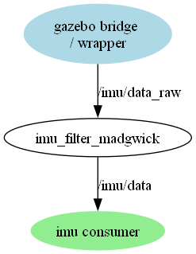
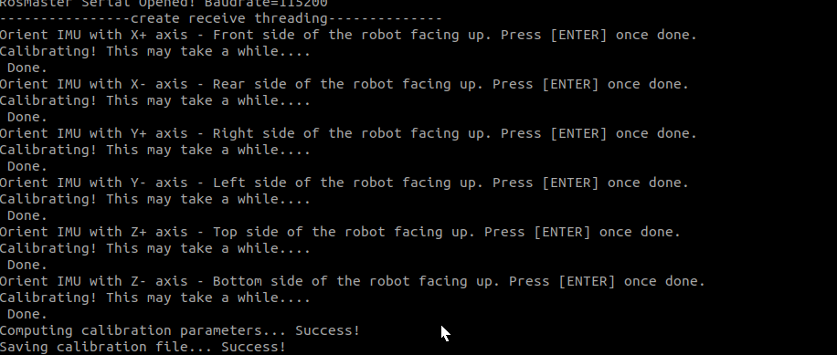

# IMU Sensor

An inertial measurement unit (IMU) is an electronic device that measures and reports a body's specific force, angular rate, and sometimes the orientation of the body, using a combination of accelerometers, gyroscopes, and sometimes magnetometers. When the magnetometer is included, IMUs are referred to as IMMUs.

## IMU in Robots

An Inertial Measurement Unit (IMU) typically consists of a 3-axis accelerometer, 3-axis gyroscope, and sometimes a 3-axis magnetometer. It measures linear acceleration, angular velocity, and possibly magnetic heading (orientation). It's important to remember that it's not possible to measure uniform motion with an IMU where the velocity is constant (acceleration is zero) and there is no change in the orientation. Therefore we cannot replace the odometry of the robot with an IMU but with the right technique we can combine these two into a more precise measurement unit.

## IMU in ROS

### Data Sources

* *Accelerometers*
The accelerometers report linear acceleration data expressed in the sensor frame of the device. This data is output from the driver as a 3D vector, representing the specific force acting on the sensor.
When the device is at rest, the vector will represent the specific force solely due to gravity. I.e. if the body z axis points upwards, its z axis should indicate +g. This data must be in m/s^2.
* *Gyroscopes*
The gyroscopes report the rotational velocity of the sensor frame w.r.t. an inertial frame, expressed in the sensor frame. This data is provided from the driver as a 3D vector.
The rotational velocity is right handed with respect to the body axes, and independent of the orientation of the device. This data must be in rad/s.
* *Magnetometers*
The magnetometers report magnetic field strength in the sensor frame of the device. This data is output from the driver as a 3D vector, with the components representing magnetic field strength in each direction. When an axis is aligned with magnetic north, its field strength reading is at maximum. This data must be in Tesla.
* *Orientation*
The IMU sensor may provide a fused orientation estimate. This data is output from the driver in the form of a quaternion, which represents the orientation of the sensor frame w.r.t. the world frame.
In the neutral orientation, the sensor frame is aligned with the world frame, hence the orientation will be the identity quaternion.

## IMU integration to the project

### Physical integration

!!! warning TODO
  Check chapter

!!! tip Missing documentation
    None of the publicly available Yahboom documentation retrieved through search explicitly states the physical orientation (axis directions) of the MPU‑9250 IMU on the Yahboom ROS Robot Control Board V3.0. 

Because Yahboom does not publish a coordinate-frame diagram for the board, the orientation must be determined experimentally or by inspecting the PCB silkscreen.

#### What you *can* infer

The Yahboom board uses an **MPU9250**, whose *chip-internal* axes are standardized:

| Axis | MPU9250 default orientation (chip-level) |
|------|-------------------------------------------|
| X    | Right (when looking at the top of the chip) |
| Y    | Forward |
| Z    | Up (out of the chip) |

But the **board designer can rotate the chip arbitrarily**, so this does *not* tell us how the axes map to the robot.

#### How to determine the orientation yourself

You can identify the board’s IMU orientation in under 2 minutes:

### Run `ros2 topic echo /imu/data_raw`)

Move the robot:

* Tilt **nose up** $\to$ check which axis shows **+Z or -Z** acceleration change
* Tilt **right side down** $\to$ check which axis shows **+Y or -Y**
* Push forward $\to$ check which gyro axis increases

This gives you the exact mapping.

### Look for silkscreen markings

Many Yahboom boards print:

* A small **triangle** on the IMU chip corner  
* Or **X/Y arrows** on the PCB

### Adapt to sensor capabilities

Based on the capabilities of the sensor and driver functionality the orientation will be provided or not.

This can be checked with the following command.

``` bash
 ros2 topic echo /imu/data_raw --field orientation
```

Here you see that the simulation provide the orientation for the IMU sensor.

``` bash
---
x: -0.0001511083073851361
y: 1.5951034194709974e-05
z: -0.9761329020842162
w: -0.21717397261294985
---
x: -0.0001511080195247618
y: 1.594975751617487e-05
z: -0.9761329020840713
w: -0.21717397261389504
```

In my case the sensor of the chosen robot board and IMU sensor does not provide the orientation but only the raw sensor data as defined in REP-0145.

Therefore the simulation shall not provide the data of the orientation.

### Topics

The following topics are expected to be common to many devices - an IMU device driver is expected to publish at least one. Note that some of these topics may be also published by support libraries, rather than the base driver implementation. All message types below are supplemented with a std_msgs/Header, containing time and coordinate frame information.

* *imu/data_raw* (sensor_msgs/Imu)
Sensor output grouping accelerometer (linear_acceleration) and gyroscope (angular_velocity) data.
* *imu/data* (sensor_msgs/Imu)
Same as imu/data_raw, with an included quaternion orientation estimate (orientation).
* *imu/mag* (sensor_msgs/MagneticField)
Sensor output containing magnetometer data.

### Node structure

The final node structure with the relevant topics are described below.

* /gazebo: When starting the simulation the gazebo bridge will publish the ROS message.
* /wrapper_node: Start the car chassis, obtain the speed vel data of the wheels, and publish it
* /Imu_filter_madgwick Receive the imu data released by the chassis, filter it through its own algorithm, and publish the filtered imu/data data to/ekf_filter_node;

<!--


-->



### Adapt the wrapper code for the raw data

The wrapper is reading the IMU data from the hardware driver.

``` python
    ax, ay, az = self.car.get_accelerometer_data()
    gx, gy, gz = self.car.get_gyroscope_data()
    mx, my, mz = self.car.get_magnetometer_data()
```

Then we need to fill the ROS message

``` python
      # Populate IMU data
      imu.header.stamp = time_stamp.to_msg()
      imu.header.frame_id = self.imu_link
      imu.linear_acceleration.x = ax * 1.0
      imu.linear_acceleration.y = ay * 1.0
      imu.linear_acceleration.z = az * 1.0
      imu.angular_velocity.x = gx * 1.0
      imu.angular_velocity.y = gy * 1.0
      imu.angular_velocity.z = gz * 1.0
```

The IMU needs covariances - and if they’re zero or missing, the EKF will ignore those measurements just like it did with the custom odom.

**robot_localization** expects every fused sensor (odom, IMU, etc.) to provide a full 36-element covariance for pose and twist; it uses those to weigh the measurements in the EKF.

For a typical **sensor_msgs/Imu** on a planar robot, you need:

* orientation_covariance: 9 values
* angular_velocity_covariance: 9 values
* linear_acceleration_covariance: 9 values

None of the fused entries may be zero if you want the EKF to accept them.

``` python
 # orientation quaternion already set here… 
        imu.orientation_covariance = [ 
            99999.0, 0.0, 0.0, 
            0.0, 99999.0, 0.0, 
            0.0, 0.0, 0.05 # yaw 
        ] 
        imu.angular_velocity_covariance = [ 
            99999.0, 0.0, 0.0, 
            0.0, 99999.0, 0.0, 
            0.0, 0.0, 0.02 # yaw rate 
        ] 
        imu.linear_acceleration_covariance = [ 
               0.5, 0.0, 0.0, 
               0.0, 0.5, 0.0, 
               0.0, 0.0, 0.5 
        ]
```

### IMU structure in robot description

But first, let's add our IMU to the urdf:

``` XML
    <link name="imu_link"/>
    <fixed_joint name="base_imu" parent="base_link" child="imu_link" 
        xyz="0.001 0.017 0.0322" rpy="0 3.1415 1.5707"/> 
```

Which is a simple link and a fixed joint in the center of the base link.
The rpy attribute inside a &lt;joint&gt; element is used to define the orientation of the joint's axis in 3D space—specifically, how the child link is rotated relative to the parent link. rpy stands for roll, pitch, and yaw, which are the rotations around the X, Y, and Z axes respectively. It uses Euler angles in radians to express these rotations.

* xyz: sets the position of the joint
* rpy: sets the orientation of the joint

So if you see rpy="0 1.5708 0", it means the joint frame is rotated 90 degrees around the Y-axis.

Let's add the plugin to the URDF or XACRO file too:

``` XML
 <gazebo reference="imu_link">
        <sensor name="imu_sensor" type="imu">
            <always_on>1</always_on>
            <update_rate>10</update_rate>
            <visualize>true</visualize>
            <topic>imu</topic>
            <gz_frame_id>imu_link</gz_frame_id >
            <imu>
              ... error model
            </imu>
        </sensor>
    </gazebo>
```

The simulation is generating gazebo IMU message on the topic *imu* which then is mapping the bridge configuration to a IMU Message in ROS on the topic */imu/data_raw*

``` yaml
- ros_topic_name: "/imu/data_raw"
  gz_topic_name: "/imu"
  ros_type_name: "sensor_msgs/msg/Imu"
  gz_type_name: "gz.msgs.IMU"
  direction: "GZ_TO_ROS"
```

With adding the IMU we aren't done yet, with the new Gazebo we also have to make sure that our simulated world has the right plugins within its &lt;world&gt; tag. We add the following code to the URDF description do add the plugin in the gazebo world.

``` XML
    <gazebo>
        <plugin
        filename="gz-sim-imu-system"
        name="gz::sim::systems::Imu">
        </plugin>
    </gazebo>
```

### IMU noise and covariance

In Gazebo we don’t actually set the covariance matrix directly on the IMU sensor; we set noise parameters in the SDF/URDF, and Gazebo publishes an IMU message whose covariance fields are usually all zeros. Gazebo Sim currently doesn’t provide an API to modify the IMU covariances themselves; the sensor noise is read from the $<imu>$ noise tags in the SDF instead.

MPU-9250 Noise Specs (needed for covariance) From the MPU-9250 datasheet (typical values):

Accelerometer

* Noise density: $300 \mu g/ \sqrt{Hz} \approx 0.00294 m/s^2/\sqrt{Hz}$
* Bias instability: $\sim 0.02 m/s^2$

Gyroscope

* Noise density: $0.005 0^\circ /s/\sqrt{Hz} \approx 8.7e-5 {rad}/s/\sqrt{Hz}$
* Bias instability: $\sim 0.005 0^\circ/s$

**Gazebo IMU noise (simulation realism)**
In $<sensor type="imu">$ we define Gaussian noise for angular velocity and linear acceleration, e.g.:

``` xml
<sensor name="imu_sensor" type="imu">
  <always_on>1</always_on>
  <update_rate>100</update_rate>
  <imu>
    <angular_velocity>
      <x>
       <noise type="gaussian"> 
        <mean>0.0</mean> 
        <stddev>8.7e-5</stddev> <!-- gyro noise density --> 
        <bias_mean>0.0</bias_mean> 
        <bias_stddev>8.7e-5</bias_stddev> 
        </noise>
      </x>
      <y> ... same ... </y> 
      <z> ... same ... </z>
    </angular_velocity>
    <linear_acceleration>
      <x> 
        <noise type="gaussian"> 
          <mean>0.0</mean> 
          <stddev>0.00294</stddev> <!-- accel noise density --> 
          <bias_mean>0.0</bias_mean> 
          <bias_stddev>0.02</bias_stddev> 
        </noise> 
      </x>
      <y> ... same ... </y> 
      <z> ... same ... </z>
    </linear_acceleration>
  </imu>
</sensor>
```

This gives a very realistic MPU-9250-like IMU.

<!-- 
**2. ROS-side IMU covariance (for EKF, filters, etc.)**
Since Gazebo often publishes zero covariances, normally override / set the covariance on the ROS side (e.g., in an IMU filter node, a small wrapper node, or in the EKF params). The usual practice:

* Fill only the diagonal entries of the $3×3$ sub-matrices (orientation, angular velocity, linear acceleration).
* Use $covariance = \sigma^2$
where $\sigma$ is the standard deviation (noise level) you want to assume.

If a part of the IMU is not used or unreliable, set its covariance to a very large value (e.g. $1𝑒3$ or higher) so the EKF effectively ignores it.

Concrete starting point (tune later, don’t treat as “correct” constants):

* Orientation covariance diagonal: something like $(0.05 rad)^2$ if you trust orientation moderately.
* Angular velocity covariance diagonal: derived from your $<angular\_velocity><noise><stddev>$ in SDF:
if $stddev = 0.0001$, $covariance = (0.0001)^2$.
* Linear acceleration covariance diagonal: same: $covariance ≈ ({stddev} {from} {SDF})^2$. -->

## Why Calibrate an IMU?

IMUs are affected by:

* Bias: Constant offset in sensor readings
* Scale factor errors: Incorrect sensitivity (e.g., 1g reads as 0.95g)
* Misalignment: Sensor axes not perfectly orthogonal
* Cross-axis sensitivity: One axis responds to motion in another
* Magnetic distortion: From nearby electronics or metal

Without calibration, these errors accumulate and degrade performance in all use cases using the IMU sensor.

## When Should an IMU be calibrated?

1. First-Time Use
    * Always calibrate  IMU the first time a new robot or sensor will be powered up.
    * Factory calibration may not match environment or mounting orientation.
2. After Firmware Updates
    * Firmware changes can reset or alter sensor parameters.
    * Recalibration ensures consistency with the new software.
3. After Physical Changes
    * If:
        * Re-mount the IMU
        * Change the robot’s frame
        * Add new hardware near the IMU
    * These can introduce new biases or magnetic interference.
4. After Temperature Shifts
    * IMU bias can drift with temperature.
    * If robot was calibrated in a warm room but now operates in a cold garage, recalibration helps.
5. After Changing Locations
    * Especially for magnetometer calibration:
        * Moving more than ~50 km
        * Operating near large metal structures or power lines
    * Local magnetic fields vary and can distort heading.
6. After a Crash or Shock
    * Sudden impacts can knock sensors out of alignment.
    * Always recalibrate after a fall, collision, or hard landing.
7. If Symptoms are noticed
    Watch for signs like:
    * Robot drifting when stationary
    * Inaccurate heading or orientation
    * Wobbling or instability in SLAM or navigation
    * Long warm-up times (especially for drones)
8. Periodic Maintenance
    * Even without issues, recalibrate every few months or after 100+ hours of operation, depending on your IMU quality.

## Types of IMU Calibration

| Calibration Type         | Purpose                                                      |
| ------------------------ | ------------------------------------------------------------ |
| Bias Calibration         | Removes constant offset when sensor is stationary            |
| Scale Calibration        | Corrects for incorrect sensitivity (e.g., 1g <> 9.81 m/s2)   |
| Misalignment             | Compensates for non-orthogonal sensor axes                  |
| Magnetometer Calibration | Removes hard/soft iron distortions in magnetic field readings|

## Typical Calibration Workflow

1. Bias Calibration (Static)
    * Keep the IMU still
    * Average readings over time
    * Subtract average from future readings

2. Scale Factor Calibration
    * Move the IMU through known accelerations or rotations
    * Compare expected vs. measured values
    * Adjust scale factors
3. 6-Position Accelerometer Calibration
    * Place IMU in 6 orientations: ±X, ±Y, ±Z
    * Use gravity (1g) as reference
    * Estimate both bias and scale
4. Magnetometer Calibration
    * Rotate IMU in all directions (figure-8 motion)
    * Fit data to a sphere or ellipsoid
    * Remove hard/soft iron distortions
5. Verification
    * Compare IMU output to known references (e.g., motion capture)
    * Fine-tune parameters if needed

## imu_calib Package

imu_calib is a ROS (Robot Operating System) package designed to compute and apply calibration parameters for IMU (Inertial Measurement Unit) sensors.
It’s typically used to correct biases, scale factors, and misalignments in accelerometer data so that IMU readings are more accurate.

### Key Features

Data Collection: Captures raw IMU data while the sensor is placed in multiple static orientations.
Calibration Computation: Estimates accelerometer bias, scale, and misalignment parameters.
Parameter Storage: Saves calibration results to a YAML file for later use.
Real-Time Correction: Applies calibration parameters to incoming IMU messages.

### Typical Workflow

Install the package

``` Bash
cd ~/ros2_ws/src
git clone https://github.com/mzahana/imu_calib.git
cd ..
colcon build
source install/setup.bash
```

Collect calibration data

Place the IMU in at least 6 different static orientations.
Run:

``` Bash
ros2 run imu_calib collect_data --ros-args -p output_file:=imu_data.csv
```

Compute calibration parameters

``` Bash
ros2 run imu_calib calibrate --ros-args -p input_file:=imu_data.csv -p output_file:=imu_calib.yaml
```

Apply calibration in real-time

``` Bash
ros2 run imu_calib apply_calib --ros-args -p calib_file:=imu_calib.yaml
```

Example YAML Output

``` Yaml
accelerometer:
  bias: [0.01, -0.02, 0.005]
  scale: [1.002, 0.998, 1.001]
  misalignment:
    - [1.0, 0.001, -0.002]
    - [-0.001, 1.0, 0.003]
    - [0.002, -0.003, 1.0]
```

!!! note Notes
    * Works with ROS 1 and ROS 2 (different branches).
    * Requires the IMU to be stationary during calibration data collection.
    * Calibration improves orientation estimation and sensor fusion results.

## Bias Calibration: Step-by-Step

To use imu_calib, a ROS package for calibrating IMU sensors, you’ll typically follow a two-step process: compute calibration parameters and then apply them. Here's a breakdown of how to do that.

### imu_calib

``` bash
ros2 run imu_calib do_calib_node --ros-args   -p measurements:=1000   -p reference_acceleration:=9.81   -p output_file:=/home/<user>/imu_calibration.yaml   -r imu:=/imu/data_raw
```

<!-- 

``` bash
[INFO] [1752001902.941540977] [do_calib]: Orient IMU with X+ axis up and press Enter

[INFO] [1752001963.154131031] [do_calib]: Recording measurements...
[INFO] [1752002062.131735739] [do_calib]: Done.
[INFO] [1752002062.231790166] [do_calib]: Orient IMU with X- axis up and press Enter

[INFO] [1752002106.326842878] [do_calib]: Recording measurements...

``` 
-->



## Simulating an Odometry System using Gazebo

We attach the noise model in the URDF description to the IMU sensor.

``` XML
 <gazebo reference="base_link">
        <sensor name="imu_sensor" type="imu">
            <always_on>1</always_on>
            <update_rate>1</update_rate>
            <visualize>true</visualize>
            <topic>imu</topic>
            <imu>
                <angular_velocity>
                  <x>
                    <noise type="gaussian">
                      <mean>0.0</mean>
                      <stddev>2e-4</stddev>
                      <bias_mean>0.0000075</bias_mean>
                      <bias_stddev>0.0000008</bias_stddev>
                    </noise>
                  </x>
                  <y>
                    <noise type="gaussian">
                      <mean>0.0</mean>
                      <stddev>2e-4</stddev>
                      <bias_mean>0.0000075</bias_mean>
                      <bias_stddev>0.0000008</bias_stddev>
                    </noise>
                  </y>
                  <z>
                    <noise type="gaussian">
                      <mean>0.0</mean>
                      <stddev>2e-4</stddev>
                      <bias_mean>0.0000075</bias_mean>
                      <bias_stddev>0.0000008</bias_stddev>
                    </noise>
                  </z>
                </angular_velocity>
                <linear_acceleration>
                  <x>
                    <noise type="gaussian">
                      <mean>0.0</mean>
                      <stddev>1.7e-2</stddev>
                      <bias_mean>0.1</bias_mean>
                      <bias_stddev>0.001</bias_stddev>
                    </noise>
                  </x>
                  <y>
                    <noise type="gaussian">
                      <mean>0.0</mean>
                      <stddev>1.7e-2</stddev>
                      <bias_mean>0.1</bias_mean>
                      <bias_stddev>0.001</bias_stddev>
                    </noise>
                  </y>
                  <z>
                    <noise type="gaussian">
                      <mean>0.0</mean>
                      <stddev>1.7e-2</stddev>
                      <bias_mean>0.1</bias_mean>
                      <bias_stddev>0.001</bias_stddev>
                    </noise>
                  </z>
                </linear_acceleration>
              </imu>
        </sensor>
    </gazebo>
```

## IMU visualization in Rviz2

When using the `rviz_imu_plugin` in RViz2 to visualize IMU data, the marker behavior is governed by how the plugin interprets and displays the `sensor_msgs/msg/Imu` message. Here's how the markers behave and what you can configure:

### Marker Behavior in `rviz_imu_plugin`

The plugin displays two main types of markers:

* **Orientation Marker** Driven by `orientation` field in the IMU message (quaternion). Rotates in real time to reflect the IMU’s orientation.
* **Acceleration Marker** Driven by `linear_acceleration` field.  Points in the direction of acceleration.and Length corresponds to magnitude.

### Best Practices

* Ensure your IMU messages include valid `orientation` and `linear_acceleration` data.
* Use `tf2` to broadcast transforms if your IMU frame isn’t directly connected to the fixed frame.

## References

[Wikipedia](https://en.wikipedia.org/wiki/Inertial_measurement_unit): IMUs are typically used to maneuver modern vehicles including motorcycles, missiles, aircraft

[Conventions for IMU Sensor Drivers](https://www.ros.org/reps/rep-0145.html): This REP defines common parameters, topics, namespaces, and data processing conventions for drivers of Inertial Measurement Unit (IMU) sensors.

[Week 5-6: Gazebo sensors](https://github.com/MOGI-ROS/Week-5-6-Gazebo-sensors): After we built a simulated robot that we can drive around manually, we'll start adding various types of sensors to it.

[eky.yaml at GitHub](https://github.com/cra-ros-pkg/robot_localization/blob/ros2/params/ekf.yaml) Sample config file with documentation.

[Getting IMU and Sensor Data in ROS](https://www.stereolabs.com/docs/ros/sensor-data): In this tutorial, you will learn how to display ZED cameras’ sensor data using PlotJuggler and subscribe to the sensors’ data streams.

[Towards understanding IMU: Frames of reference used to represent IMU orientation](https://atadiat.com/en/e-towards-understanding-imu-frames-vpython-visualize-orientation/): In this part, we will discuss the most common frames of reference used with IMUs, Inertial and body frames, and how to convert between them

[imu_calib](https://github.com/dpkoch/imu_calib): This repository contains a ROS package with tools for computing and applying calibration parameters to IMU measurements.

[How to Calibrate an IMU: A Step-by-Step Guide](https://thetechylife.com/how-do-you-calibrate-an-imu/): In this step-by-step guide, we will explore the fundamentals of IMU calibration and walk you through the necessary steps to achieve precise and reliable measurements.
