# LIDAR Sensor

LIDAR (Light Detection and Ranging) is a remote sensing method that uses light in the form of a pulsed laser to measure variable distances to the Earth. It is commonly used in robotics for mapping and navigation.

LIDAR systems emit laser beams and measure the time it takes for the light to return after bouncing off an object. This data is then used to create a 3D map of the environment, which can be crucial for autonomous navigation and obstacle avoidance.

## Available Hardware options

Whether you're prototyping obstacle avoidance, SLAM, or environmental mapping, these sensors offer solid performance without straining your budget:

### Entry-Level & Budget-Friendly LIDAR Sensors

These are ideal for indoor mapping, basic navigation, and obstacle detection:

| Sensor | Type | Range | Price Estimate | Notes |
| ------ | ---- | ----- | -------------- | ----- |
| **TF-Luna** | 1D | Up to 8 m | ~$20–$30 | Compact, low-power, great for short-range sensing |
| **RPLIDAR A1M8** | 2D 360° | Up to 12 m | ~$100–$120 | 8,000 samples/sec, plug-and-play, ROS compatible |
| **WayPonDEV LD14P** | 2D 360° | ~12 m | ~$90–$110 | Good for robot navigation and mapping |
| **Youyeetoo RPLIDAR C1** | 2D 360° | ~15 m | ~$130–$150 | Fusion-ready, supports ROS |

### Mid-Range LIDAR Sensors (Indoor/Outdoor)

These offer better resolution and longer range, suitable for SLAM and outdoor use:

| Sensor | Type | Range | Price Estimate | Notes |
| ------ | ---- | ----- | -------------- | ----- |
| **Slamtec RPLIDAR A2M12** | 2D 360° | Up to 16 m | ~$250–$300 | High-speed scanning, ROS support |
| **Slamtec RPLIDAR S2L** | 2D 360° | Up to 30 m | ~$300–$350 | Enhanced accuracy, suitable for SLAM |
| **WayPonDEV TFS20-L** | 2D | ~20 m | ~$200–$250 | Designed for drones and robots |

### Advanced & Long-Range Options

These are more expensive but offer full 3D mapping and outdoor durability:

| Sensor | Type | Range | Price Estimate | Notes |
| ------ | ---- | ----- | -------------- | ----- |
| **EOS LiDAR Sensor** | 3D Spherical | 15–45 m | ~$2750 | IP54-rated, 360°x180° FOV, WiFi/Bluetooth |
| **Matterport Pro3** | 3D | ~100 m | ~$6000 | High-res scans for virtual tours and mapping |

## LPLidar C1

I choose the LPLidar C1

The RPLIDAR C1 has a ranging radius of up to 12m, with a ranging blind zone as low as 0.05m, making it capable of easily scanning and ranging objects at various distances, addressing challenges posed by various obstacles in the environment. It is suitable for practical applications such as robotic vacuum cleaners, educational ROS (Robot Operating System) cars, commercial robots, low-speed unmanned vehicles in parks, and parking space detection.

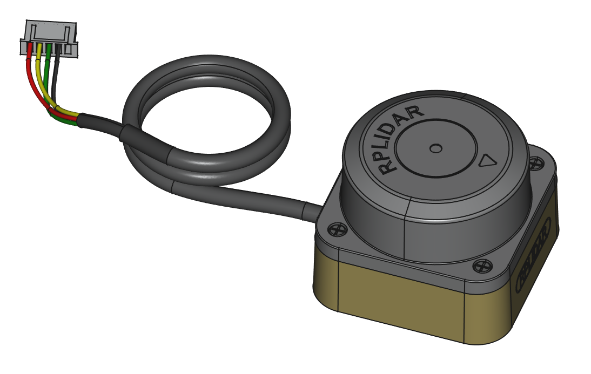

The RPLIDAR C1 is a 360-degree laser scanner that can be used for various applications, including robotics, mapping, and navigation. It is a low-cost, lightweight, and compact device that can be easily integrated into different systems. The RPLIDAR C1 is capable of providing high-resolution 2D laser scans with a range of up to 12 meters and a scanning frequency of up to 10 Hz.

### LiDAR Module Specifications

| **Parameter** | **Value** |
| ------------------------ | ------------------------------------------------------------------------- |
| Ranging Distance | 0.05–12.0 m (white target, 90% reflectivity) <br> 0.05–6.0 m (black target, 10% reflectivity) |
| Scanning Frequency | 5–12 Hz |
| Ranging Frequency | 4500 Hz |
| Angular Resolution | 0.45°–1.35° |
| Communication Interface | UART / USB |
| Power Supply | 5 V |
| Operating Current | <300 mA |
| Operating Temperature | -10 °C to 40 °C |
| Storage Temperature | -40 °C to 85 °C |
| Ranging Accuracy | ±30 mm |

### Safety and Scope

!!! warning "Class I"
    The RPLIDAR system uses a low-power infrared laser as its light source and drives it by using modulated pulse. The laser emits light in a very short time frame which can ensure the safety of humans and pets, and it reaches the Class I laser safety standard.
    Complies with 21 CFR 1040.10 and 1040.11, except for deviations pursuant to IEC 60825-1 Ed. 3., as described in Laser Notice No. 56, dated May 8, 2019.
    **Caution:** Use of controls or adjustments or performance of procedures other than those specified herein may result in hazardous radiation exposure.

## Adding Sensor to simulation model

First let's create a frame to fix our lidar to. This should be added inside of the robot definition, since the lidar frame is attached to the robot's chassis:

``` XML
    <xacro:common_link name="laser_link" material="White" path="sensor">
        <inertial>
            <origin xyz="-0.0176558922685589 0.000671805271544437 0.0219302095894866" rpy="0 0 0"/>
            <mass value="0.0483909504209895"/>
            <inertia ixx="1.58456966399128E-05" ixy="-4.23913983850005E-07" ixz="-2.09597897904374E-07"
                     iyy="3.89262522903605E-05" iyz="3.24809725932687E-07" izz="4.86230801106223E-05"/>
        </inertial>
    </xacro:common_link>
    <xacro:fixed_joint name="laser_joint" parent="base_link" child="laser_link" xyz="0.0435 5.25826986680105E-05 0.11" rpy="0 0 0"/>
```

Consider the physical size of the scanner and the sensor relevant height based on the specification data of the SDK documentation.

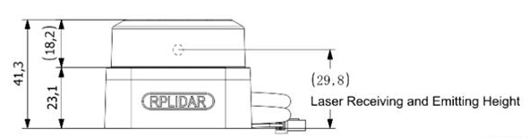

Then add this plugin under the &lt;world&gt; tag, to be able to use the lidar sensor:

``` XML
 <plugin
      filename="gz-sim-sensors-system"
      name="gz::sim::systems::Sensors">
      <render_engine>ogre2</render_engine>
    </plugin>
```

``` XML
    <gazebo reference="laser_link">
        <sensor name='gpu_lidar' type='gpu_lidar'>"
        <pose relative_to='laser_link'>0 0 0 0 0 0</pose>
        <topic>lidar</topic>
        <update_rate>10</update_rate>
        <gz_frame_id>laser_link</gz_frame_id>
        <ray>
            <scan>
                <horizontal>
                    <samples>720</samples>
                    <resolution>1</resolution>
                    <min_angle>-3.14159</min_angle>
                    <max_angle>3.14159</max_angle>
                </horizontal>
                <vertical>
                    <samples>1</samples>
                    <resolution>0.01</resolution>
                    <min_angle>0</min_angle>
                    <max_angle>0</max_angle>
                </vertical>
            </scan>
            <range>
                <min>0.05</min>
                <max>16.0</max>
                <resolution>0.01</resolution>
            </range>
        </ray>
        <always_on>1</always_on>
        <visualize>true</visualize>
    </sensor>
</gazebo>
```

First we defined the name and type of our sensor, then we defined its &lt;pose&gt; relative to the lidar_frame.

* In the &lt;topic&gt; we define the topic on which the lidar data will be published.
* &lt;update_rate&gt; is the frequency at which the lidar data is generated, in our case 10 Hz which is equal to 0.1 sec.
* Under the &lt;horizontal&gt; and &lt;vertical&gt; tags we define the properties of the horizontal and vertical laser rays.
* &lt;samples&gt; is the number of simulated lidar rays to generate per complete laser sweep cycle.
* &lt;resolution&gt;: this number is multiplied by samples to determine the number range data points.
* The &lt;min_angle&gt; and &lt;max_angle&gt; are the angle range of the generated rays.
* Under the &lt;range&gt; we define range properties of each simulated ray
* &lt;min&gt; and &lt;max&gt; define the minimum and maximum distance for each lidar ray.
* The &lt;resolution&gt; tag here defines the linear resolution of each lidar ray.
* &lt;always_on&gt;: if true the sensor will always be updated according to the &lt;update_rate&gt;.
* &lt;visualize&gt;: if true the sensor is visualized in the GUI.
* &lt;topic&gt;: defines the topic to publish the scan results.
* &lt;gz_frame_id&gt;: defines frame id of the link which is the reference for the transformation of the result

## Coordinate System Definition of Scanning Data

The RPLIDAR C1 adopts a coordinate system of the left hand. The dead ahead of the
sensors is the x-axis of the coordinate system; the origin is the rotating center of the range scanner core. The rotation angle increases as the device rotates clockwise. The detailed definition is shown in the following figure:

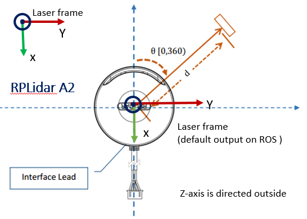

Due to the fact, that the coordinate system is not aligned with the robot base, we need to adjust the link in the robot description to rotate the coordinate system properly by 180 degree which is $\Pi$ here with $3.14159$.

``` XML
     <xacro:fixed_joint name="laser_joint" parent="base_link" child="laser_link"
        xyz="0.10478 0 0.035" rpy="0 0 3.14159" />
```

### Operate mobile base inside the simulation

``` bash
ros2 launch x3plus_gazebo x3plus_drive.launch.py
```

After spawning the model in the simulation and an empty world the following actions can trigger the drive logic

* Add the teleop UI in the simulation UI with *...*, search for *Visualize Lidar*
* Scroll to the plugin UI
* Refresh the available topics button.
* Select the *lidar* topic
* Use teleops control  to move the mobile base
* Add a box primitive in front of the robot

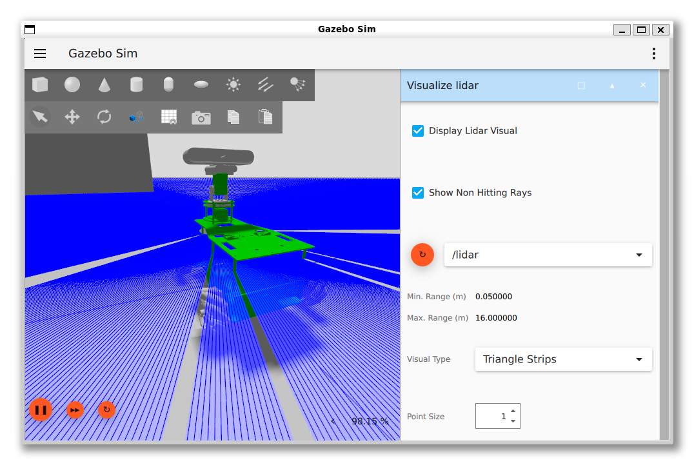

Checking the overall system configuration we can check if the information is available

Also in RVIZ2 we can evaluate that the position of the LIDAR causes interferences with the robot itself which result in conflicts with the interpretation of the scan data.

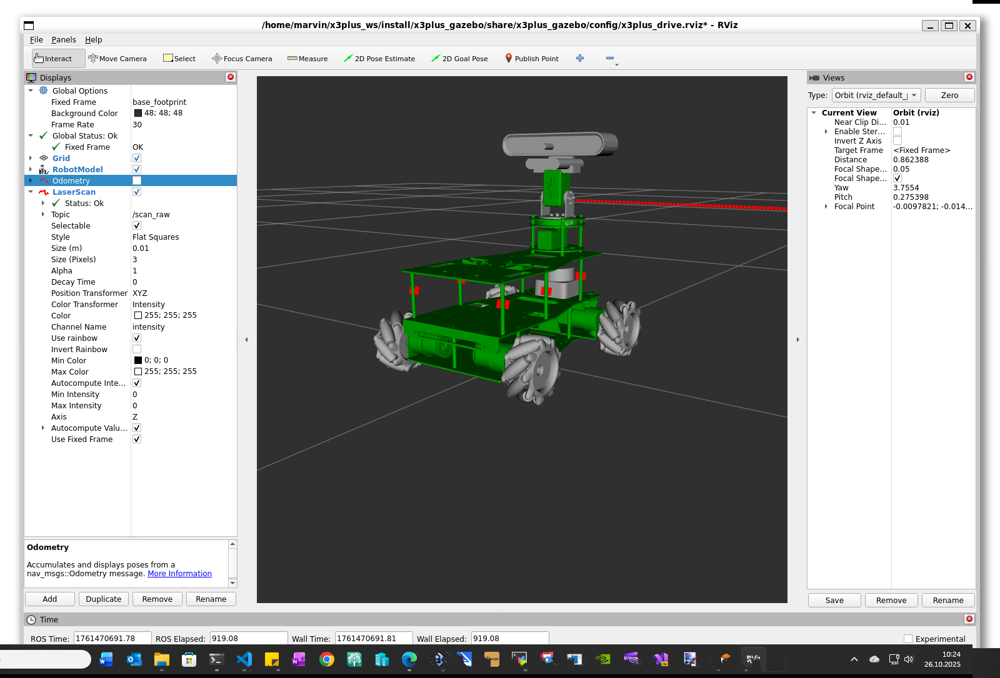

## ROS LIDAR Packages

In ROS, LIDAR data is typically processed using various packages that handle the raw data from LIDAR sensors. Some of the commonly used packages include:

* **`laser_filters`**: This package provides a set of filters for processing LIDAR data. It allows users to apply various filters to the laser scan data, such as removing outliers, smoothing the data, or applying custom filters.
* **`laser_geometry`**: This package provides tools for converting laser scan data into point clouds, which can be useful for 3D mapping and visualization.
* **`laser_scan_matcher`**: This package implements algorithms for matching laser scans to a map, which is useful for localization and navigation tasks.
* **`velodyne`**: This package provides drivers and tools for working with Velodyne LIDAR sensors, which are commonly used in autonomous vehicles.
* **`pointcloud_to_laserscan`**: This package converts point cloud data into laser scan data, allowing users to work with LIDAR data in a more traditional format.
* **`rplidar_ros`**: This package provides a driver for RPLIDAR sensors, which are popular low-cost LIDAR devices used in robotics.
* **`hector_slam`**: This package provides a SLAM (Simultaneous Localization and Mapping) solution that uses LIDAR data for mapping and localization in real-time.
* **`cartographer_ros`**: This package provides a SLAM solution that uses LIDAR data for creating high-quality maps and performing localization.
* **`gmapping`**: This package provides a SLAM solution that uses LIDAR data for creating maps and performing localization in real-time.

## Laser Filter Nodes

The scan_to_scan_filter_chain is a very minimal node which wraps an instance of a filters::FilterChain<sensor_msgs::LaserScan>. This node can be used to run any filter in this package on an incoming laser scan. If the ~tf_message_filter_target_frame parameter is set, it will wait for the transform between the laser and the target_frame to be available before running the filter chain.

<!--

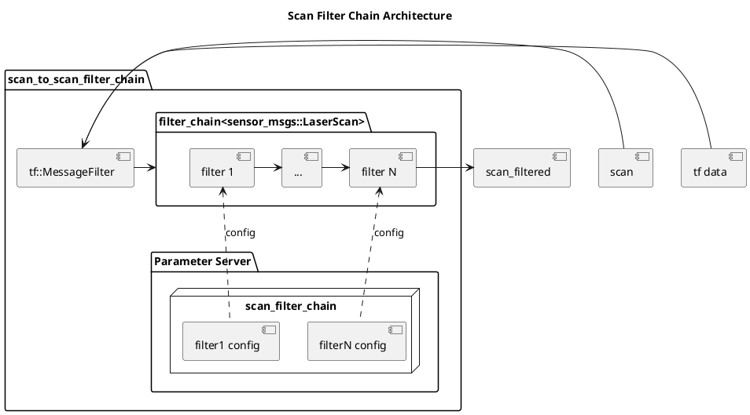
-->

<!-- 

[filter1 config] ..> [filter 1] : config
[filterN config] ..> [filter N] : config -->

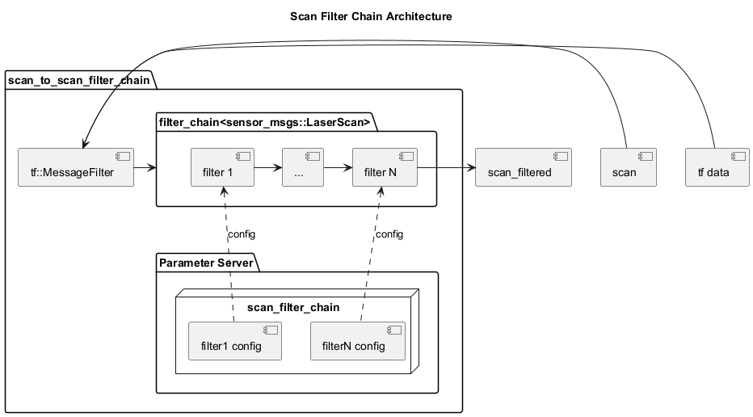

## Filter the scans

Using a filter to remove the points in the 360 degree scan which collide with the robot.

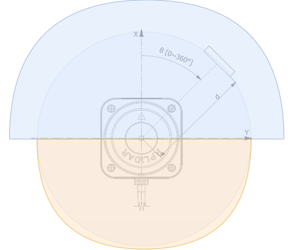

The target is to target the the following flow.

<!--

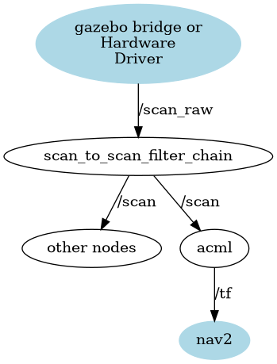
-->

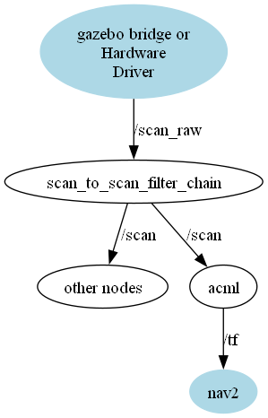

This is the reason why the gazebo topic *lidar* will be mapped to the ROS topic *scan_raw*. The raw topic will be post processed to filter the correct data.

``` yaml
- ros_topic_name: "/scan_raw"
  gz_topic_name: "/lidar"
  ros_type_name: "sensor_msgs/msg/LaserScan"
  gz_type_name: "gz.msgs.LaserScan"
  direction: "GZ_TO_ROS"
```

We add then the filter processing to the *bringup_launch.py* script in the "x3plus_bringup* package which is valid for the simulation and the hardware scenarios.

``` python
    laser_filters_cmd = Node(
            package="laser_filters",
            executable="scan_to_scan_filter_chain",
            parameters=[
                PathJoinSubstitution([
                    get_package_share_directory("x3plus_bringup"),
                    "config", "laser_filters.yaml",
                ]), {'use_sim_time': use_sim_time}],
                remappings=[
                    ('/scan', '/scan_raw'),
                    ('/scan_filtered', '/scan')
                ]
        )
```

The configuration of the filter will in this case filter all the point in the scan which do not fall in a certain angle bounds.

``` yaml
scan_to_scan_filter_chain:
  ros__parameters:
    filter1:
      name: angle
      type: laser_filters/LaserScanAngularBoundsFilterInPlace
      params:
        lower_angle: -1.52
        upper_angle: 1.52
```

The filter file is locate under */x3plus_bringup/config
/laser_filters.yaml*

## Check in the simulation

``` bash
ros2 launch x3plus_gazebo x3plus_launch.py
```

When using the lidar in the simulation we see that the points are only in a range of 180 degree in front of the robot base.

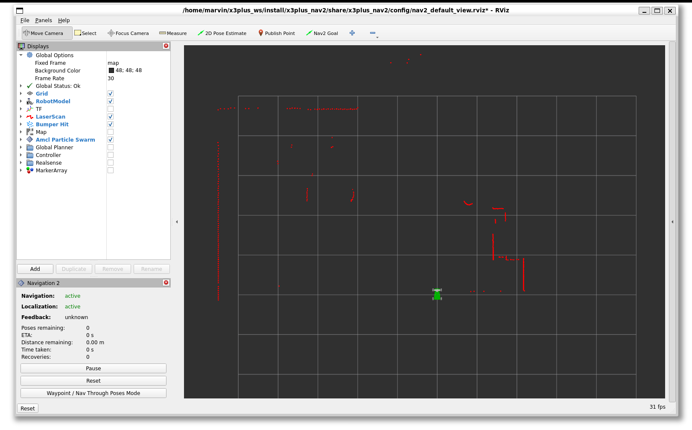

## Check the hardware

Run *lsusb* in the terminal

Look for a line like:

``` bash
...
10c4:ea60 Silicon Labs CP2102 USB to UART Bridge Controller
...
```

When you find the entry then the device can be found on the USB bus. Now we need to bind the device. Use the rules script from the *sllidar* repository.

``` bash
cd src/sllidar_ros2/scripts/
sudo cp rplidar.rules /etc/udev/rules.d
```

I was using a reboot to ensure the proper system configuration.

``` bash
sudo reboot
```

We can use the start script from the vendor to start the LIDAR ROS driver with a visualization in *Rviz2*.

``` bash
 ros2 launch sllidar_ros2 view_sllidar_c1_launch.py
```

You should see the driver output.

``` bash
[INFO] [launch]: All log files can be found below /home/marvin/.ros/log/2025-11-08-11-19-42-736148-ma3jet-2927
[INFO] [launch]: Default logging verbosity is set to INFO
[INFO] [sllidar_node-1]: process started with pid [2928]
[INFO] [rviz2-2]: process started with pid [2930]
[sllidar_node-1] [INFO] [1762597182.897318089] [sllidar_node]: SLLidar running on ROS2 package SLLidar.ROS2 SDK Version:1.0.1, SLLIDAR SDK Version:2.1.0
[sllidar_node-1] [INFO] [1762597183.415447238] [sllidar_node]: SLLidar S/N: B91BE195C1E79ED8B5E29EF13DCC4A7D
[sllidar_node-1] [INFO] [1762597183.415584041] [sllidar_node]: Firmware Ver: 1.02
[sllidar_node-1] [INFO] [1762597183.415602281] [sllidar_node]: Hardware Rev: 18
[sllidar_node-1] [INFO] [1762597183.418660595] [sllidar_node]: SLLidar health status : 0
[sllidar_node-1] [INFO] [1762597183.418731157] [sllidar_node]: SLLidar health status : OK.
[sllidar_node-1] [INFO] [1762597183.696539078] [sllidar_node]: current scan mode: Standard, sample rate: 5 Khz, max_distance: 16.0 m, scan frequency:10.0 Hz,
[rviz2-2] [INFO] [1762597184.553775534] [rviz2]: Stereo is NOT SUPPORTED
[rviz2-2] [INFO] [1762597184.554199416] [rviz2]: OpenGl version: 4.5 (GLSL 4.5)
[rviz2-2] [INFO] [1762597184.618672875] [rviz2]: Stereo is NOT SUPPORTED

```

!!! note "Raw scan data"
    Keep in mind that this driver is providing the full scan data for the 360 degree scope.

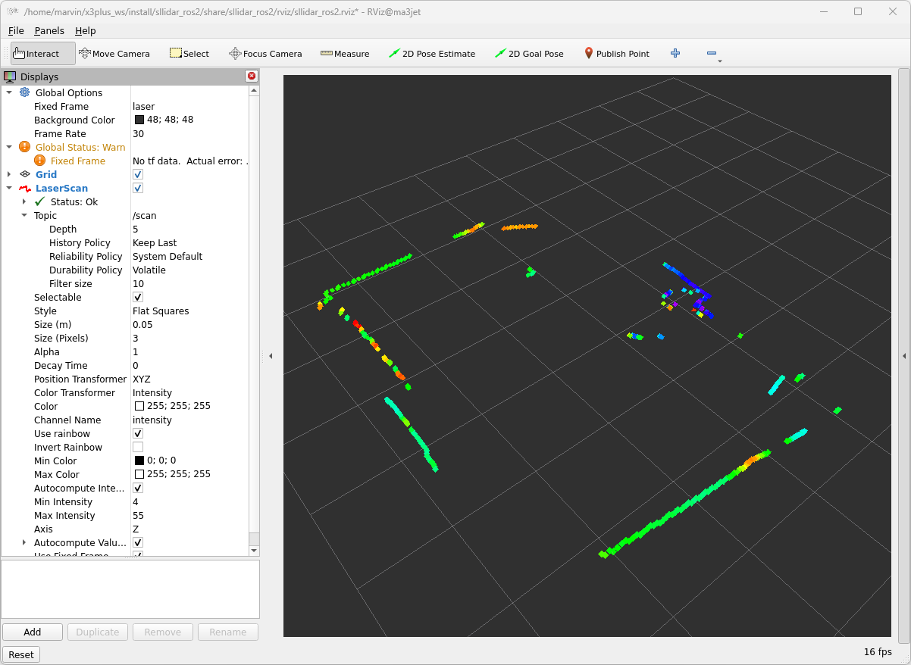

## Integration in the launch file

We integrate the new node for the LIDAR inclusive the driver into our launch file with the following snippet.

``` python
    # Instead of using IncludeLaunchDescription, directly launch the sllidar_node with remappings:
    lidar_cmd = Node (
        package='sllidar_ros2',
        executable='sllidar_node',
        name='sllidar_node',
        output='screen',
        parameters=[{
            'channel_type':'serial',
            'serial_port': '/dev/rplidar',
            'serial_baudrate': 460800, 
            'frame_id': 'laser_link',
            'inverted': False, 
            'angle_compensate': True, 
            'scan_mode': 'Standard',
        }], 
        remappings=[('scan', 'scan_raw')]
    )
```

This will not call the vendor launch file. We start the node directly, with the port name which we bound to the USB device and we are using a frame id which corresponds to the robot description. Important is the remapping of the original topic name *scan* to *scan_raw*

!!! note "Several launch files"
    Keep in mid that we implement the driver handling in the launch file *bringup_launch.py* in the *x3plus_bot_bringup* which encapsulates the hardware handling.
    The laser scan post processing is handled in the launch file *bringup_launch.py* from the *x3plus_bringup* package which encapsulates the common handling.

## References

[RobotShop’s LIDAR section](https://www.robotshop.com/collections/lidar) offers a wide range of sensors with specs and compatibility filters.

[What If Monsters](https://whatifmonsters.com/vetted/best-affordable-lidar-scanners-for-amateur-investigators/) has a vetted list of affordable LIDARs for amateur robotics.

[RPLIDAR C1](https://www.slamtec.com/en/C1) Product page from vendor

[RPLIDAR C1 with Raspberry PI 4 and ROS2](https://hackaday.io/project/197642-rplidar-c1-with-raspberry-pi-4-and-ros2/details) DIY Project  for laser scanner (RPLIDAR C1) working on a hardware (Raspberry PI 4 - 1GB)

[Docs / Gazebo Harmonic / Sensors](https://gazebosim.org/docs/harmonic/sensors)

[SLAMTEC rplidar data sheet](https://bucket-download.slamtec.com/2d4664be9f9f5c748f3b608f2cf1862962b168eb/SLAMTEC_rplidar_datasheet_C1_v1.1_en.pdf)

[Laser Filter Nodes](https://wiki.ros.org/laser_filters)
