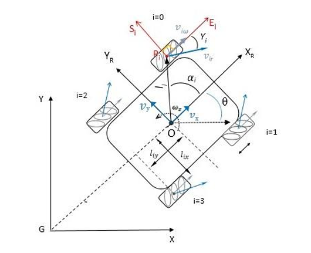
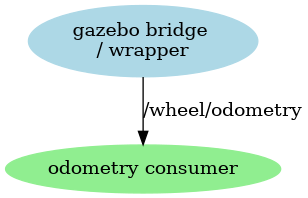
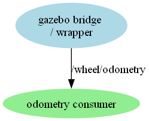

# Kinematic Model of a Four Mecanum Wheeled Mobile Robot

First calculate the encode to length values for the motor and gear setup.

``` python
# conversion factor from meter to ticks 
# MD520  1:56 has Encoder counts per output shaft turn 360 
# Wheel is 80 mm diameter.
# circumference is then 2 * PI * Radius ==> 251,28 mm per turn
# 1000 mm / 251,28 mm * 2464 ticks per round  ==> 9805.794333 ticks per meter
# The speed of the motor is 205 +-10 RPM (revolutions per minute)
# So the maximum speed of the car is 205 * 0.25128 m / 60 s = 0.85854 m/s
self.ticks_per_round = 2464             # Encoder ticks per round 
self.ticks_per_meter = 9805.794333      # Encoder ticks per meter 
```

Define some constant values based on the physical layout of the robot.

``` python
# Distance between front and rear wheels (in meters)
self.distance_between_front_rear_wheels = 0.22  
# Distance between left and right wheels (in meters)
self.distance_between_left_right_wheels = 0.208  
```

## Inverse kinematics

The Inverse kinematics is calculated in the *x3plus_wrapper* package.



### Formula

The formula is based on parameter and the article from [@TaheriQiaoGhaeminehad2015]

* $\omega_i$ [rad/s],  wheels angular velocity
* $l_x$ [m] is the distance from the center robot to the middle of the wheel
* $l_y$ [m] is the distance from the center robot to the axis of the wheels

Longitudial Velocity:

$$v_x(t) = (\omega_1 + \omega_2 + \omega_3 + \omega_4) * r / 4$$

Transversal Velocity:

$$v_y(t) = (- \omega_1 + \omega_2 + \omega_3 - \omega_4) * r / 4$$

Angular Velocity:

$$\omega_z(t) = (- \omega_1 + \omega_2 - \omega_3 + \omega_4) * r / 4 (l_x + l_y)$$

### Calculation

``` python
# calculate the delta time
dt = (time_stamp - self.last_time_stamp).nanoseconds / 1e9  # Convert to seconds
self.last_time_stamp = time_stamp
# calculate the distance traveled by each wheel
dfl = (front_left_encoder - self.front_left_encoder_old) / self.ticks_per_meter;
dfr = (front_right_encoder - self.front_right_encoder_old) / self.ticks_per_meter;
drl = (rear_left_encoder - self.rear_left_encoder_old) / self.ticks_per_meter;
drr = (rear_right_encoder - self.rear_right_encoder_old) / self.ticks_per_meter;

# calculate the average distance traveled by the robot
dx = (dfl + dfr + drl + drr) / 4.0  # Average distance traveled by all wheels in the x direction
dy = (-dfl + dfr + drl - drr) / 4.0  # Average distance traveled in the y direction
dtheta = (-dfl + dfr - drl + drr) / (4.0 * (self.distance_between_left_right_wheels + self.distance_between_front_rear_wheels) / 2)  # Average rotation
```

Then update the internal position

``` python
# Update internal position
self.x += (dx * np.cos(self.theta) - dy * np.sin(self.theta)) * dt  # Update x position
self.y += (dx * np.sin(self.theta) + dy * np.cos(self.theta)) * dt  # Update y position
self.theta += dtheta  # Update orientation
self.theta = (self.theta + np.pi) % (2 * np.pi) - np.pi  # Normalize theta to [-pi, pi]
```

Then remember the latest encoder values

``` python
# remember the old encoder values
self.front_left_encoder_old = front_left_encoder
self.front_right_encoder_old = front_right_encoder
self.rear_left_encoder_old = rear_left_encoder
self.rear_right_encoder_old = rear_right_encoder
```

Then calculate the values fo the odometry message to that it is prepared for publishing

``` python
# Populate odometry message
odom.header.stamp = time_stamp.to_msg()
odom.header.frame_id = "odom"
odom.pose.pose.position.x = self.x
odom.pose.pose.position.y = self.y
odom.pose.pose.position.z = 0.0
odom.pose.pose.orientation = Quaternion(x=quat[0], y=quat[1], z=quat[2], w=quat[3])

#  set the velocity
odom.child_frame_id = "base_link";
odom.twist.twist.linear.x =  vx * 1.0
odom.twist.twist.linear.y = vy * 1.0
odom.twist.twist.angular.z = angular * 1.0
```

!!! warning TODO
    Check the vx and vy values

### Node structure

The final node structure with the relevant topics are described below.

* /gazebo: When starting the simulation the gazebo bridge will publish the ROS message.
* /wrapper_node: Start the car chassis, obtain the speed vel data of the wheels, and publish it

<!--


-->



## References

[Kinematic Model of a Four Mecanum Wheeled Mobile Robot](https://research.ijcaonline.org/volume113/number3/pxc3901586.pdf) : International Journal of Computer Applications article describing kinematic background.
