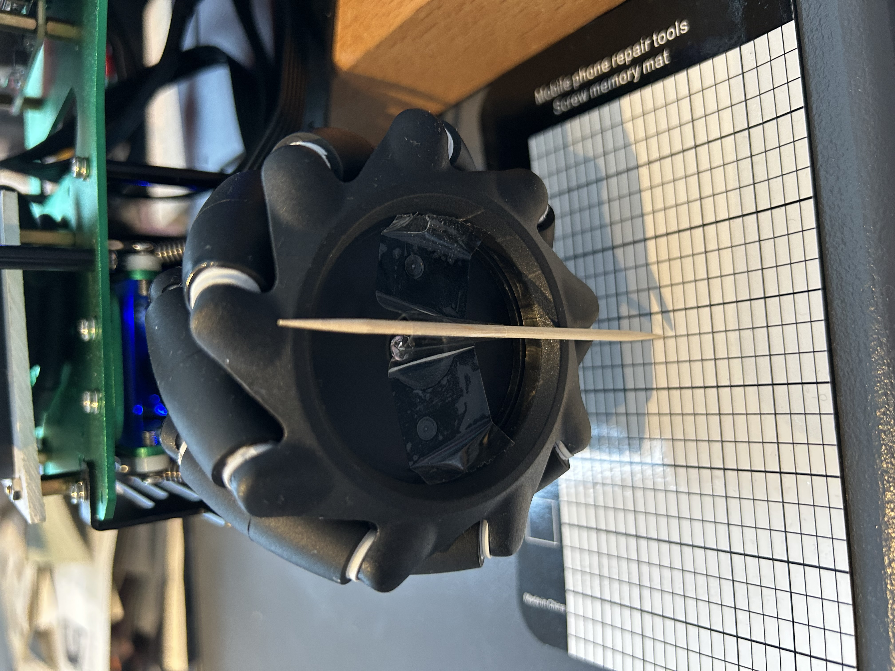
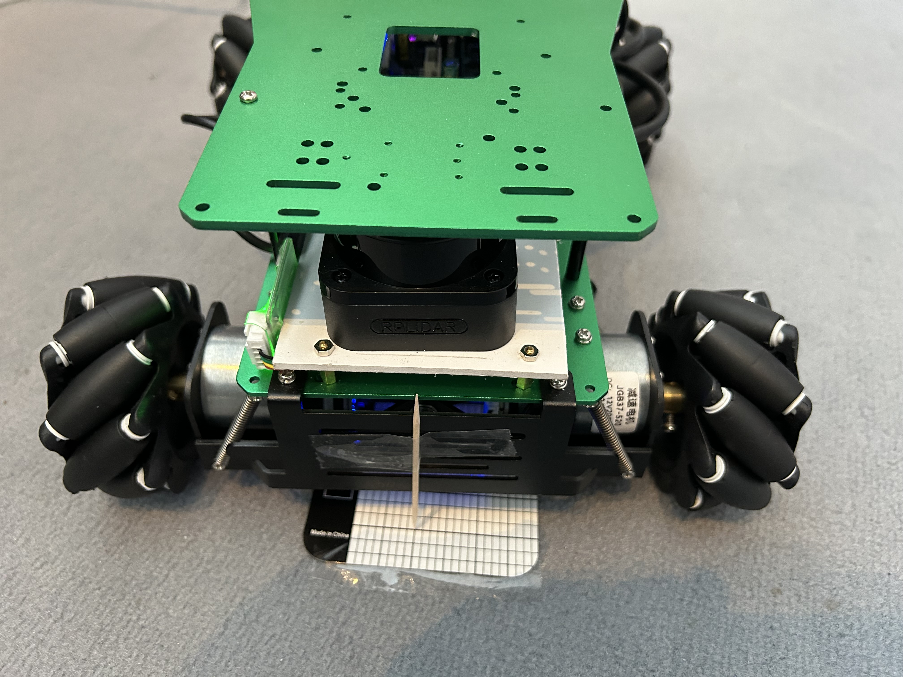
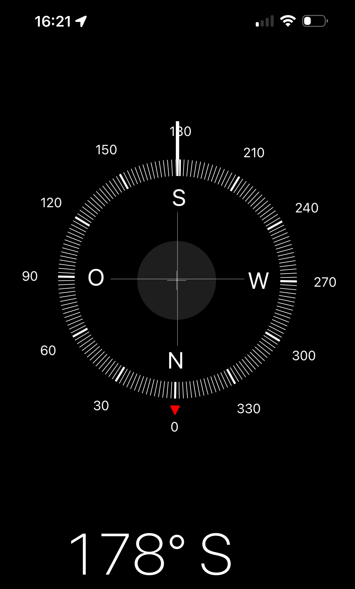
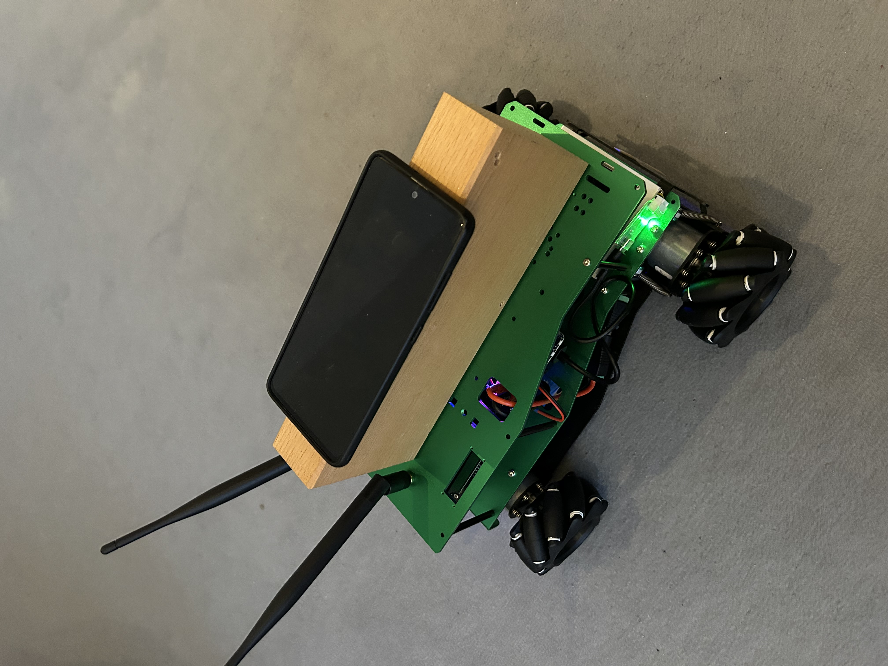

# Calibrating wheel odometry

Calibrating wheel odometry is one of those tasks that looks simple on paper but becomes surprisingly subtle once you want drift-free, repeatable results.

Below is a calibration workflow used in research labs and industry. It works for differential-drive, skid-steer, and even mecanum robots (with small adjustments).

## Motor unit

520 DC Gear Motor: Comes with an encoder for precise speed and position control. Available in different RPM variants (205, 333, 550).


### Encoder output description

The phase difference between the two signals is 100 degrees, and the rotation direction of the motor can be judged according to the sequence of the two signals. The current tire walking distance can be calculated according to the number of signal pulses per unit time and the tire circumference. If only the number of AB-phase pulses per unit time is detected, the speed and slowness of the current motor speed can also be measured.

Take a motor with a reduction ratio of 1:56 as an example, the single-phase output of 11 pulses when the motor rotates one circle, and with a reduction ratio of 1:56, the maximum output of the output shaft of the gear rotates one circle $(56*11*4) = 2464$ counts. The phase difference of AB two-phase output pulse signal is 100 degrees, which can detect the rotation direction of the motor.


!!! tip "What “ticks per revolution” actually means"
      There are two different revolutions in the drivetrain:
      *Motor shaft revolution* and *Wheel revolution (after gearbox)*
      Encoders are almost always mounted on the motor shaft, not the wheel.
      So:
      * The encoder measures motor revolutions
      * The robot moves based on wheel revolutions

## Calibration model

### Identify the Parameters to Calibrate

For a mecanum‑drive robot, the core parameters are:

- `wheel_radius` Wheel radius
- `wheel_separation_width` Wheel separation (track width)
- `wheel_separation_length` Wheel separation (track length)
- `ticks_per_revolution` : Ticks per revolution of the wheel including the gearbox
- `front_left_scale` Per-wheel calibration multipliers front left
- `front_right_scale` Per-wheel calibration multipliers front right
- `rear_left_scale` Per-wheel calibration multipliers rear left
- `rear_right_scale` Per-wheel calibration multipliers rear right

### Background

Why scale factors belong ONLY in odometry Wheel scale factors correct physical differences between wheels:

- roller wear
- slight radius differences
- gearbox friction
- encoder inconsistencies

These differences affect how far the robot actually moves, not what you command it to do.

### Adjustment of the kinematics

We need to adjust the calculation to consider the correction factors.

``` python
dfl = (front_left_encoder - self.front_left_encoder_old) / self.compute_ticks_per_meter() * self.front_left_scale
dfr = (front_right_encoder - self.front_right_encoder_old) / self.compute_ticks_per_meter() * self.front_right_scale
drl = (rear_left_encoder - self.rear_left_encoder_old) / self.compute_ticks_per_meter() * self.rear_left_scale
drr = (rear_right_encoder - self.rear_right_encoder_old) / self.compute_ticks_per_meter() * self.rear_right_scale
```

Each wheel scale factor corrects the effective wheel circumference, which directly affects:

- how far the wheel actually travels per encoder tick
- how much distance you compute from encoder deltas

So the scale factor must be applied after converting ticks → meters, but before feeding the distances into the mecanum kinematics.

<!-- ## Step 1 - Check Roller Angle

Most mecanum wheels are 45$^0$. Some industrial wheels use 60$^0$.

You can verify by measuring the angle of a roller relative to the wheel axis.

If you bought standard 45$^0$ wheels, you can safely set:

``` yaml
roller_angle: 0.78539816339
``` -->

## Check encoder ticks per revolution (of the gear box)

Most MD520Z56 motors come with a Hall-effect quadrature encoder that provides:

- 11 pulses per motor revolution (PPR)
- When decoded in quadrature (×4), this becomes: $11×4=44$ counts per motor revolution
- So the effective counts per wheel revolution are:
   $counts per wheel rev=44×gear ratio$

MD520Z56-12V Motor unit has $(56*11*4) = 2464$ counts, you can set:

``` yaml
ticks_per_revolution: 2464
```

### How to verify your exact encoder resolution

You can confirm it in 10 seconds:

- Rotate the wheel exactly one full turn by hand.
- Read the encoder tick change from your microcontroller or ROS topic.
- That number is your true counts per wheel revolution.

This automatically includes:

- encoder CPR
- quadrature decoding
- gear ratio
- any driver scaling

It’s the most reliable method.

I prepared the wheel with a tooth stick for better measurement.



There is a python script *show_encoders.py* to display the current encoder values in the folder *scripts* of the x3plus_wrapper package.

Start it by

``` bash
python show_encoders.py
```

You see then the current values of all wheel encoder.

``` bash
1766824733.504,-2444,0,0,0,0,0,0,0
1766824733.604,-2444,0,0,0,0,0,0,0
1766824733.705,-2444,0,0,0,0,0,0,0
...
```

I pick the measured value from one wheel

``` yaml
ticks_per_revolution: 2444
```

## Wheel Separation Width (left - right)

### What you need

- Tape measure
- Robot on a flat surface

### Procedure

1. Measure the distance between the contact points of the left and right wheels.
2. For mecanum wheels, the contact point is the center of the wheel hub, not the roller tips.

So:

$$ {\text{wheel\_separation\_width}} = \text{distance between left and right wheel centers} $$

This is usually stable unless your frame flexes.

Pick the measured value

``` yaml
wheel_separation_width:  0.215 # Measured  
```

## Calibrate Wheel Radius (Linear Motion Test)

### Goal

Ensure that commanded linear velocity matches actual linear motion.

<!-- ### What you need

- Calipers or a ruler
- A flat surface
- A way to command a constant wheel velocity -->

### Procedure Linear Motion Test

- Place the robot on a long, straight, flat surface.
- Command a **pure forward velocity** (e.g., `0.2 m/s`) for a fixed time (e.g., 10 seconds).
- Measure the **actual distance traveled** with a tape measure or motion capture.
- Compute the scaling factor:

$$
k_r = \frac{\text{actual distance}}{\text{odometry distance}}
$$

- Multiply your wheel radius by $k_r$.

### Why Linear Motion Test matters

Even tiny manufacturing differences (1–2 mm in wheel diameter) cause large drift over time. This gives you the effective radius including roller compression.

### How to execute Linear Motion Test

Start the launch file which enables the drive command.

``` bash
 ros2 launch x3plus_wrapper drive_bringup_X3Plus_launch.py
```

Get the starting odometry position.

``` bash
ros2 topic echo /wheel/odometry --field pose.pose.position --once
x: 1.6152765775934375
y: 0.02462562066615426
z: 0.0
```

Mark the physical starting position



Then command a **pure forward velocity** (e.g., `0.2 m/s`) for a fixed time of 10 seconds

``` bash
 timeout 10 ros2 topic pub /cmd_vel geometry_msgs/msg/Twist "{linear: {x: 0.2}}" -r 10
ros2 topic pub /cmd_vel geometry_msgs/msg/Twist "{linear: {x: 0.0}}"
```

Get the position after driving

``` bash
ros2 topic echo /wheel/odometry --field pose.pose.position --once
x: 4.1170790533469654
y: -0.06087575917865744
z: 0.0
```

Then calculate the $k_r$ value

$$
k_r = \frac{\text{measured distance}}{\sqrt{(x_1-x_0)^2 + (y_1-y_0)^2}}
$$

then apply the value

$$
\text{wheel\_radius} = \text{wheel\_radius} * k_r
$$

## Calibrate Wheel Separation (front - rear) (Rotation Test)

### Goal Rotation Test

Ensure that commanded angular velocity matches actual rotation.

### Procedure Rotation Test

- Command a **pure rotation** (e.g., `0.3 rad/s`) for a fixed time.
- Measure the **actual angle turned** using:
  - A large protractor on the floor
  - A printed circle
  - A motion capture system
  - A smartphone compass (surprisingly decent)

- Compute the scaling factor:

$$
k_s = \frac{\text{actual angle}}{\text{odometry angle}}
$$

- Multiply your `wheel_separation` by the factor $k_s$.

### Why Rotation Test matters

Track width is almost never the nominal CAD value once you include tire deformation, load, and friction.


!!! warning TODO


### How to execute Rotation Test

I am using the compass of a smart phone



To reduce the influence with the robot i used a wooden block



Start the launch file which enables the drive command.

``` bash
 ros2 launch x3plus_wrapper drive_bringup_X3Plus_launch.py
```

Get the starting odometry orientation.

``` bash
ros2 topic echo /wheel/odometry --field pose.pose.orientation --once
x: 0.0
y: 0.0
z: -0.632196990083624
w: 0.7748076959666872
```

Then command a **pure rotation** (e.g., `0.3 rad/s`)  for a fixed time of 10 seconds

``` bash
 timeout 10 ros2 topic pub /cmd_vel geometry_msgs/msg/Twist "{angular: {z: 0.3}}" -r 10
ros2 topic pub /cmd_vel geometry_msgs/msg/Twist "{angular: {z: 0.0}}"
```

``` bash
ros2 topic echo /wheel/odometry --field pose.pose.orientation --once
x: 0.0
y: 0.0
z: 0.4601918267968138
w: 0.887819510119828
```

!!! tip "Quaternion handling"
      Ros is using Quaternion to handle orientation. The odometry is using Quaternion.

- A quaternion is $[x, y, z, w]$ where w is the scalar part and $(x,y,z)$ the vector part $(axis·sin(theta/2))$.
- For a planar rotation about $Z: x \approx 0, y \approx 0 \ \text{and} \ z = sin(theta/2), w = cos(theta/2)$.
- Yaw (theta) = $2 * atan2(z, w)$.
- If x,y may be non‑zero use the general formula: $yaw = atan2(2*(wz + xy), 1 - 2*(yy + zz))$.


$0^0$ $210^0$

$210^0$ 0.7748076959666872
$80^0$ 0.887819510119828

## Correct Left/Right Asymmetry

Even after radius and separation calibration, robots often **curve slightly** during straight motion.

### Procedure Left/Right Asymmetry

- Command a long straight drive (3–5 m).
- Measure lateral drift.
- Adjust:

- `front_left_scale`
- `front_right_scale`
- `rear_left_scale`
- `rear_right_scale`

- Repeat until straight motion is stable.

!!! tip Important
      This is the single most important calibration for mecanum robots.

### Rule of thumb

If the robot drifts **right**, the **left wheel** is effectively “larger” → reduce its multiplier slightly. Adjust by small increments (0.5–1%).

## Validate with a Square Path Test

Drive a square:

- 1 m forward  
- 90$^0$ turn  
- Repeat 4 times  

Check:

- Does the robot return close to the starting point?
- Is the final heading correct?

If not:

- Position error $\to$ wheel radius
- Heading error $\to$ wheel separation
- Curved edges $\to$ left/right multipliers

## Optional — Slip Compensation

You measure these empirically:

- Drive forward $\to$ measure drift in Y $\to$ adjust slip_y
- Drive sideways $\to$ measure drift in X $\to$ adjust slip_x
- Rotate $\to$ measure drift in X/Y $\to$ adjust slip_yaw

These are fine-tuning parameters.

## Optional — Use ROS 2 Tools for Automation

If you want to integrate this into your reproducible workflow:

- Log `/odom` and `/tf`
- Use a Jupyter notebook (fits your Pixi/Jupyter setup)
- Compute scaling factors automatically
- Store calibration in YAML (fits your modular config style)

## A Few Expert Tips

- **Mecanum?** You must calibrate each wheel separately.
- **Jetson Orin Nano + depth camera?** Fuse wheel odometry with visual odometry to reduce drift.
