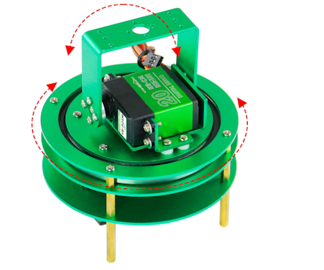
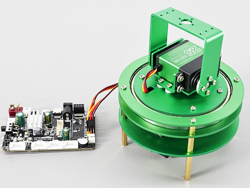
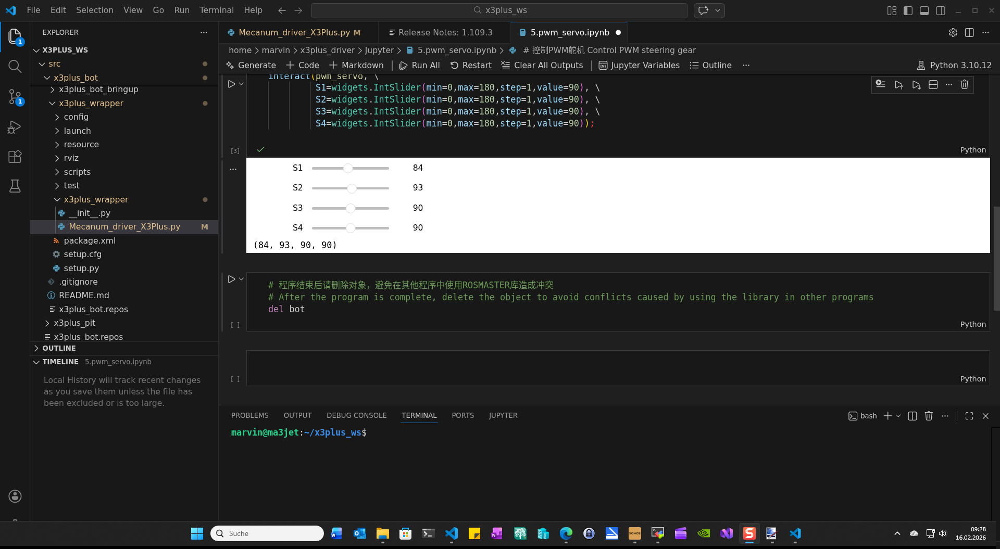
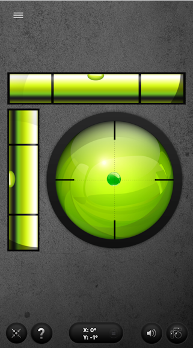
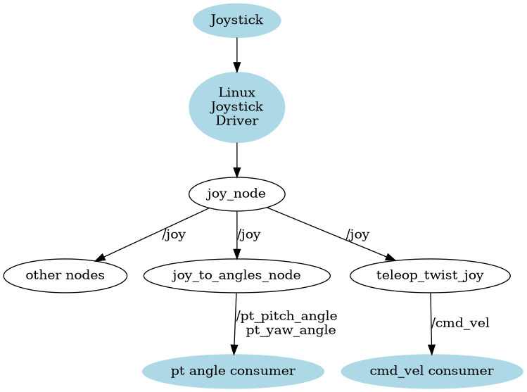

# Pan Tilt Unit

We want a pan tilt capability to cover a greater area with the vision and depth camera.



## Connect the servos

This is the universal mapping for hobby servos.

| Board Pin | Function | Typical Servo Wire Color |
| --------- | -------- | ------------------------ |
| GND       | Ground   | Black, Brown             |
| VCC (5V)  | Power    | Red                      |
| PWM       | Signal   | Yellow, Orange, White    |

Orientation on the Yahboom Board

Yahboom boards typically place:

* GND on the outer edge
* PWM on the inner side (closest to the microcontroller)

But the safest move is to check the tiny silkscreen labels next to the 3‑pin header: `G 5V S`



## Driver test

The driver provides direct access to the servo controller on the board.

This can be tested with a jupyter notebook `5.pwm_servo.ipynb` under `x3plus_driver/Jupyter/`



## How a real PWM servo behaves

A standard RC servo (like the ones you’d drive from the Yahboom board):

Keeps its position as long as:

* it has power, and
* it receives a steady PWM signal (e.g., 50 Hz, 1–2 ms pulse)

## Calibrating the servo position

When people talk about calibrating a servo, they typically mean one or more of these:

* Finding the true center position (the pulse width where the horn is mechanically centered)
* Aligning the servo horn so that $0^\circ$ or “center” matches your robot’s geometry
* Compensating for mechanical offsets introduced by linkages or mounting

What i did using the smart phone with a spirit level app to find the $0^\circ$ of the tilt horn.



Im my case it was not $90^\circ$, it was $97^\circ$.

I decided to compensate the angle in the wrapper logic.

## Add a Servo Joint to Your URDF/Xacro

A servo in Gazebo is just a revolute joint with limits.

``` xml
    <xacro:revolute_joint name="arm_joint1" parent="base_link"  child="arm_link1"
        xyz="0.09825 0 0.102" rpy="0 0 0" axisZ="-1"
        lower="-${pi/2}" upper="${pi/2}" />
    <xacro:revolute_joint name="arm_joint2" parent="arm_link1" child="arm_link2b" xyz="0 0 0.0405"
        rpy="-${pi/2} 0 0" axisZ="-1" lower="-${pi/2}" upper="${pi/2}" />
```

If your real servo is 0–180°, convert to radians:

## Setting the origins

In the wrapper we define the origin values as measred previously

``` python
    self.servo1_angle_origin = 90.0
    self.servo2_angle_origin = 97.0
    self.servo1_angle_old = self.servo1_angle_origin
    self.servo2_angle_old = self.servo2_angle_origin
```

## Calculate joint states

The joint states message for the joints in the wrapper will be extended for the 2 additional joints.

``` python
        state.header.stamp = time_stamp.to_msg()
        state.header.frame_id = "joint_states"
        state.name = [
            ...
            self.Prefix + "arm_joint1",
            self.Prefix + "arm_joint2",
        ]
        state.position = [
            ...
                   # Assuming servo angles are in degrees, convert to radians and apply any necessary scaling
                        # Servo1 controls arm_joint1 with a 270 range, 
                        # Values are from 0 - 180 degrees, 
                        # but we want to map that to 0 - 270 degrees for the joint, so we multiply by 270/180 = 3/2
                        # servo2 controls arm_joint2b with a full range
            -(self.servo1_angle_old - self.servo1_angle_origin) * pi / 180.0 * 3 / 2,  # Assuming servo1 is in degrees, convert to radians
            (self.servo2_angle_old - self.servo2_angle_origin) * pi / 180.0,  # Assuming servo2 is in degrees, convert to radians
        ]        ]
```

### Add the control topics

For each topic for the axes the reverse calculation needs to be done.

``` python
 def pt_yaw_angle_callback(self, msg):
        """
        Callback for setting the pan-tilt tilt angle (servo1).

        Parameters:
        -----------
        - msg (Float32): Tilt angle in degrees.
        """
        if not isinstance(msg, Float32):
            return
        # Invert the angle to match the expected direction of servo movement (if needed)
        #             -(self.servo1_angle_old - self.servo1_angle_origin) * pi / 180.0 * 3 / 2,  # Assuming servo1 is in degrees, convert to radians
        degree_angle = (msg.data) / pi * 180.0 * 2.0 / 3.0 + self.servo1_angle_origin  # Convert from radians to degrees and shift to [0, 180]
        if (degree_angle < 0.0):
            degree_angle = 0.0
        elif (degree_angle > 180.0):
            degree_angle = 180.0
        self.servo1_angle_old = degree_angle
        value = self.servo1_angle_old
        self.car.set_pwm_servo (1, value)  # Assuming servo1 is in degrees
```

## Add gazebo support

To support the simulation we need to extend the simulation configuration

### Add a Gazebo Joint Controller Plugin

For Gazebo add the plugins into the URDF description:

``` xml
  <plugin
            filename="gz-sim-joint-position-controller-system"
            name="gz::sim::systems::JointPositionController">
            <joint_name>arm_joint1</joint_name>
        </plugin>
        <plugin
            filename="gz-sim-joint-position-controller-system"
            name="gz::sim::systems::JointPositionController">
            <joint_name>arm_joint2</joint_name>
        </plugin>
```

This gives Gazebo the ability to move the joints.

### Create a ROS 2 Node That Bridges /servo_angle $\to$ Joint Command

In simulation, you don’t call the Hardware layer to move the servos.
Instead, you publish to the joint controller in the simulation which is listening on the topic `/model/<robot>/joint/<joint_name>/cmd_pos`

Gazebo (ROS 2 Control)

``` python
#include <memory>

#include "rclcpp/rclcpp.hpp"
#include "std_msgs/msg/float32.hpp"
#include "std_msgs/msg/float64.hpp"

class PtJointCommandBridge : public rclcpp::Node
{
public:
  PtJointCommandBridge()
  : Node("pt_joint_command_bridge")
  {
    arm_joint1_pub_ = create_publisher<std_msgs::msg::Float64>(
      "/model/x3plus_bot/joint/arm_joint1/cmd_pos", 10);
    arm_joint2_pub_ = create_publisher<std_msgs::msg::Float64>(
      "/model/x3plus_bot/joint/arm_joint2/cmd_pos", 10);

    pt_yaw_sub_ = create_subscription<std_msgs::msg::Float32>(
      "pt_yaw_angle", 10,
      [this](const std_msgs::msg::Float32::SharedPtr msg)
      {
        std_msgs::msg::Float64 out;
        out.data = static_cast<double>(msg->data);
        arm_joint1_pub_->publish(out);
      });

    pt_pitch_sub_ = create_subscription<std_msgs::msg::Float32>(
      "pt_pitch_angle", 10,
      [this](const std_msgs::msg::Float32::SharedPtr msg)
      {
        std_msgs::msg::Float64 out;
        out.data = static_cast<double>(msg->data);
        arm_joint2_pub_->publish(out);
      });
  }

private:
  rclcpp::Publisher<std_msgs::msg::Float64>::SharedPtr arm_joint1_pub_;
  rclcpp::Publisher<std_msgs::msg::Float64>::SharedPtr arm_joint2_pub_;
  rclcpp::Subscription<std_msgs::msg::Float32>::SharedPtr pt_yaw_sub_;
  rclcpp::Subscription<std_msgs::msg::Float32>::SharedPtr pt_pitch_sub_;
};

int main(int argc, char ** argv)
{
  rclcpp::init(argc, argv);
  rclcpp::spin(std::make_shared<PtJointCommandBridge>());
  rclcpp::shutdown();
  return 0;
}

```

Therefore we add the mapping node in the simulation launch files with the following statement

``` python
   pt_joint_bridge_cmd = Node(
        package='x3plus_gazebo',
        executable='pt_joint_command_bridge',
        output='screen'
    )
```

## Add support for the joystick

The goal is to control the PT Unit from the joystick when operating manually

This extend the mapping from the joy controls like this

| Axis / button | Index | description                | Mapping             |
|---------------|-------|----------------------------|-------------------- |
| Axis          | 7     | Directional pad vertical   | Pitch move PTZ unit |
| Axis          | 6     | Directional pad horizontal | Yaw move PTZ unit   |

Therefore we need a mapper from joy to the control topics of the PT Unit

<!-- 


This node will be added to the joystick launch file

``` python
    pl_node = Node(
            package='x3plus_convert2ui',
            executable='joy_to_angles_node',
            name='joy_to_angles_node',
```
