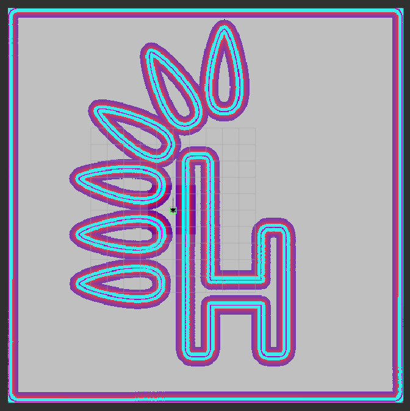
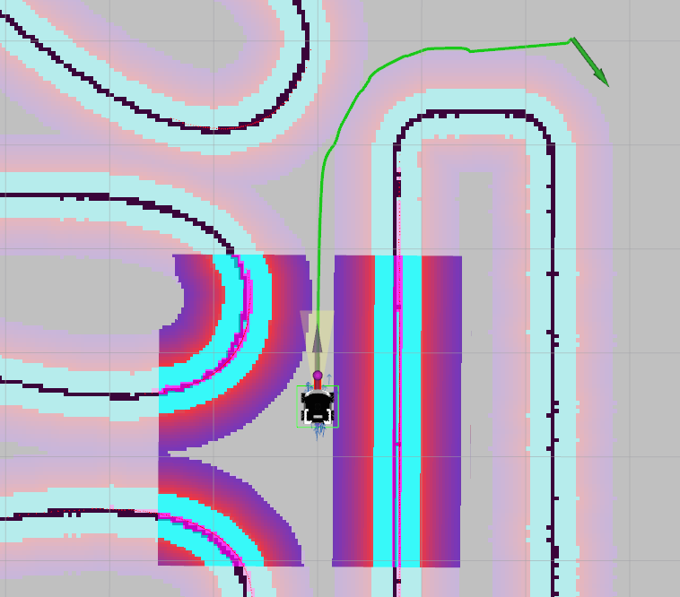

# Navigation

##  Why Nav2?

Navigation2, or Nav2 for short, is the second generation of the ROS Navigation stack, designed specifically for ROS2. It offers a comprehensive solution for autonomous navigation in robotics and it is particularly useful and important for a number of reasons:

Improved Performance: Nav2 takes full advantage of the features of ROS2. It's designed with a focus on multi-robot systems, safety, and mission critical reliability, utilizing the real-time and high-performance aspects of ROS2.

Modularity: Nav2 has a modular design, enabling users to replace or augment different parts of the system to cater to their specific use-cases. For example, you could replace the path planner, controller, or the recovery behaviors with your own implementations.

Behavior Trees: Nav2 uses behavior trees for task planning, which offer more flexibility and sophistication compared to the state machine model used in the original ROS Navigation stack. This allows more complex behaviors to be encapsulated in a maintainable and reusable way.

Advanced Features: Nav2 introduces several advanced navigation features not available in the original ROS Navigation stack. For example, it supports dynamic obstacle avoidance, multi-map support, multi-robot support, and 3D perception.

Safety: Safety and reliability are key priorities in Nav2. It supports safety plugins and various fallback behaviors to ensure safe operation in challenging environments.

Active Community Support: Nav2 is actively maintained and used by a large community, ensuring regular updates, bug fixes, and improvements.

These attributes make Nav2 an essential tool for building advanced robotic systems using ROS2.

## Introduction

Robot navigation consists in determining the sequence of maneuvers that the robot must perform in order to move from the starting point to the destination, while avoiding collisions with obstacles. Navigation can be simplified to three main algorithms: costmap, planner and controller.

It can be compared to driving a car with the navigation turned on. Navigation will show us the optimal way to the destination, but we, as drivers, can react to situations on the road. For example, if you see a traffic jam, you can try to avoid it even though the navigation tells us to go straight.

### Costmap

Costmap is similar to the map a robot uses to find out where it can safely go. Imagine that you are trying to get through a room full of obstacles such as furniture and toys. The costmap helps the robot understand which areas are easy to navigate and which are a bit more difficult.

The costmap is created based on the provided map and data from sensors such as cameras and laser scanners that measure whether there are obstacles in the way. Then it creates a special map where each spot has a "cost" value. Low cost means it is safe to move there, high cost means congested or blocked area.

### Planner

Planner, also known as the global planner or just path planer, is therefore responsible for determining the optimal path to the goal. The planner uses a costmap to get you to your destination safely and quickly. It avoids high-cost areas, such as obstacles, and prefers low-cost areas, such as open spaces. This helps the robot make smart decisions about where to move. Some of the most popular scheduling algorithms are: Dijkstra’s algorithm, A*, D*, Artificial potential field method, Visibility graph method. All of these path planning algorithms are based on one of two approaches.

* *Graph methods* - method that is using graphs, defines places where robot can be and possibilities to traverse between these places. In this representation graph vertices define places e.g. rooms in building while edges define paths between them e.g. doors connecting rooms. Moreover each edge can have assigned weights representing difficulty of traversing path e.g. door width or energy required to open it. Finding the trajectory is based on finding the shortest path between two vertices while one of them is robot current position and second is destination.
* *Occupancy grid methods* - method that is using occupancy grid divides area into cells (e.g. map pixels) and assign them as occupied or free. One of cells is marked as robot position and another as a destination. Finding the trajectory is based on finding shortest line that do not cross any of occupied cells.

### Controller

Controller, also known as the local planner, is responsible for taking actions that will allow you to get closer to the goal, while taking into account the current state of the path. There are many types of controllers.

<!-- The one we're going to use is called Regulated Pure Pursuit.

*Regulated Pure Pursuit* is a path tracking algorithm. Its basic principle is to continuously select a destination on a predetermined path and adjust the vehicle's steering angle to guide it towards that point. This is achieved by defining the path as a sequence of waypoints and specifying a lookahead distance. The algorithm tries to minimize the lateral distance between the current position of the vehicle and the point on the route. Using trigonometry, it calculates the necessary steering angle to steer the vehicle towards that target, and the vehicle's control system adjusts accordingly.

 -->

## Navigation in ROS

In ROS it is possible to plan a path based on the occupancy map created in previous chapter, created with the slam_toolbox node. The next step is to add a navigation package that will allow you to safely move around the entire map. In the first step, you will specify the parameters used to create the costmap, on the basis of which the optimal trajectory will be selected. Knowing the best trajectory, you can choose the control that will allow you to travel the designated path as quickly as possible. In ROS, both of these functions: determining the optimal path and determining the appropriate speed values ​​can be done using the nav2 package.

### Introduction to nav2

The nav2 node is quite a complicated component because it implements as many closely related functionalities:

* *Planner Server* - creates a global costmap and determines the optimal trajectories based on the global costmap.
* *Controller Server* - creates a local costmap and implements the server for handling the controller requests.
* *Behavior Server* - determines the actions that should be performed when the robot gets stuck.
* *BT Navigator Server* - behavioral tree determining the execution of the appropriate step of the algorithm (e.g. first determine the optimal path and then run the controller).
* *Smoother Server* - creates smoother path plans to be more continuous and feasible.

Below is a diagram that contains all discussed elements inside blue area.

On the left are the components that must be provided for the nav2 algorithm to work. These are:

* *BT* allows you to change the behavior of services to create a unique robot behavior (default behavior tree will be used),
* *TF* is necessary to determine the relative position between frames. For example, between LiDAR, the base of the robot, and the map, so you can uniquely determine the location of the obstacle detected by LiDAR relative to the map,
* *map* is essential at the stage of planning the path and determining the optimal path,
* *Sensor Data* sensor data is necessary to react to changes occurring in the robot's local vicinity. The controller is able to dynamically avoid new objects that are not on the map.

In addition, nav2 encourages, but does not require configuration of additional functionalities, such as: *Waypoins Follower*, *Autonomy System*, *Velocity Smoother*, *Collision Monitor*. For all these functionalities to work properly, dozens of parameters must be properly configured. If you don't, your robot may move very counter-intuitively and even refuse to follow a certain trajectory, so we'll focus primarily on Planner Server and Controller Server.

### Configure nav2

The configuration of nav2 is a very difficult task, because it is based on many advanced algorithms, where each particular algorithm contains a number of its own parameters and functions. Discussing all these parameters would be very time consuming, so in order to start navigation, download or copy the configuration from github. Place the configuration file named navigation.yaml inside the path tutorial_pkg/config. Inside this file is the configuration of several services:

* *amcl* - parameters for localization algorithm learned in previous chapter used to locate the robot on the map,
* *behavior_server* - parameters to configure recovery behavior,
* *bt_navigator* - parameters for the behavioral tree,
* *controller_server* - parameters related to the selection and fine-tuning of the controller,
* local_costmap/global_costmap*  - parameters responsible for creating a local/global costmap,
* *planner_server* - parameters related to the selection and fine-tuning of the global path,
* *waypoint_follower* - parameters related to following a multi-point route,
* *velocity_smoother* - parameters to smooth out the robot's motion.

File created based on official Nav2 Documentation where you can found more information.

## Parameters overview

### Costmap
A costmap is a grid map where each cell is assigned a specific value - cost. The cost is related to the distance from the obstacle, the closer the object is, the higher the cost of a given cell on the map. You will create two costmaps, global and local. The global map is needed by the global planner and will be used to determine the shortest path from point A to point B based on historical data provided from the map and sensors. The local map, in turn, is needed by the local planner to find the best control over a section of the path.

!!! note "Note:"
    The global map is used primarily to determine the global path, while the local map is used to react to nearby objects and follow the global path.

Among the dozens of parameters related to the map, it is worth remembering the existence of:

* *update_frequency* - defines frequency in Hz for the map to be updated,
* *publish_frequency* - defines frequency in Hz for the map to be publish display information,
* *global_frame* - defines name of frame which contains occupancy grid map (created in previous tutorial),
* *robot_base_frame* - defines name of robot base,
* *footprint/robot_radius* - defines the outline of the robot base (robot size),
* *footprint_padding* - defines amount to pad footprint (m).
* * rolling_window* - parameter setting parameter to true select robot_base_frame as a middle of the costmap,
* *inflation_radius* - determines from what distance from the obstacle, take into account the cost - any distance less than indicated will be included as an additional cost,
* *cost_scaling_factor* - defines the rate of cost decay with distance, increasing the value causes the cost at the same distance from the obstacle to have a higher cost value,
* *obstacle_max_range* - determines the maximum range sensor reading that will result in an obstacle being put into the costmap,
* *width & height* - parameters define size of map (for local map),
* *track_unknown_space* - true value add a third value on the costmap unknown, if the data from the sensor does not cover part of the area e.g. an unknown value will appear around the corner, as long as we do not cross the corner of the wall (for global map),
* *resolution* - resolution of the costmap,
* *observation_sources* - define properties of used sensor, these are:
data_type - type of message published by sensor (supported: PointCloud, PointCloud2, LaserScan),
* *topic* - name of topic where sensor data is published,
* *marking* - true if sensor can be used to mark area as occupied,
* *clearing* - true if sensor can be used to mark area as clear.

#### How to interpret visualization

When you run our navigation project, you will see a costmap. An example look can be seen in the picture below. As you can see, there are several colors on it and each of them has a specific meaning:

* pink inside cyan means a wall = certain collision,
* cyan indicates high probable collision,
* colors from red to blue indicate the value of the cost. Red means high value (the wall is close), blue means low value (the wall is far away).

The costmap should look like this:

### Planner

The planner's task is to find a way to get to the destination. The planner relies on the costmap and finds a trajectory to get there. Navfn Planner will be used as the global planner. This global planner, depend on configuration is based on the Dikstra or A* algorithm depend on use_astar parameter. Configuration of Navfn Planner is relatively simple, there is probably no need to change parameters. 

### Controller

The configuration of Navfn Planner is simple due to the small number of parameters. Unfortunately, the configuration of the controller may take longer due to the large number of parameters. Regulated Pure Pursuit will be used for control. Click on the following links if you want to know more about the Controller Server or Regulated Pure Pursuit configuration. You can learn how the Pure Pursuit algorithm works in this video.

Besides Regulated Pure Pursuit, there are other planners like DWB Controller and Model Predictive Path Integral Controller. The DWB Controller is relatively easy to understand so it may take more time to properly configure and understand the Model Predictive Path Integral Controller.

Using Regulated Pure Pursuit it is worth remembering the existence of:

* *desired_linear_vel* - the desired maximum linear velocity (m/s) to use,
* *min_lookahead_dist/max_lookahead_dist* - the minimum/maximum lookahead distance (m) threshold,
* *rotate_to_heading_min_angle* - the difference in the path orientation and the starting robot orientation (radians) to trigger a rotate in place (only if use_rotate_to_heading param is true),
* *rotate_to_heading_angular_vel* - the speed of rotation, if use_rotate_to_heading param is true.

#### How to interpret visualization

After running our project, RViz will launch, as in the picture below, where you can observe a green path and a red line at the end of which there is a purple point. As you can easily guess, the green path is a global trajectory. The purple point is the point to which you can determine the controls that will allow you to approach the indicated point. The red line defines the collision distance, which, if exceeded, will slow down or stop the vehicle.

## Generate a Map with SLAM

The goal for navigation is to make a robot move from one place to another while avoiding collision.

Navigation: a 2 step process:

* *Step1*: Create a map (with SLAM) - Fist create a map of the world(the space where the robot can move).
* *Step2*: Make the robot navigate from point A to point B
SLAM: Allows the robot to localize itself in the environment relative to all of the worlds, the objects, obstacles and at the same time, it will also map this environment.

## References

[Navigation](https://husarion.com/tutorials/ros2-tutorials/9-navigation/)

[ROS2-Nav2-with-SLAM-and-Navigation](https://github.com/bmaxdk/ROS2-Nav2-with-SLAM-and-Navigation?tab=readme-ov-file#why-nav2)

This week, as planned, I tried out Steven Macenski’s slam_toolbox package alongside slam_karto, the ROS wrapper for the Karto mapping library, another popular SLAM method.

[Comparing different SLAM methods](https://adityakamath.github.io/2021-09-05-comparing-slam-methods/)

[ROS 2 Cartographer](https://ros2-industrial-workshop.readthedocs.io/en/latest/_source/navigation/ROS2-Cartographer.html)

[On Use of Nav2 Smac Planners](http://download.ros.org/downloads/roscon/2022/On%20Use%20of%20Nav2%20Smac%20Planners.pdf)

We introduce the Nav2 project's MPPI Local Trajectory Planner. It is the functional successor of the TEB and DWB controllers, providing predictive time-varying trajectories reminiscent of TEB while providing tunable critic functions similar to DWB.

[MPPI Controller](https://roscon.ros.org/2023/talks/On_Use_of_Nav2_MPPI_Controller.pdf)

We present two open-source ROS software stacks that in combination enable a very powerful real-time localization and navigation on an arbitrary 3D surface. Using ray tracing, the robot is localized in real-time on the 3D mesh in 6DoF.

[Autonomous Robot Navigation and Localization on 3D Mesh Surfaces in ROS](https://roscon.ros.org/2023/talks/Autonomous_Robot_Navigation_and_Localization_on_3D_Mesh_Surfaces_in_ROS.pdf)

Aerial robotics presents unique challenges that distinguish it from ground robots, resulting in numerous projects and stack developments solely dedicated to aerial vehicles in ROS. The field is currently witnessing a surge in UAV-specific control and navigation projects, alongside the development of flight simulators. Moreover, critical factors such as UAV-based control, diverse vehicle types.

[Up, Up, and Away: Adventures in Aerial Robotics](https://roscon.ros.org/2023/talks/Up_Up_and_Away_Adventures_in_Aerial_Robotics.pdf)

We present NEXUS, a ROS 2 framework developed by Johnson & Johnson and partners, which enables configuration and orchestration of process workflows for both individual robotic cells and sets of cells (line).

[NEXUS: A ROS 2 framework for orchestrating industrial robotic lines and cells](https://roscon.ros.org/2023/talks/NEXUS_A_ROS_2_framework_for_orchestrating_industrial_robotic_lines_and_cells.pdf)

SLAM is a fundamental problem in robotic field and there have been many techniques on it. It is necessary to give an insight on weakness and strength of these techniques specific to the intended final application. This paper presents a study of three most common laser-based 2D SLAM techniques: Gmapping, KartoSLAM and Cartographer. Each technique was applied to construct maps combined with autonomous exploration. All the approaches have been evaluated and compared in terms of inaccuracy of constructed maps against the ground truth. In order to draw conclusions on the performance of the tested techniques, a metrics of average distance to the nearest neighbor (ADNN) was applied. Moreover, the computational load of each technique is examined

[An evaluation of Lidar-based 2D SLAM techniques with an exploration mode](https://www.researchgate.net/publication/351683550_An_evaluation_of_Lidar-based_2D_SLAM_techniques_with_an_exploration_mode/fulltext/60a5939092851c43da027997/An-evaluation-of-Lidar-based-2D-SLAM-techniques-with-an-exploration-mode.pdf?_tp=eyJjb250ZXh0Ijp7ImZpcnN0UGFnZSI6Il9kaXJlY3QiLCJwYWdlIjoicHVibGljYXRpb24iLCJwcmV2aW91c1BhZ2UiOiJwdWJsaWNhdGlvbiJ9fQ)

[From the desks of ROS maintainers: A survey of modern & capable mobile robotics algorithms in the robot operating system 2](https://www.sciencedirect.com/science/article/abs/pii/S092188902300132X)