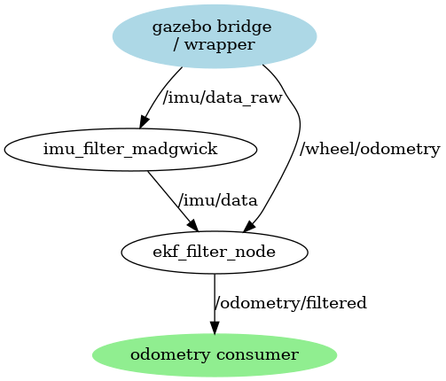
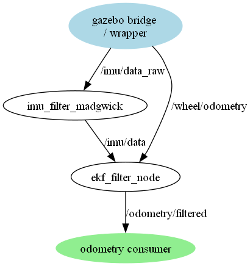

# State Estimation

## Introduction to Robot State Estimation

Robot state estimation is the process of determining a robot's position, orientation, and velocity in real time using sensor data and mathematical models. Since raw sensor readings—like those from IMUs, odometers, and cameras—are often noisy or incomplete, state estimation techniques fuse multiple sources of information to produce a more accurate and reliable understanding of the robot's motion and environment.

Common approaches include:

- **Kalman Filters** (EKF, UKF): Probabilistic methods that predict and correct the robot's state based on sensor inputs.
- **Sensor Fusion**: Combining data from IMUs, GPS, wheel encoders, and magnetometers to improve accuracy.
- **ROS Packages** like `robot_localization` and `imu_filter_madgwick` help implement these techniques in real-world robotic systems.

Effective state estimation is critical for navigation, control, and autonomy—especially in dynamic or GPS-denied environments.

### Node structure

The final node structure with the relevant topics are described below.

* /gazebo: When starting the simulation the gazebo bridge will publish the ROS message.
* /wrapper_node: Start the car chassis, obtain the speed vel data of the wheels, and publish it
* /Imu_filter_madgwick Receive the imu data released by the chassis, filter it through its own algorithm, and publish the filtered imu/data data to/ekf_filter_node;
* /ekf_filter_node Receive /wheel/odometry data and/Imu/data published by node nodes_filter_madgwick publishes imu/data data data through its own algorithm, and after fusion, publishes odom on /odometry/filtered topic

<!--

-->



## handling localization

When we adjust the relative position and rotation of the IMU sensor to the base_link, we also have to adjust the calculation of the kalman filter in the params file for the ekf_filter_node.
 
``` yaml
  imu0: example/imu
        imu0_config: [false, false, false,
                      true,  true,  true,
                      false, false, false,
                      true,  true,  true,
                      true,  true,  true]
        imu0_differential: false
        imu0_relative: true
        imu0_remove_gravitational_acceleration: true
```


## Configuration of the Madgwick filter

### Oscillating roll on a 4-wheel robot

Oscillating roll on a 4-wheel robot using the Madgwick filter usually points to one of a few sneaky culprits. Let’s break it down:

Common Causes of Roll Oscillation
Overly high beta (gain) value A high beta makes the filter aggressively correct orientation, which can cause oscillations—especially in roll and pitch. Try gradually reducing the gain parameter in imu_filter_madgwick (e.g., from 0.1 to 0.03 or lower) and observe the effect.

Accelerometer noise or vibration On a 4-wheel robot, vibrations from motors or uneven terrain can introduce high-frequency noise. The filter may misinterpret this as tilt, causing roll to wobble. Consider:

Adding a low-pass filter to the accelerometer data

Using IMUs with built-in filtering or damping

Incorrect IMU placement or mounting If the IMU isn’t mounted flat and rigidly on the robot’s frame, small mechanical shifts can be amplified in roll. Double-check that it’s level and secure.

Sensor fusion mismatch If you’re fusing IMU data with wheel odometry or other sources (e.g., via robot_localization), make sure the frames are aligned and time-synced. A mismatch can cause feedback loops that manifest as oscillation.

Dynamic motion misinterpreted as tilt When your robot accelerates or decelerates, the accelerometer picks up linear acceleration, which the filter might confuse with a tilt—especially in the roll axis.

### What You Can Try

Reduce gain: Start with ~gain: 0.02 and increase slowly.

Add a static test: Keep the robot still and log roll. If it still oscillates, it’s likely sensor noise or gain.

Visualize: Use rqt_plot to monitor /imu/data/orientation and /imu/data_raw/linear_acceleration to see if spikes in acceleration correlate with roll swings.

When the gain is too large you can see the orientation roll values oscillating.


Adjust the gain in the reconfigure dialog from rqt to a lower value.


<!-- --------------------------------------------------------- -->


## References

[ROS2 Navigation: Setting up Robot](https://robotics.snowcron.com/robotics_ros2/nav_basics_localization.htm)

[Robot state estimation](https://www.yahboom.net/public/upload/upload-html/1641546102/Robot%20state%20estimation.html)

[Robot state estimation](https://github.com/YahboomTechnology/ROS-robot-expansion-board/blob/main/6.ROS2%20robot%20control/4.Robot%20state%20estimation.pdf)