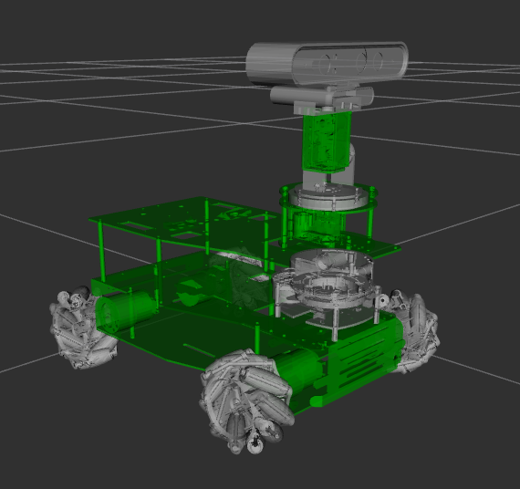
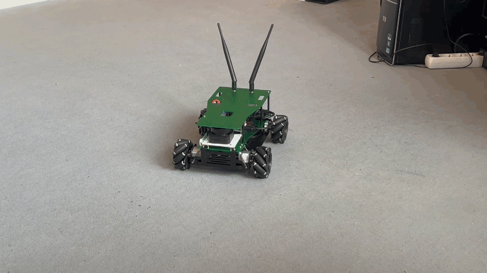

# X3Plus robot project description

ROS 2 description of X3 Plus robot

!!! warning "Under Construction"
    **Note:** This repository is still under construction

## Vision

Use the robot base to operate some use cases in the robotics world.

!!! note "Only the vision"
    Be aware that the final robot will grow over time and might look different in the end.

## Current Status

The hardware is capable to drive with the base.

Having a gazebo simulation environment

Drive around in the simulation

